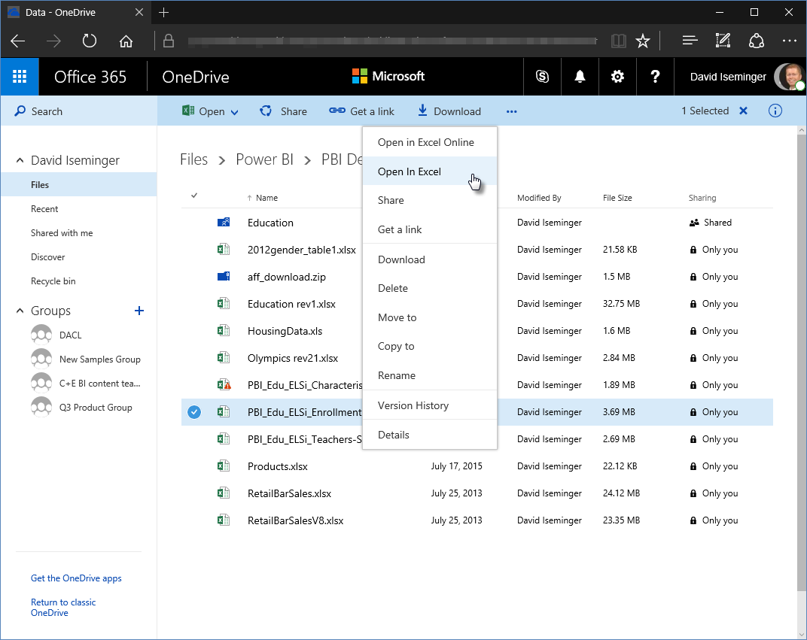
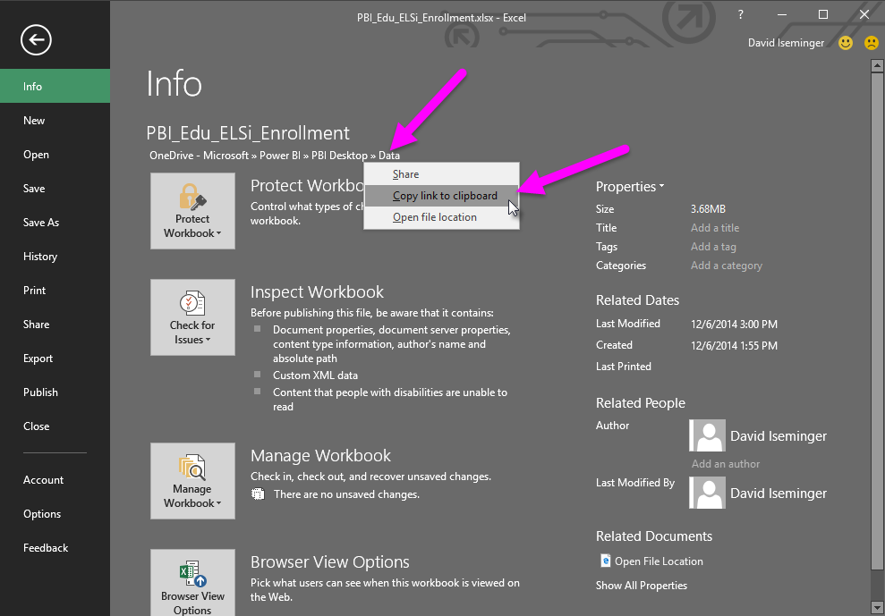
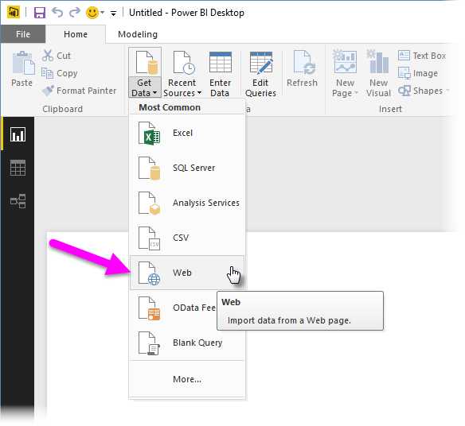
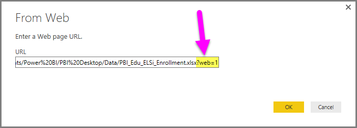

<properties
   pageTitle="Use OneDrive for Business links in Power BI Desktop"
   description="Use OneDrive for Business links in Power BI Desktop"
   services="powerbi"
   documentationCenter=""
   authors="davidiseminger"
   manager="mblythe"
   editor=""
   tags=""
   qualityFocus="no"
   qualityDate=""/>

<tags
   ms.service="powerbi"
   ms.devlang="NA"
   ms.topic="article"
   ms.tgt_pltfrm="NA"
   ms.workload="powerbi"
   ms.date="04/20/2016"
   ms.author="davidi"/>

# Use OneDrive for Business links in Power BI Desktop

Many people have Excel workbooks stored on their OneDrive for Business drive that would be great for use with Power BI Desktop. With **Power BI Desktop**, you can use online links for **Excel** files stored in **OneDrive for Business** to create reports and visuals. You can use a **OneDrive for Business** group account, or your individual **OneDrive for Business** account.

Getting an online link from **OneDrive for Business** does require a few specific steps. The following sections explain those steps, which let you share the file link among groups, across different machines, and with your coworkers.

## Get a link from Excel, starting in the browser

1.  Navigate to your OneDrive for Business location using a browser. Right-click the file you want to use, and select **Open in Excel**.
    >Note: Your browser interface might not look exactly like the following image. There are many ways to select **Open in Excel** for files in your **OneDrive for Business** browser interface. You can use any option that allows you to open the file in Excel.

    

2.  In **Excel**, select **File > Info** and select the link above the **Protect Workbook** button. Select **Copy link to clipboard**.

    

## Use the link in Power BI Desktop

In Power BI Desktop, you can use the link you just copied to the clipboard. Take the following steps:

1.  In Power BI Desktop, select **Get Data > Web**.

    

2. Paste the link into the **From Web** dialog (do **not** select OK yet).

    

3.  Notice the *?web=1* string at the end of the link - you must *remove that portion of the Web URL string* **before** selecting **OK**, in order for **Power BI Desktop** to properly navigate to your file.

4.  If **Power BI Desktop** prompts you for credentials, choose either **Windows** (for on-premises SharePoint sites) or **Organizational Account** (for Office 365 or OneDrive for Business sites).

    

A **Navigator** window appears, allowing you to select from the list of tables, sheets, and ranges found in the Excel workbook. From there, you can use the OneDrive for Business file just like any other Excel file, and create reports and use it in datasets like you would with any other data source.
