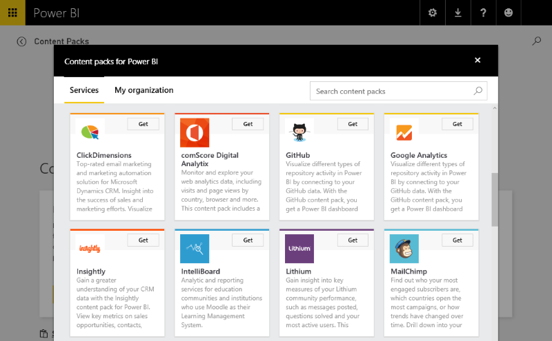
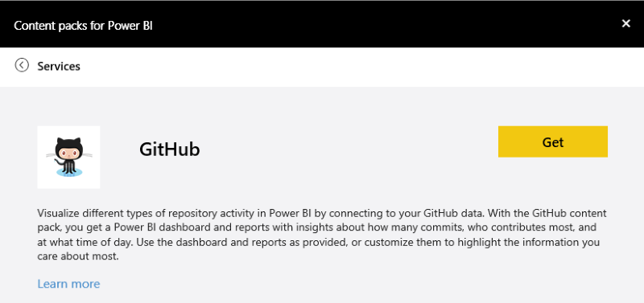
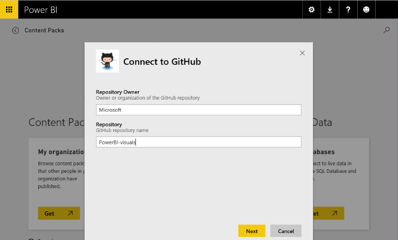
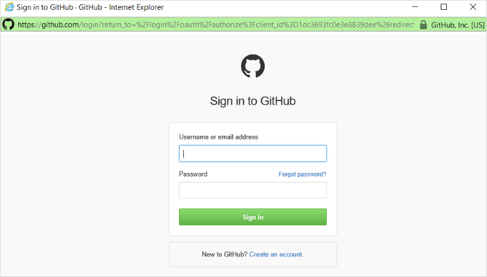
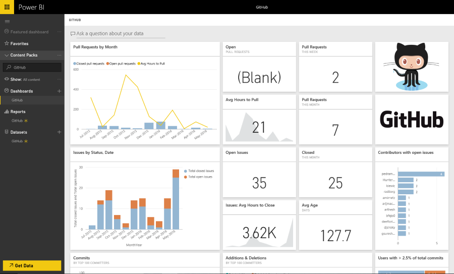

<properties 
   pageTitle="ISV Content Pack Experiences"
   description="ISV Content Pack Experiences"
   services="powerbi" 
   documentationCenter="" 
   authors="theresapalmer" 
   manager="mblythe" 
   backup=""
   editor=""
   tags=""
   qualityFocus="no"
   qualityDate=""/>
 
<tags
   ms.service="powerbi"
   ms.devlang="NA"
   ms.topic="article"
   ms.tgt_pltfrm="NA"
   ms.workload="powerbi"
   ms.date="05/17/2016"
   ms.author="tpalmer"/>

# ISV Content Pack Experiences 
This section highlights a typical experience for a user connecting to an ISV content pack. Connect to a released content pack yourself at https://app.powerbi.com/getdata/services 

## Connect
The content pack provides a name, an icon and a descriptive text.

## Parameters
The parameters dialog is provided declaratively during the packaging of your content pack.

Current the parameters UI is very basic – there is no way to enumerate drop down lists and data input validation is constrained to regex.

## Credentials
If login is required, a login window will be generated.  If your service requires OAuth, then your service’s login UI will pop up when the user presses Sign In.  Otherwise, the user can enter their credentials in the provided dialog.

## Instantiation
When login succeeds, the artifacts you created – model, reports, and dashboard appear in the in the navigation bar.  These artifacts are added to each users’ account.  The data load asynchronously to populate the dataset (model).  The user is then able to consume the dashboard, reports, and model.

By default a daily refresh schedule is configured for the user.  This will call your APIs.  The credential provided to the user must allow them to refresh the data without being present.

## Exploration and Monitoring
Once the content pack is hydrated into the users’ account, they can explore and monitor the data/insights.

Typically this includes:
-	Viewing and customizing the dashboard.
-	Viewing and customizing the report.
-	Using natural language to ask questions of the data
-	Using the exploration canvas to explore the data in the data model

Consideration should be made for providing natural language modelling (synonyms) and understandable model schema to enable better exploration experiences.
