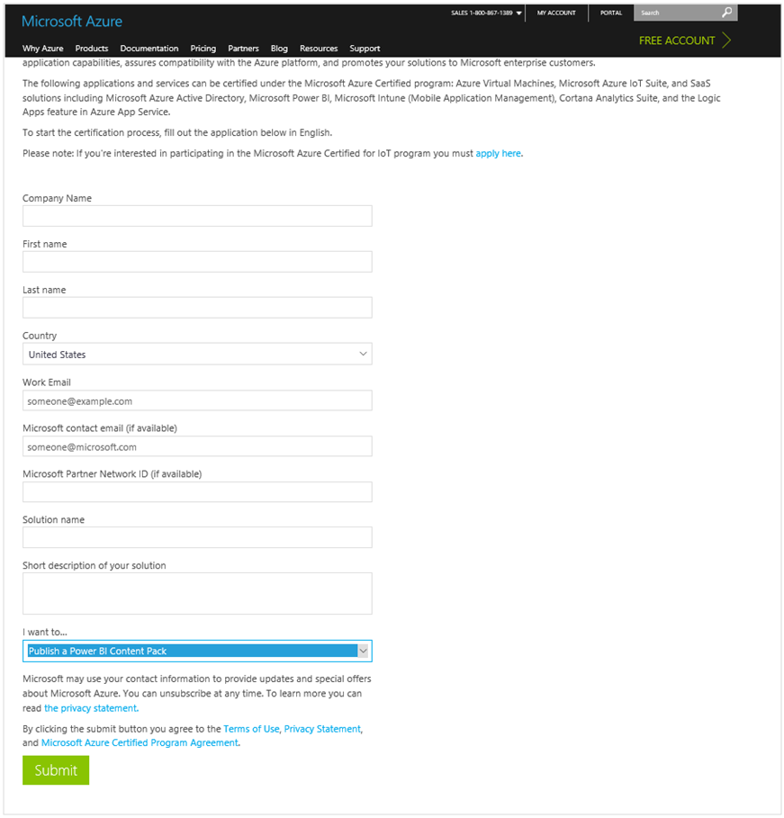

<properties 
   pageTitle="IntelliBoard content pack for Power BI"
   description="IntelliBoard content pack for Power BI"
   services="powerbi" 
   documentationCenter="" 
   authors="theresapalmer" 
   manager="mblythe" 
   backup=""
   editor=""
   tags=""
   qualityFocus="no"
   qualityDate=""/>
 
<tags
   ms.service="powerbi"
   ms.devlang="NA"
   ms.topic="article"
   ms.tgt_pltfrm="NA"
   ms.workload="powerbi"
   ms.date="05/17/2016"
   ms.author="tpalmer"/>

# ISV Content Pack Overview

A content pack is a set of out-of-box content allowing users to immediately gain insights from a source.  A content pack is typically focused on a specific business scenario providing insights for a role, domain, or workflow. 

ISVs can build template content packs that allow customers to connect and instantiate with their own accounts. As domain experts, they can unlock the data in a way that is easily consumable by a business users. The content packs allow offer adhoc monitoring and analysis to your customers without investing heavily in reporting infrastructure. These template content packs are intended to eventually become publically available in the Power BI content pack gallery (app.powerbi.com/getdata/services). An example of the public content pack experience can be found [here](powerbi-developer-content-pack-experience.md).

>**Note:** This requires access to the preview features and therefore initial approval through the [Microsoft Azure Certified](#Nomination) program to access. If you're interested, please submit a nomination.

## Overview
The general process to develop and submit an ISV content pack is as follows:

1.	Submit nomination through Azure Certified
2.	Build content in the Power BI Desktop
3.	Create a dashboard in PowerBI.com
4.	Test the content pack yourself within your organization
5.	Submit the content to Power BI for publishing

## Requirements
To build and submit a content pack, you must meet the following requirements:
-	Business user scenarios that fit well with Power BI  
-	Stable services with an API accessible through public internet  
-	Signed partner agreement for content pack development  

Please review the [authoring](powerbi-developer-content-pack-authoring.md) section for more details on the technical requirements. 

**Note:** If connectivity is not possible to your service through the Power BI Desktop today, please respond to your Azure Certified nomination.

## Business Scenario
Content packs provide insights and metrics focused on a specific business scenario. Understanding your audience and the benefit they'll receive from the content pack will help ensure your users are successfully with the content you provide.

### Tips:
-	Identify your audience and the task they're trying to accomplish
-	Focus on a certain time period (last 90 days) or the last N results
-	Only import the tables/columns related to your scenario
-	Consider offering more than one content pack for separate unique scenarios

## Nomination
Submissions to build a public content pack are collected through the Microsoft Azure Certified program. We currently require an individual submission for each artifact you want to build.

[https://azure.microsoft.com/en-us/marketplace/programs/certified/apply/](https://azure.microsoft.com/en-us/marketplace/programs/certified/apply/)

There are multiple steps to complete the nomination.
-	Submit nomination
-	Complete secondary form
-	Returned a signed agreement
-	Receive approval from Power BI team along with instructions for development
-   Complete pre-requirements in order to publish the content pack (see [submission](powerbi-developer-content-pack-testing.md/#submission)).

 

### Support
For support during development, please use [https://powerbi.microsoft.com/support](https://powerbi.microsoft.com/support). This is actively monitored and managed. Customer incidents quickly find their way to the appropriate team.

Next: [Authoring](powerbi-developer-content-pack-authoring.md)
