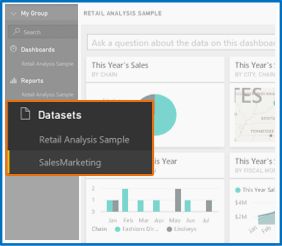
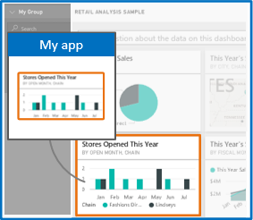
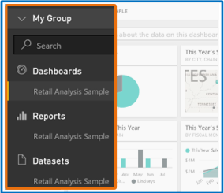
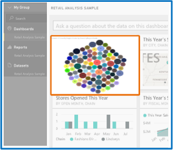

<properties
   pageTitle="Overview of Power BI REST API"
   description="Overview of Power BI REST API"
   services="powerbi"
   documentationCenter=""
   authors="dvana"
   manager="mblythe"
   editor=""
   tags=""/>

<tags
   ms.service="powerbi"
   ms.devlang="NA"
   ms.topic="article"
   ms.tgt_pltfrm="NA"
   ms.workload="powerbi"
   ms.date="02/11/2016"
   ms.author="derrickv"/>

# Overview of Power BI REST API

Power BI displays dashboards that are interactive, and can be created and updated from many different data sources in real time. Using any programming language that supports REST calls, you can create apps that integrate with your Power BI dashboard in real-time. You can also integrate Power BI visuals, tiles and reports, into apps.

## What can I do with the Power BI API?

|[Push data into a Dashboard](https://msdn.microsoft.com/en-us/library/mt203562.aspx) | [Integrate visuals into an app ](powerbi-developer-integrate-a-power-bi-tile-or-report.md)
|---|---
|[**Get Dashboard resources**](https://msdn.microsoft.com/library/mt465742.aspx)| [**Create custom visuals** ](powerbi-custom-visuals-create-for-the-gallery.md)

### With the API, you can also

- [Add rows to a table](https://msdn.microsoft.com/library/mt203561.aspx) and [delete all rows in a table](https://msdn.microsoft.com/en-us/library/mt238041.aspx).
- [List all tables](https://msdn.microsoft.com/library/mt203556.aspx) and [update table schemas](https://msdn.microsoft.com/library/mt203560.aspx).
- [Import from an Excel file or PBIX file](https://msdn.microsoft.com/library/mt203560.aspx).

### Other things you can do to learn about the Power BI API

- **Check out the Power BI projects on GitHub and our samples** - GitHub has many Power BI projects: Go to [GitHub](https://github.com/search?utf8=%E2%9C%93&q=Power+BI) and search “Power BI”. Or, take a look at [our samples](http://go.microsoft.com/fwlink/?LinkId=618971). We have these samples:
	- [Client app sample](https://msdn.microsoft.com/library/mt186159.aspx): A console app that shows you how to authenticate a client app and call all Power BI operations.
	- [Web app sample](https://msdn.microsoft.com/library/mt186158.aspx): A web app that shows you how to authenticate a Power BI web app.

  - [Integrate a Power BI tile into an app](https://msdn.microsoft.com/library/mt576402.aspx): A web app that shows you how to integrate a Power BI tile into an app.
  - [Integrate a Power BI report into an app](https://msdn.microsoft.com/library/mt631357.aspx): A web app that shows you how to integrate a Power BI report into an app.

- [**Try the Power BI REST API**](http://docs.powerbi.apiary.io/) -
In the Apiary interactive API console, you can try all Power BI REST API operations such as [Create Dataset](https://msdn.microsoft.com/library/mt203562.aspx) and [Get Datasets](https://msdn.microsoft.com/library/mt203567.aspx).

## See also
- [Get started creating a Power BI app](powerbi-developer-steps-to-create-a-power-bi-app.md)
- [Power BI REST API reference](https://msdn.microsoft.com/library/mt147898.aspx)
