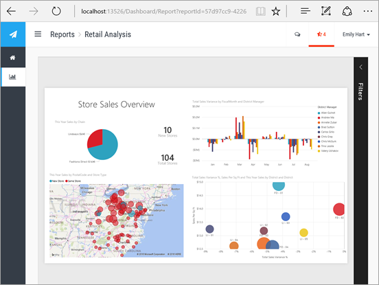
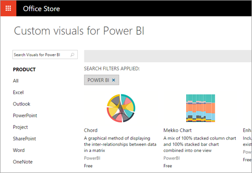

<properties
   pageTitle="What can developers do with Power BI?"
   description="Power BI offers a wide range of options for developers. This ranges from embedding to custom visuals and streaming datasets."
   services="powerbi"
   documentationCenter=""
   authors="guyinacube"
   manager="erikre"
   backup=""
   editor=""
   tags=""
   qualityFocus="no"
   qualityDate=""/>

<tags
   ms.service="powerbi"
   ms.devlang="NA"
   ms.topic="article"
   ms.tgt_pltfrm="NA"
   ms.workload="powerbi"
   ms.date="05/01/2017"
   ms.author="asaxton"/>
# What can developers do with Power BI?

Power BI offers a wide range of options for developers. This ranges from embedding to custom visuals and streaming datasets.

## Embedding

The Power BI service and Power BI Embedded in Azure are coming together to offer a single API for embedding your dashboards and reports. This will allow you flexibility in how you embed your dashboards and reports. For more information, see [Embedding with Power BI](powerbi-developer-embedding.md).

## Custom visuals

Custom visuals allow you to create your own visuals for use within Power BI reports. Custom visuals are written in TypeScript which is a superset of JavaScript that supports some advanced features and early access to ES6/ES7 functionality. Visual styling is handled using cascading styles sheets (css). For your convinence, we use the Less pre-compiler which supports some advanced features such as nesting, variables, mixins, conditions, loops, etc. If you don't want to use any of those features, you can just write plain css in the less file.

For more information about how to develop and publish a custom visual, see [Publish custom visuals to the Office store](powerbi-developer-office-store.md).

## Push data into Power BI

You can use the Power BI API to push data into a dataset. This allows you to add a row to a table within a dataset. The new data can then be reflected in tiles on a dashboard and within visuals within your report.

For more information, see [Push data into a dashboard](powerbi-developer-walkthrough-push-data.md)

## Next steps

[Embedding with Power BI](powerbi-developer-embedding.md)  
[Migrate content from the Power BI Embedded Azure service](powerbi-developer-migrate-from-powerbi-embedded.md)  
[JavaScript API Git repo](https://github.com/Microsoft/PowerBI-JavaScript)  
[Power BI C# Git repo](https://github.com/Microsoft/PowerBI-CSharp)  
[Publish custom visuals to the Office store](powerbi-developer-office-store.md)  
[Power BI Visuals Git repo](https://github.com/Microsoft/PowerBI-visuals)  
[JavaScript embed sample](https://microsoft.github.io/PowerBI-JavaScript/demo/)  
[Power BI API on Apiary](http://docs.powerbi.apiary.io/#)  
More questions? [Try the Power BI Community](http://community.powerbi.com/)