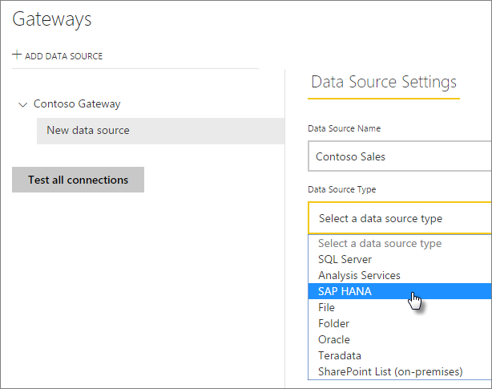
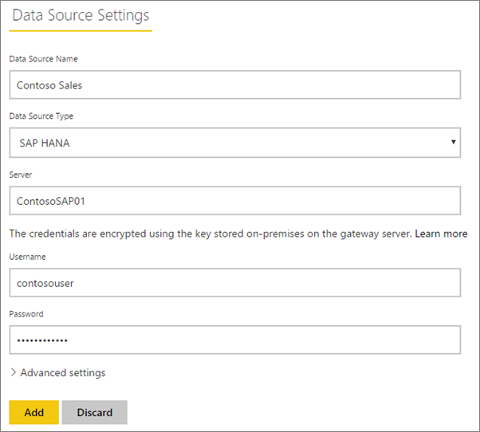

<properties
pageTitle="Manage your enterprise data source - SAP HANA"
description="How to manage the enterprise gateway and data sources that belong to that gateway. This article is specific to SAP HANA."
services="powerbi"
documentationCenter=""
authors="guyinacube"
manager="mblythe"
editor=""
tags=""
qualityFocus="no"
qualityDate=""/>

<tags
ms.service="powerbi"
ms.devlang="NA"
ms.topic="article"
ms.tgt_pltfrm="na"
ms.workload="powerbi"
ms.date="02/09/2016"
ms.author="asaxton"/>
# Manage your enterprise data source - SAP HANA

Once you have installed the Power BI Gateway - Enterprise, you will need to add data sources that can be used with the gateway. This article will look at how to work with gateways and data sources. You can use the SAP HANA data source either for scheduled refresh or for DirectQuery.

## Add a gateway

To add a Gateway, simply [download](https://go.microsoft.com/fwlink/?LinkId=698863) and install the enterprise gateway on a server in your environment. After you have installed the gateway, it will show in the lists of gateways under **Manage gateways**.

> NOTE: **Manage gateways** will not show up until you are the admin of at least one gateway. This can happen either by being added as an admin or you installing and configuring a gateway.

## Remove a gateway

Removing a gateway will also delete any data sources under that gateway.  This will also break any dashboards and reports that rely on those data sources.

1.	Select the gear icon  in the upper-right corner > **Manage gateways**.

2.	Gateway > **Remove**

    

## Add a data source

You can add a data source by either selecting a gateway and click **Add data source**, or go to Gateway > **Add data source**.

You can then select the **Data Source Type** from the list.

You will then want to fill in the information for the data source which includes the **Server**, **Username** and **Password**. 

> NOTE: All queries to the data source will run using these credentials. [Learn more](powerbi-gateway-enterprise.md#credentials)

You can click **Add** after you have everything filled in.  You can now use this data source for scheduled refresh, or DirectQuery, against a SAP HANA server that is on-premises. You will see *Connection Successful* if it succeeded.

### Advanced settings

You can configure the privacy level for your data source. This controls how data can be mashed up. This is only used for scheduled refresh. It does not apply to DirectQuery. [Learn more](https://support.office.com/article/Privacy-levels-Power-Query-CC3EDE4D-359E-4B28-BC72-9BEE7900B540)

## Remove a data source

Removing a data source will break any dashboards or reports that rely on the given data source.  

To remove a Data Source, go to the Data Source > **Remove**.

## Manage administrators

On the Administrators tab, for the gateway, you can add, and remove, users that can administer the gateway. You can only add users at this time. Security groups cannot be added.

## Manage users

On the Users tab, for the data source, you can add, and remove, users, or security groups, that can use this data source.

> NOTE: The users list only controls who are allowed to publish reports. The report owners can create dashboards, or content packs, and share those with other users.

## See Also

[Power BI Gateway – Enterprise](powerbi-gateway-enterprise.md)

[Power BI Gateway - Enterprise in-depth](powerbi-gateway-enterprise-indepth.md)

[Troubleshooting the Power BI Gateway - Enterprise](powerbi-gateway-enterprise-tshoot.md)

[Tools for troubleshooting refresh issues](powerbi-refresh-tools-for-troubleshooting-issues.md)