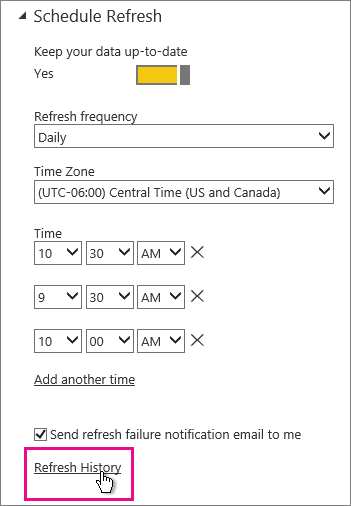
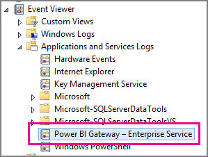

<properties
pageTitle="Troubleshoot the enterprise gateway"
description="Troubleshooting the enterprise gateway"
services="powerbi"
documentationCenter=""
authors="guyinacube"
manager="mblythe"
editor=""
tags=""
qualityFocus="monitoring"
qualityDate="04/04/2016"/>

<tags
ms.service="powerbi"
ms.devlang="NA"
ms.topic="article"
ms.tgt_pltfrm="na"
ms.workload="powerbi"
ms.date="04/13/2016"
ms.author="asaxton"/>
# Troubleshooting the Power BI Gateway - Enterprise

The following goes through some common issues you may encounter when using the Power BI Gateway - Enterprise. 

> **Note**: If you encounter an issue that is not listed below, you can ask for further assistance on the [community site](http://community.powerbi.com/), or you can create a [support ticket](https://powerbi.microsoft.com/support/).

## Update to the latest version 
 
A lot of issues can surface when the gateway version is out of date.  It is a good general practice to make sure you are on the latest version.  If you haven't updated the gateway for a month, or longer, you may want to consider installing the latest version of the gateway and see if you can reproduce the issue.

## Installation

**Error: Failed to add user to group.  (-2147463168   PBIEgwService   Performance Log Users   )**

You may receive this error if you are trying to install the enterprise gateway on a domain controller. Deploying on a domain controller is not supported. You will need to deploy the enterprise gateway on a machine that is not a domain controller.

## Configuration

**How to restart the gateway**

The enterprise gateway runs as a windows service. You can start and stop it like any windows service. There are multiple ways to do this. Here is how you can do it from the command prompt. 

1. On the machine where the enterprise gateway is running, launch an admin command prompt.

2. Use the following command to **stop** the service.

    net stop PBIEgwService
    
3. Use the following command to **start** the service.

    net start PBIEgwService

**Error: Failed to create gateway. Please try again.**

All of the details are available, but the call to the Power BI service returned an error. The error, and an activity id, will be displayed. This could happen for different reasons. You can collect, and review, the logs as mentioned above to get more details. 

This could also be due to proxy configuration issues. The user interface does now allow for proxy configuration. You can learn more about making [proxy configuration changes](powerbi-gateway-proxy.md)

**Error: Failed to update gateway details.  Please try again.**

Information was received from the Power BI service, to the gateway. The information was passed onto the local windows service, but it failed to return. Or, a symmetric key generation failed. The inner exception will be displayed under **Show details**. You can collect, and review, the logs as mentioned above to get more details. 

**Error: Power BI service reported local gateway as unreachable. Please restart the gateway and try again.**

At the end of configuration, the Power BI service will be called again to validate the gateway. The Power BI service does not report the gateway as *live*. Restarting the windows service may allow the communication to be successful. You can collect, and review, the logs as mentioned above to get more details. 

## Data sources

**Error: Unable to Connect. Details: "Invalid connection credentials"**

Within **Show details**, it should display the error message received from the data source. For SQL Server, you should see something like the following.

    Login failed for user 'username'.

Verify that you have the correct username and password. Also verify that those credentials can successfully connect to the data source. Make sure the account being used matches the **Authentication Method**.

**Error: Unable to Connect. Details: "Cannot connect to the database"**

We were able to connect to the server, but not to the database supplied. Verify the name of the database, and that the user credential as the proper permission to access that database.

Within **Show details**, it should display the error message received from the data source. For SQL Server, you should see something like the following.

    Cannot open database "AdventureWorks" requested by the login. The login failed. Login failed for user 'username'.

**Error: Unable to Connect. Details: "Unknown error in enterprise gateway"**

This error could occur for different reasons. Be sure to validate that you can connect to the data source from the machine hosting the gateway. This could be the result of the server not being accessible.

Within **Show details**, you will see an error code of **DM_GWPipeline_UnknownError**.

You can also look in the Event Logs > **Applications and Services Logs** > **Power BI Enterprise Gateway Service** for more details.

**Error: We encountered an error while trying to connect to <server>. Details: "We reached the enterprise gateway, but the gateway can't access the on-premises data source."**

We were unable to connect to the specified data source. Be sure to validate the information provided for that data source.

Within **Show details**, you will see an error code of **DM_GWPipeline_Gateway_DataSourceAccessError**. 

If the underlying error message is similar to the following, this means that the account you are using for the data source is not a server admin for that Analysis Services instance. [Learn more](powerbi-gateway-enterprise-manage-ssas.md#add-a-data-source)

    The 'CONTOSO\account' value of the 'EffectiveUserName' XML for Analysis property is not valid.

**Unable to see enterprise gateway data sources in the 'Get Data' experience for Analysis Services from the Power BI site**

We haven’t yet integrated data sources from the enterprise gateway into the *Get Data* experience for Analysis Services from Power BI web. This will be coming soon.

To make use of data sources for Analysis Services, you can create a report within Power BI Desktop. Be sure that you select live data for Analysis Services. Then publish it to Power BI and it will make use of the enterprise gateway.

## Dataset

**Error: Couldn't refresh because your Personal Gateway is offline. Make sure your Personal Gateway is up and running.**

You may have configured an enterprise gateway, and see this error for a given dataset when you try to refresh. The enterprise gateway currently does not support imported data. It supports SQL Server and SAP HANA in DirectQuery mode, or live connections with Analysis Services, either Tabular or Multidimensional.

If you have imported data into your file, you will need the Personal Gateway to refresh the dataset.

## Reports

**Report could not access the data source because you do not have access to our data source via an enterprise gateway.**

This is usually caused by one of the following. 

1. The data source information does not match what is in the underlying dataset. The server and database name need to match between the data source defined for the enterprise gateway and what you supply within Power BI Desktop. If you use an IP Address in Power BI Desktop, the data source, for the enterprise gateway, needs to use an IP Address as well.

2. There is not a data source available on any enterprise gateway within your organization. You can configure the data source on a new, or existing, enterprise gateway.

## Firewall

You can test to see if your firewall may be blocking conections by running the following command from a PowerShell prompt. This will test connectivity to the Azure Service Bus.

    Test-NetConnection -ComputerName watchdog.servicebus.windows.net -Port 9350

The results should look similar to the following. The difference will be with TcpTestSucceeded. If **TcpTestSucceeded** is not *true*, then you may be blocked by a firewall.

    ComputerName           : watchdog.servicebus.windows.net
    RemoteAddress          : 70.37.104.240
    RemotePort             : 5672
    InterfaceAlias         : vEthernet (Broadcom NetXtreme Gigabit Ethernet - Virtual Switch)
    SourceAddress          : 10.120.60.105
    PingSucceeded          : False
    PingReplyDetails (RTT) : 0 ms
    TcpTestSucceeded       : True

If you want to be exhaustive, substitute the **ComputerName** and **Port** values with those listed for [ports](powerbi-gateway-enterprise.md/#ports)

## Tools for troubleshooting

### Collecting logs from the gateway configurator

There are several logs you can collect for the enterprise gateway. Always start with the logs!

**Installer logs**

    %localappdata%\Temp\Power_BI_Gateway_–_Enterprise*.log

**Configuration logs**

    %localappdata%\Microsoft\Power BI Enterprise Gateway\GatewayConfigurator*.log

**Enterprise gateway service logs**

    C:\Users\PBIEgwService\AppData\Local\Microsoft\Power BI Enterprise Gateway\EnterpriseGateway*.log

### Refresh History  
When using the enterprise gateway for scheduled refresh, **Refresh History** can help you see what errors have occurred, as well as provide useful data if you should need to create a support request. You can view both scheduled, as well as on demand, refreshes. Here is how you can get to the **Refresh History**.

1.  In the Power BI navigation pane, in **Datasets**, select a dataset &gt; Open Menu &gt; **Schedule Refresh**.

    

2.  In **Settings for...** &gt; **Schedule Refresh**, select **Refresh History**.

    

    

### Event Logs  
The **Data Management Gateway** and **PowerBIGateway** logs are present under **Application and Services Logs**.

### Fiddler Trace  
[Fiddler](http://www.telerik.com/fiddler) is a free tool from Telerik that monitors HTTP traffic.  You can see the back and forth with the Power BI service from the client machine. This may show errors and other related information.

## See also

[Configuring proxy settings for the Power BI Gateways](powerbi-gateway-proxy.md)

[Power BI Gateway – Enterprise](powerbi-gateway-enterprise.md)

[Power BI Gateway - Enterprise in-depth](powerbi-gateway-enterprise-indepth.md)

[Manage your enterprise data source - Analysis Services](powerbi-gateway-enterprise-manage-ssas.md)

[Manage your enterprise data source - SAP HANA](powerbi-gateway-enterprise-manage-sap.md)

[Manage your enterprise data source - SQL Server](powerbi-gateway-enterprise-manage-sql.md)

[Manage your enterprise data source - Import/Scheduled refresh](powerbi-gateway-enterprise-manage-scheduled-refresh.md)
