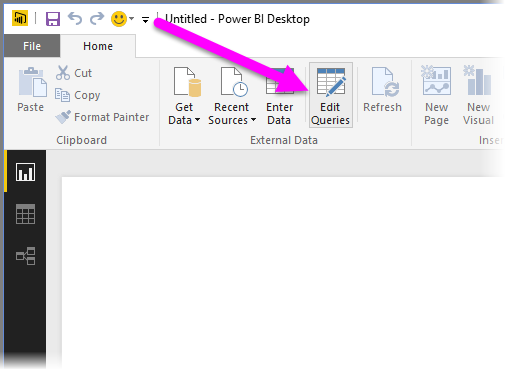
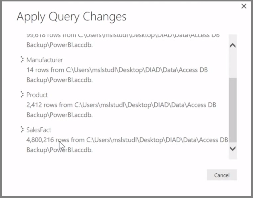

<properties
   pageTitle="Clean and Transform Your Data With the Query Editor"
   description="Get data in shape for use with Power BI"
   services="powerbi"
   documentationCenter=""
   authors="davidiseminger"
   manager="mblythe"
   backup=""
   editor=""
   tags=""
   qualityFocus="no"
   qualityDate=""
   featuredVideoId="o-sinon5JYY"
   courseDuration="8m"/>

<tags
   ms.service="powerbi"
   ms.devlang="NA"
   ms.topic="article"
   ms.tgt_pltfrm="NA"
   ms.workload="powerbi"
   ms.date="03/28/2016"
   ms.author="davidi"/>

# Clean and Transform Your Data With the Query Editor

**Power BI Desktop** includes **Query Editor**, a powerful tool for shaping and transforming data so it's ready for your models and visualizations. When you select Edit from Navigator, Query Editor launches and is populated with the tables or other entities you selected from your data source.

You can also launch **Query Editor** directly from **Power BI Desktop**, using the **Edit Queries** button on the **Home** ribbon.

Once Query Editor is loaded with data that's ready for you to shape, you see a handful of sections:

1.  In the ribbon, many buttons are now active to interact with the data in the query
2.  In the left pane, queries (one for each table, or entity) are listed and available for selection, viewing, and shaping
3.  In the center pane, data from the selected query is displayed and available for shaping
4.  The Query Settings window appears, listing the query’s properties and applied steps

In the center pane, right-clicking on a column displays a number of different available transformations, such as removing the column from the table, duplicating the column under a new name, and replacing values. From this menu you can also split text columns into multiples by common delimiters.

The **Query Editor** ribbon contains additional tools, such as changing the data type of columns, adding scientific notation, or extracting elements from dates, such as day of the week.

As you apply transformations, each step appears in the **Applied Steps** list in the **Query Settings** pane on the right side of **Query Editor**. You can use this list to undo or review specific changes, or even change the name of a step. To save your transformations, select **Close & Apply** on the **Home** tab.

Once you select **Close & Apply**, Query Editor applies the query changes you made, and applies them to Power BI Desktop.

There are all sorts of things you can do when transforming data in **Query Editor**, including advanced transformations. In the next section, we take a look at a few of those advanced transformations, to give you a sense of the almost immeasurable ways you can transform your data with **Query Editor**.
