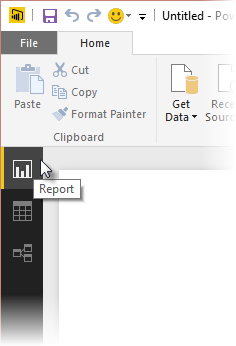
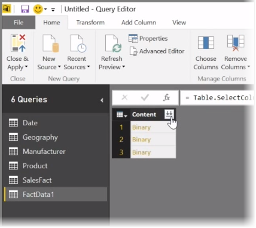
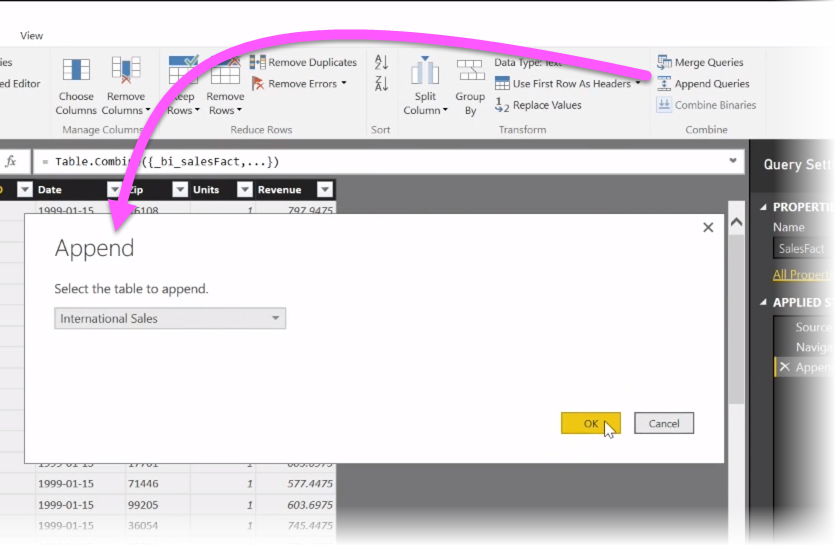

<properties
   pageTitle="More Advanced Data Sources and Transformation"
   description="Connect and combine two data sources - it's easy"
   services="powerbi"
   documentationCenter=""
   authors="davidiseminger"
   manager="erikre"
   backup=""
   editor=""
   tags=""
   qualityFocus="no"
   qualityDate=""
   featuredVideoId="8WsY0R2V_bw"
   courseDuration="8m"/>

<tags
   ms.service="powerbi"
   ms.devlang="NA"
   ms.topic="get-started-article"
   ms.tgt_pltfrm="NA"
   ms.workload="powerbi"
   ms.date="06/06/2017"
   ms.author="davidi"/>

# More Advanced Data Sources and Transformation

In this article, we investigate some advanced data import and cleaning techniques for **Power BI Desktop**. Once you've shaped your data in **Query Editor** and brought it into **Power BI Desktop**, you can look at it in a few different ways. There are three views in Power BI Desktop: **Report** view, **Data** view, and **Relationships** view. You see each view by selecting its icon in the upper left side of the canvas. In the following image, **Report** view is selected. The yellow bar beside the icon indicates which view is active.

To change the view, just select either of other two icons. The yellow bar beside the icon indicates which view is active.

Power BI Desktop can combine data from multiple sources into a single report, at any time during the modelling process. To add additional sources to an existing report, select **Edit Queries** in the **Home** ribbon and then select **New Source** in **Query Editor**.

There are many different possible data sources you can use in **Power BI Desktop**, including Folders. By connecting to a folder, you can import data from multiple files at once, such as a series of Excel files of CSV files. The files contained within your selected folder appear in **Query Editor** as binary content, and clicking the double-arrow icon at the top of the **Content** column loads their values.

One of Power BI's most useful tools is its *Filters*. For example, selecting the drop-down arrow next to a column opens a checklist of text filters that you can use to remove values from your model.

You can also merge and append queries, and turn multiple tables (or data from various files, in folders) into a single table that contains just the data you want. You can use the **Append Queries** tool to add the data from a new table to an existing query. Power BI Desktop attempt to match up the columns in your queries, which you can then adjust as necessary in **Query Editor**.

Finally, the **Add Custom Column** tool gives advanced users the option of writing query expressions from scratch using the powerful M language. You can add a custom column based on M query language statements, and get your data just the way you want it.

