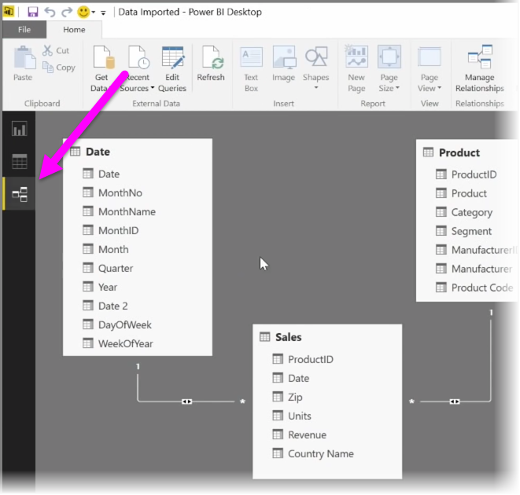

<properties
   pageTitle="How to Manage Your Data Relationships"
   description="See and manage data relationships in Power BI"
   services="powerbi"
   documentationCenter=""
   authors="davidiseminger"
   manager="mblythe"
   backup=""
   editor=""
   tags=""
   qualityFocus="no"
   qualityDate=""
   featuredVideoId="qPQ6iXGf0Pc"
   featuredVideoThumb=""
   courseDuration="9m"/>

<tags
   ms.service="powerbi"
   ms.devlang="NA"
   ms.topic="article"
   ms.tgt_pltfrm="NA"
   ms.workload="powerbi"
   ms.date="03/28/2016"
   ms.author="davidi"/>

# How to Manage Your Data Relationships

Power BI allows you to visually set the relationship between tables or elements. To see a diagrammatic view of your data, use the **Relationship view**, found on the far left side of the screen next to the Report canvas.

From the **Relationships** view, you can see a block that represents each table and its columns, and lines between them to represent relationships.

Adding and removing relationships is simple. To remove a relationship, right-click on it and select **Delete**. To create a relationship, drag and drop the fields that you want to link between tables.

To hide a table or individual column from your report, right-click on it in the Relationship view and select **Hide in Report View**.

For a more detailed view of your data relationships, select **Manage Relationships** in the **Home** tab. This will open the **Manage Relationships** dialog, which displays your relationships as a list instead of a visual diagram. From here you can select **Autodetect** to find relationships in new or updated data. Select **Edit** in the **Manage Relationships** dialog to manually edit your relationships. This is also where you can find advanced options to set the *Cardinality* and *Cross-filter* direction of your relationships.

Your options for Cardinality are *Many to One*, and *One to One*. *Many to One* is the fact to dimension type relationship, for example a sales table with multiple rows per product being matched up with a table listing products in their own unique row. *One to One* is used often for linking single entries in reference tables.

By default, relationships will be set to cross-filter in both directions. Cross-filtering in just one direction limited some of the modeling capabilities in a relationship.

Setting accurate relationships between your data allows you to create complex calculations across multiple data elements.
