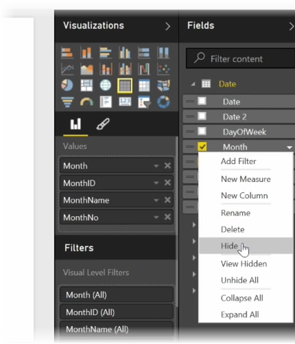
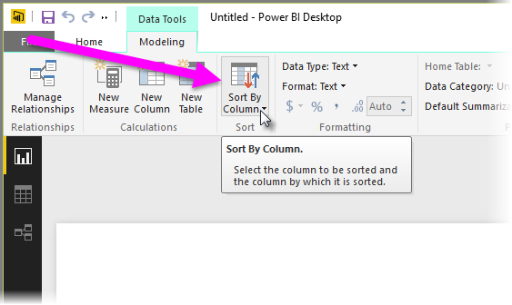
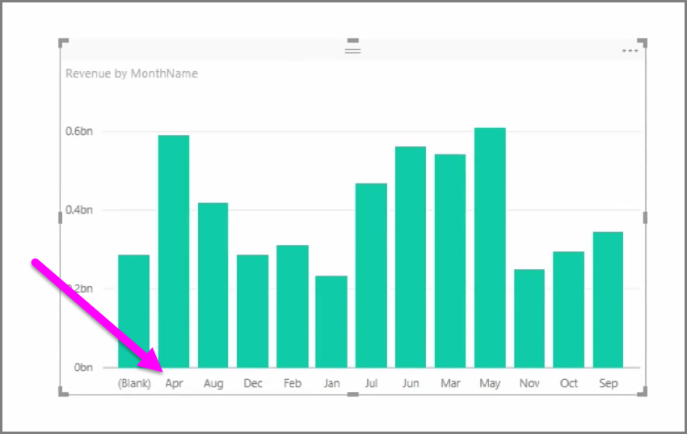
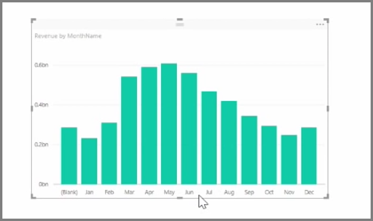

<properties
   pageTitle="Optimizing Data Models"
   description="Optimize your data to make creating and viewing visuals easier"
   services="powerbi"
   documentationCenter=""
   authors="davidiseminger"
   manager="mblythe"
   editor=""
   tags=""
   featuredVideoId="tDcrfnjjlgk"
   featuredVideoThumb=""
   courseDuration="8m"/>

<tags
   ms.service="powerbi"
   ms.devlang="NA"
   ms.topic="article"
   ms.tgt_pltfrm="NA"
   ms.workload="powerbi"
   ms.date="02/18/2016"
   ms.author="v-jescoo"/>

# Optimizing Data Models for Better Visuals

Imported data often contains fields that you don't actually need for your reporting and visualization tasks, either because it's extra information, or because that data is already available in another column. Power BI Desktop has tools to optimize your data, and make it more usable for you to create reports and visuals, and for viewing your shared reports.

## Hiding fields

To hide a column in the **Fields** pane of Power BI Desktop, right-click on it and select **Hide**. Note that your hidden columns are not deleted; if you've used that field in existing visualizations, the data is still in that visual, and you can still use that data in other visualizations too, the hidden field just isn't displayed in the **Fields** pane.

If you view tables in the **Relationships** view, hidden fields are indicated by being grayed out. Again, their data is still available and is still part of the model, they're just hidden from view. You can always unhide any field that has been hidden by right-clicking the field, and selecting **unhide**.

## Sorting visualization data by another field

The **Sort by Column** tool, available in the **Modeling** tab, is very useful to ensure that your data is displayed in the order you intended.

As a common example, data that includes the name of the month is sorted alphabetically by default, so for example, "August"  appears before "February".

In this case, selecting the field in the Fields list, then selecting **Sort By Column** from the **Modeling** tab and then choosing a field to sort by can remedy the problem. In this case, the "MonthNo" category sort option orders the months as intended.

Setting the data type for a field is another way to optimize your information so it's handled correctly. To change a data type from the report canvas, select the column in the **Fields** pane, and then use the **Format** drop-down menu to select one of the formatting options. Any visuals you've created that display that field are updated automatically.
