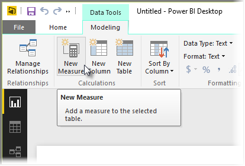
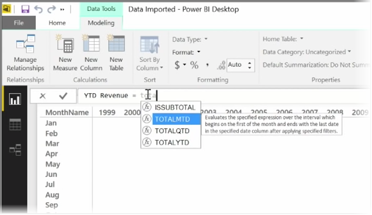
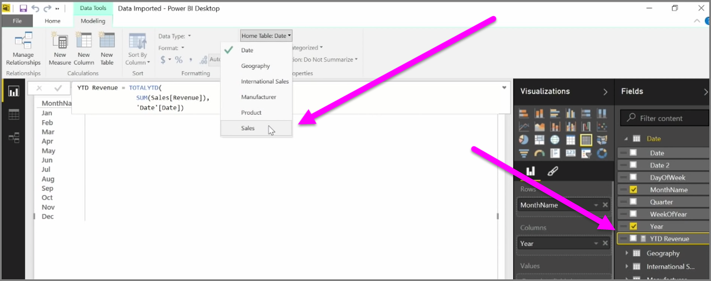

<properties
   pageTitle="Create Calculated Measures"
   description="Define custom calculations to evaluate time-based functions"
   services="powerbi"
   documentationCenter=""
   authors="davidiseminger"
   manager="mblythe"
   editor=""
   tags=""
   featuredVideoId="yn2bXVQJLx8"
   featuredVideoThumb=""
   courseDuration="14m"/>

<tags
   ms.service="powerbi"
   ms.devlang="NA"
   ms.topic="article"
   ms.tgt_pltfrm="NA"
   ms.workload="powerbi"
   ms.date="03/28/2016"
   ms.author="davidi"/>

# Create measures and work with time-based functions

A *measure* is a calculation that exists in your Power BI data model. To create a measure, in **Report** view select **New Measure** from the **Modeling** tab.

One of the great things about DAX, the Data Analysis Expression language in Power BI, is that it has lots of useful functions, particularly around time-based calculations such as *Year to Date* or *Year Over Year*. With DAX you can define a measure of time once, and then slice it by as many different fields as you want from your data model.

In Power BI, a defined calculation is called a *measure*. To create a *measure*, select **New Measure** from the **Home** tab. This opens the Formula bar where you can enter the DAX expression that defines your measure. As you type, Power BI suggests relevant DAX functions and data fields as you enter your calculation, and you'll also get a tooltip explaining some of the syntax and function parameters.

If your calculation is particularly long, you can add extra line breaks in the Expression Editor by typing **ALT-Enter**.

Once you've created a new measure, it will appear in one of the tables the **Fields** pane, found on the right side of the screen. Power BI inserts the new measure into whichever table you have currently selected, and while it doesn't matter exactly where the measure is in your data, you can easily move it by selecting the measure and using the **Home Table** drop-down menu.

You can use a measure like any other table column: just drag and drop it onto the report canvas or visualization fields. Measures also integrate seamlessly with slicers, segmenting your data on the fly, which means you can define a measure once, and use it in many different visualizations.

The **Calculate** DAX function is a powerful function that enables all sorts of useful calculations, which is especially useful for financial reporting and visuals.
