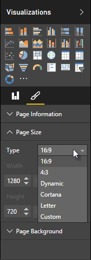

<properties
   pageTitle="Page Layout and Formatting"
   description="Display your reports and dashboards how you want them"
   services="powerbi"
   documentationCenter=""
   authors="davidiseminger"
   manager="mblythe"
   backup=""
   editor=""
   tags=""
   qualityFocus="no"
   qualityDate=""
   featuredVideoId="5tg-OXzxe2g"
   featuredVideoThumb=""
   courseDuration="5m"/>

<tags
   ms.service="powerbi"
   ms.devlang="NA"
   ms.topic="get-started-article"
   ms.tgt_pltfrm="NA"
   ms.workload="powerbi"
   ms.date="12/01/2016"
   ms.author="davidi"/>

# Style Your Reports With page layout and formatting

Power BI Desktop gives you the ability to control the layout and formatting of your report pages, such as size and orientation.

Use the **Page View** menu from the Home tab to change the way your report pages scale. The available options include **Fit To Page** (default), **Fit To Width**, and **Actual Size**.

You can also change the pages size itself. By default, report pages are 16:9. To change the page size, make sure no visuals are selected, then select the paintbrush icon in the Visualizations pane, then select **Page Size** to expand that section.

Options for page size include 4x3 (more square aspect ratio), and Dynamic (the page will stretch to fill the available space). There's a standard letter size for reports as well. Keep in mind that you may need to resize your visuals after changing the page size to ensure that they're completely on the canvas.

You can also specify a custom page size, setting the size by inches or pixels, and change the background color of the entire report.

Another option is to select Cortana, which sizes the report so that it can be used as a result for searches using Cortana.
