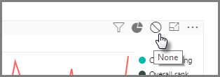
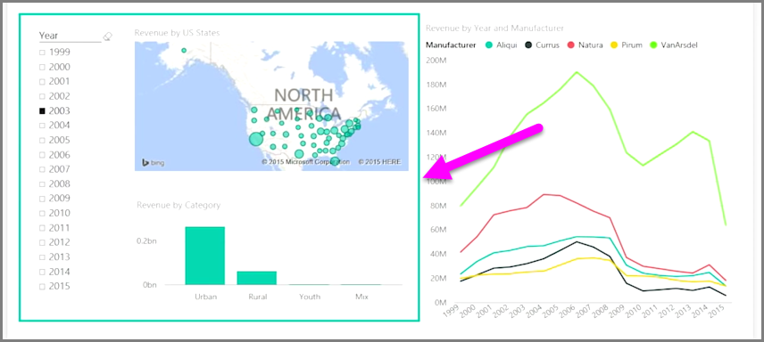

<properties
   pageTitle="Group interactions among visualizations"
   description="Specify which visuals interact on a dashboard, and which do not"
   services="powerbi"
   documentationCenter=""
   authors="davidiseminger"
   manager="mblythe"
   backup=""
   editor=""
   tags=""
   qualityFocus="no"
   qualityDate=""
   featuredVideoId="N_xYsCbyHPw"
   featuredVideoThumb=""
   courseDuration="9m"/>

<tags
   ms.service="powerbi"
   ms.devlang="NA"
   ms.topic="get-started-article"
   ms.tgt_pltfrm="NA"
   ms.workload="powerbi"
   ms.date="12/01/2016"
   ms.author="davidi"/>

# Create Complex Interactions Between Visualizations

When you have multiple visualizations on the same report page, selecting a particular segment by clicking or using a slicer will affect all the visuals on that page. In some cases, though, you may want to slice only specific visuals. This is particularly true when using elements such as scatter plots, where limiting the data to a specific segment will remove crucial meaning. Fortunately, Power BI Desktop lets you control how interactions flow between visuals.

To change the interaction between your visualizations, select **Edit** from the Visuals section of the **Home** ribbon to toggle **Edit Mode** on.

> Note: The **Edit Interactions** icon in Power BI Desktop has changed since the video was recorded.

Now when you select a visual on your report canvas, you'll see a small opaque *filter* icon in the top right-hand corner of every other visual it will affect. To exclude a visual from the interaction, click the *None* symbol in the upper right corner, near the *filter* icon.

In some instances you can adjust the type of filter interaction that happens between visuals. With **Edit Mode** toggled on, select the visual you use to filter. If you can change the type of interaction on another visual, a *pie chart* icon will appear next to the filter icon in the top right-hand corner.

Click the *pie chart* icon to highlight the segmented data. Otherwise, the data will be filtered. As before, you can click the *None* icon to remove all interaction.

A useful design tip is to draw a transparent shape around visuals that interact with each other, so it's clear to the user that they have an interactive relationship.

