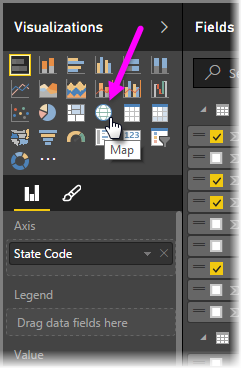
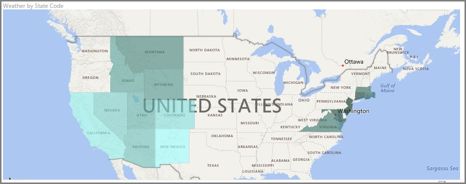
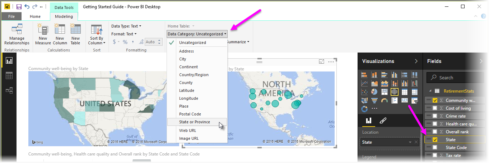

<properties
   pageTitle="Map visualizations"
   description="Bring reports to life with interactive map visuals"
   services="powerbi"
   documentationCenter=""
   authors="davidiseminger"
   manager="mblythe"
   backup=""
   editor=""
   tags=""
   qualityFocus="no"
   qualityDate=""
   featuredVideoId="mGkdiZF8GEM"
   featuredVideoThumb=""
   courseDuration="11m"/>

<tags
   ms.service="powerbi"
   ms.devlang="NA"
   ms.topic="get-started-article"
   ms.tgt_pltfrm="NA"
   ms.workload="powerbi"
   ms.date="06/20/2016"
   ms.author="davidi"/>

# How to Use Map Visualizations

Power BI has two different types of map visualizations: a bubble map that places a bubble over a geographic point, and a shape map that actually shows the outline of area you want to visualize.

## Create bubble maps

To create a bubble map, select the **Map** option in the **Visualization** pane. You must add a value to the *Location* bucket in the **Visualizations** options to use a map visual.

Power BI is flexible about what type of location value it accepts, from more general details like city name or airport code, down to very specific latitude and longitude data. Add a field to the **Values** bucket to change the size of the bubble accordingly for each map location.

## Create shape maps

To create a shape map, select the **Filled Map** option in the Visualization pane. As with bubble maps, you must add some kind of value to the Location bucket to use this visual. Add a field to the Values bucket to change the intensity of the fill color accordingly.

A warning icon in the top left corner of your visual indicates that the map needs more location data to accurately plot values. This is a particularly common problem when the data in your location field is ambiguous, such as using an area name like *Washington* that could indicate a state or a district. One way to resolve this problem is to rename your column to be more specific, such as *State*. Another way to resolve it is to manually reset the data category by selecting **Data Category** in the Modeling tab. From there you can assign a category to your data such as "State" or "City".

