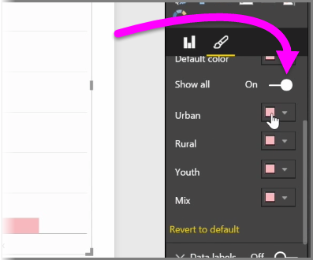
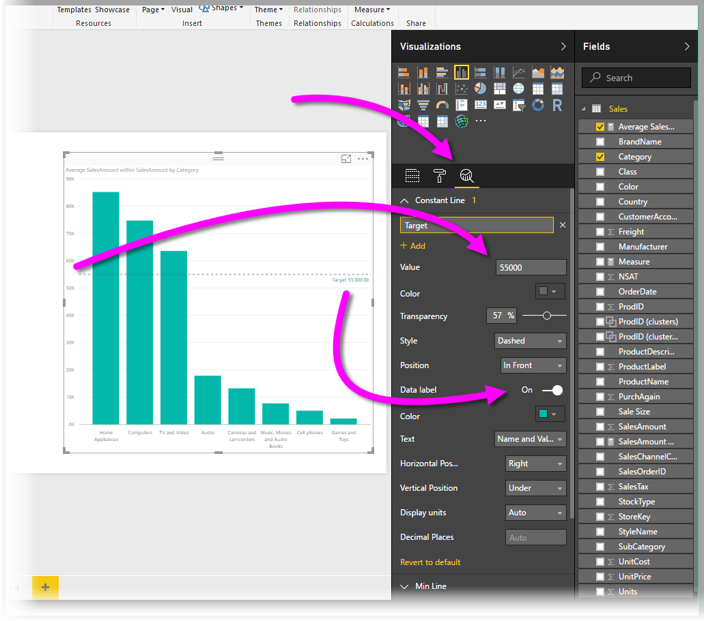
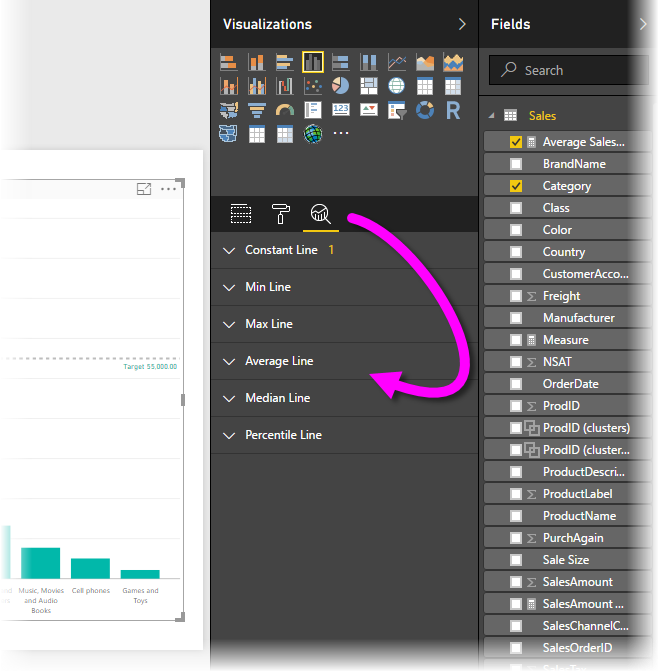

<properties
   pageTitle="Modify colors in charts and visuals"
   description="Color your visual world with colors, shades, and scale"
   services="powerbi"
   documentationCenter=""
   authors="davidiseminger"
   manager="erikre"
   backup=""
   editor=""
   tags=""
   qualityFocus="no"
   qualityDate=""
   featuredVideoId="oNME83EAvLw"   
   featuredVideoThumb=""
   courseDuration="5m"/>

<tags
   ms.service="powerbi"
   ms.devlang="NA"
   ms.topic="get-started-article"
   ms.tgt_pltfrm="NA"
   ms.workload="powerbi"
   ms.date="09/06/2017"
   ms.author="davidi"/>

# How to modify colors in charts and visuals

There are many times when you might want to modify the colors used in charts or visuals. Power BI gives you lots of control over how colors are displayed. To get started, select a visual then in the **Visualizations** pane, click the **paintbrush** icon.

There are many options for changing the colors or formatting of the visual. You can change the color of all bars of a visual by selecting the color picker beside **Default color**, then selecting your color of choice.

You can also change the color of each bar (or other element, depending on the type of visual you selected) by toggling the **Show all** slider to on. When you do, a color selector appears for each element.

You can also change the color based on a value, or measure. To do so, drag a field into the **Color saturation** bucket in the Visualizations pane (note that this is available in the **field well** section, not the **paintbrush** section).

In addition, you can change the scale and the colors that are used when filling data element colors. You can also select a diverging scale by toggling the Diverging slider to on, which lets the color scale between three colors. And you can also set *Minimum*, *Center*, and *Maxumum* values displayed on your chart.

You can also use those values to create rules, for example, to set values above zero a certain color, and values below to another color.

Another handy tool for using colors is setting a *constant line*, also sometimes referred to as a *reference line*. You can set the value of the constant line, set its color, and even have the reference line contain a label. To create a constant line (and other interesting lines), select the **Analytics pane** (looks like a magnifying glass) then expand the **Reference Line** section.

There are many other lines you can create for a visual, also found in the **Analytics pane**, such as Min, Max, Average, Median, and Percentile lines.

Lastly, you can create a border around an individual visualization, and like other controls, you can specify the color of that border as well.
