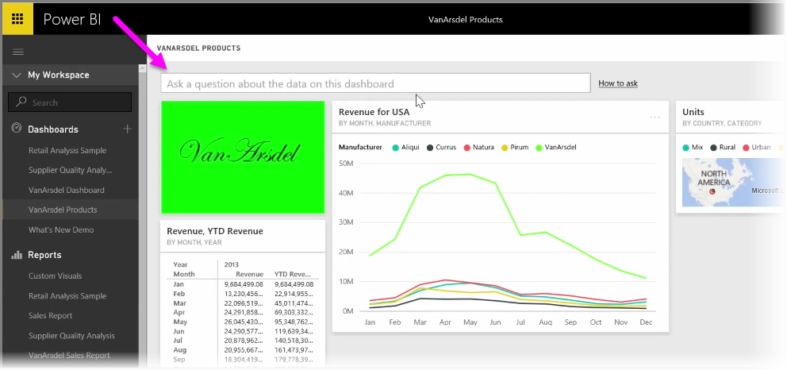
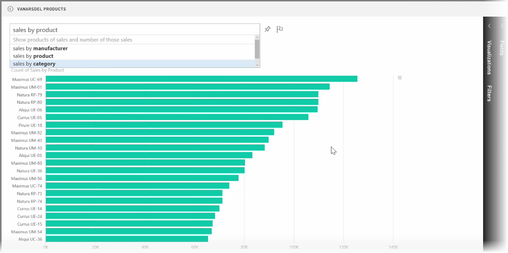

<properties
   pageTitle="Ask Questions of Your Data With Natural Language"
   description="Ask questions and create new visuals with natural language."
   services="powerbi"
   documentationCenter=""
   authors="davidiseminger"
   manager="mblythe"
   editor=""
   tags=""
   featuredVideoId="boDGFL58VBc"
   featuredVideoThumb=""
   courseDuration=""/>

<tags
   ms.service="powerbi"
   ms.devlang="NA"
   ms.topic="article"
   ms.tgt_pltfrm="NA"
   ms.workload="powerbi"
   ms.date="02/19/2016"
   ms.author="v-jescoo"/>

# Ask Questions of Your Data With Natural Language

Power BI comes with a powerful language recognition engine that lets you ask questions of your data using conversational phrases and questions. So along with building reports and visualizations with Power BI, you can create charts and graphs just by asking simple questions.

To ask a question of your data, open a dashboard in Power BI and the top of the screen you'll see an input box, where you can ask questions about the displayed data. This feature is sometimes referred to as *Questions & Answers*, or more often, this feature is just referred to as **Q&A**.

When you click in the box, Power BI displays prompts with some suggested terms based on your data, such as "YTD revenue". You can click on a suggested term to see the result, often displayed as a simple table or card. When you select one of the suggested phrases, Power BI automatically creates a visual based on your selection, in real time.

You can also ask questions using natural language, such as "What was our revenue last year?" or "What product had the highest sales in March 2014?". Power BI displays its interpretation of your question, and chooses the best type of visual to represent the answer. And just like any other visual in Power BI, you can **pin** it to the dashboard of your choice by selecting the **pin** icon.

At any point along the way, you can edit the visual created by your natural language question or phrase. Just use the **Visualizations** and **Fields** panes on the right side of the screen. Like any other visual in Power BI, you can alter the layout, adjust filters, and change the field inputs.

To save the visualization to a dashboard once you've created the perfect visual, just select the **pin** icon next to the question input box.
