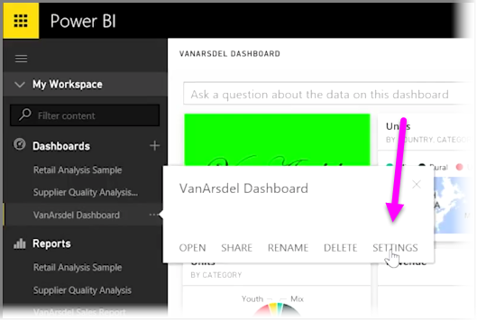
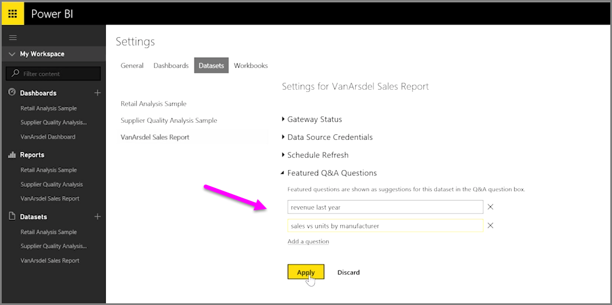

<properties
   pageTitle="Create Custom Q & A Suggestions"
   description="Add your own questions to suggested Q & A dashboard prompts"
   services="powerbi"
   documentationCenter=""
   authors="davidiseminger"
   manager="mblythe"
   backup=""
   editor=""
   tags=""
   qualityFocus="no"
   qualityDate=""
   featuredVideoId="E1mIAyEXuF4"
   featuredVideoThumb=""
   courseDuration="4m"/>

<tags
   ms.service="powerbi"
   ms.devlang="NA"
   ms.topic="get-started-article"
   ms.tgt_pltfrm="NA"
   ms.workload="powerbi"
   ms.date="06/06/2017"
   ms.author="davidi"/>

# Create Custom Q&A Suggestions

With Power BI, you can add your own suggested questions for other users who use the natural language query box for a dashboard, frequently referred to as the **Q&A** box. These suggested questions are what users will see when they click on the input box at the top of a dashboard.

To add your own questions, select the ellipses (the three dots ...) next to the name of the dashboard you want to use, and select **Settings** from the menu.

 This opens the **Settings** page for the dashboard and underlying datasets or workbooks. You can disable the Q&A search input box completely from the **Dashboards** section of the **Settings** page, but we want to add questions, so we select the **Datasets** section.

In the **Datasets** section, all datasets associated with the Dashboard are displayed. Select the dataset associated with your dashboard from the list,  select **Featured Q&A Questions**, then select the **Add a question** link. Enter your question or prompt into the input box and select **Apply**.

Now any time someone clicks on the search input box on the selected dashboard, they'll see your suggested entries at the top of the prompt list, and selecting that question will take them right through to the Q&A answer. This is a valuable way to get dashboard users thinking about the type of data available, and how they can best use it.
