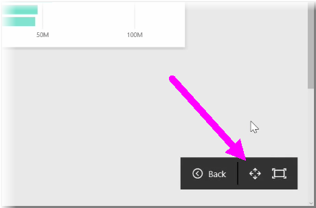

<properties
   pageTitle="Get more space on your dashboard"
   description="Use Full Screen mode to manage your dashboard space more effectively"
   services="powerbi"
   documentationCenter=""
   authors="davidiseminger"
   manager="mblythe"
   editor=""
   tags=""
   featuredVideoId="LF-Ti8FTkpQ"
   featuredVideoThumb=""
   courseDuration="5m"/>

<tags
   ms.service="powerbi"
   ms.devlang="NA"
   ms.topic="article"
   ms.tgt_pltfrm="NA"
   ms.workload="powerbi"
   ms.date="03/28/2016"
   ms.author="davidi"/>

# Get More Space on Your Dashboard

*See how to display your entire dashboard with Full Screen Mode*

You may find that occasionally when you create your dashboards, you have more content than what can fit on your canvas. There are a few solutions that help you manage how your dashboard space is displayed, so you can get a full view of your dashboard content.

The easiest method to display your entire dashboard in one screen is selecting the **Full Screen Mode** button in the top right-hand corner of the dashboard.

Selecting the **Full Screen Mode** button puts your browser into full screen mode, removing all chrome elements from around the dashboard, and thereby increasing the amount of viewable space.

From within **Full-Screen Mode**, you can select the **Fit to Screen** option to shrink all of your tiles so they fit on a single screen, without the need for scrollbars. This is commonly called *TV mode*, and is useful for giving presentations with dashboards, or displaying a dashboard on hallway monitors.

Another way to manage dashboard space is collapsing the Navigation pane on the left-hand side of the page, by selecting the hamburger icon. To expand the navigation pane, click the icon again.

You can ensure that a dashboard will always have a collapsed navigation bar by appending the following to the end of the URL:

>?collapseNavigation=true

Users who follow that link will open the dashboard with a collapsed navigation bar.
