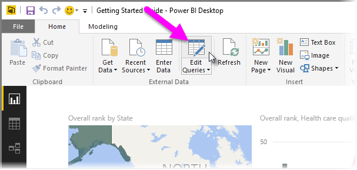
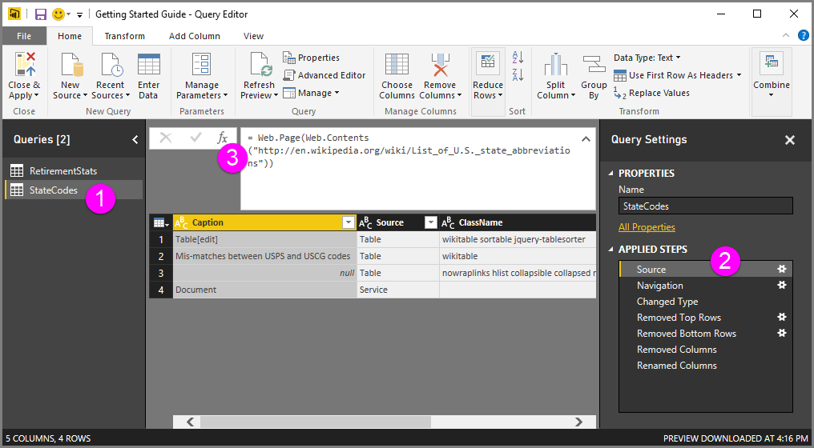
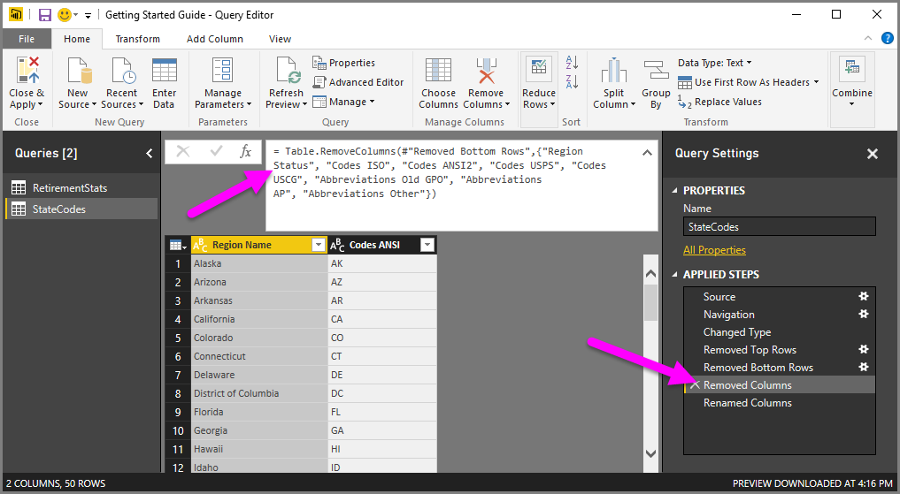
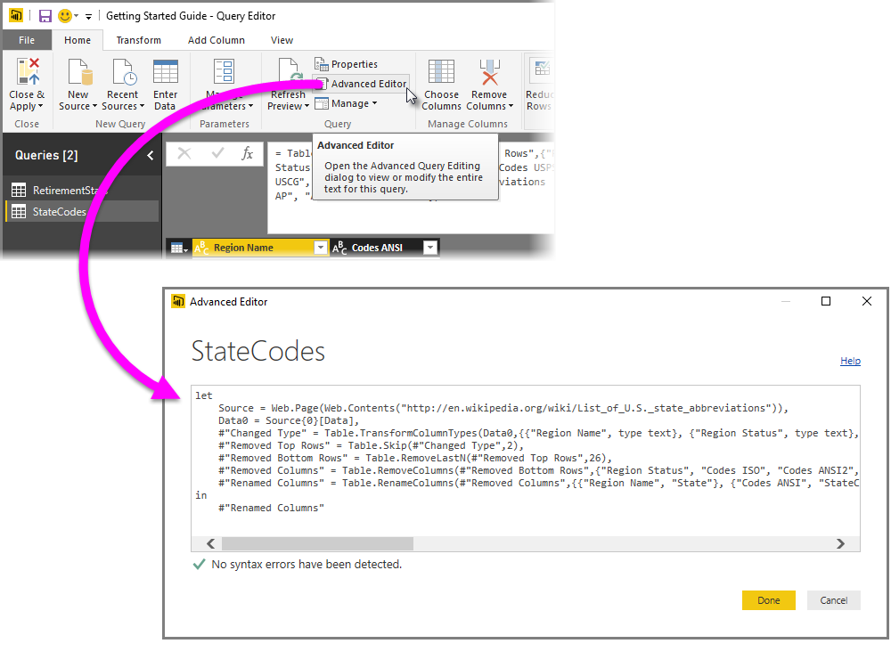
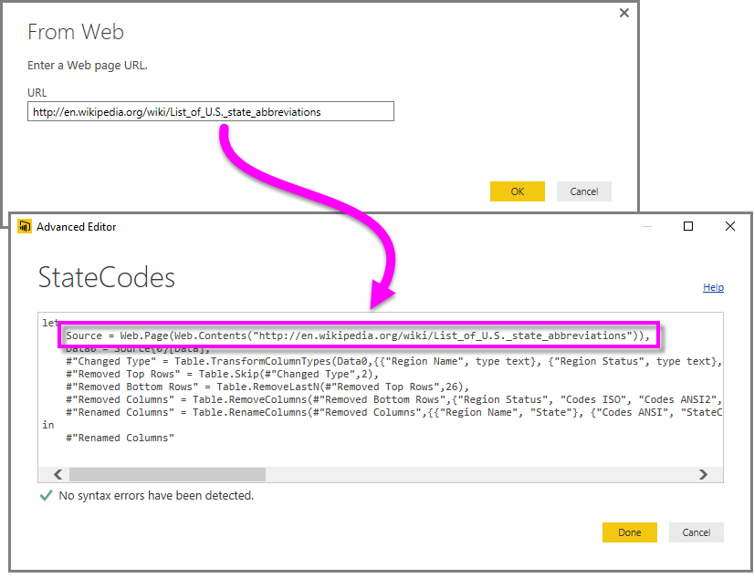

<properties
   pageTitle="Introduction to DAX"
   description="Learn what DAX is and some of its basic building blocks"
   services="powerbi"
   documentationCenter=""
   authors="davidiseminger"
   manager="mblythe"
   backup=""
   editor=""
   tags=""
   qualityFocus="no"
   qualityDate=""
   featuredVideoId=""
   courseDuration="9m"/>

<tags
   ms.service="powerbi"
   ms.devlang="NA"
   ms.topic="article"
   ms.tgt_pltfrm="NA"
   ms.workload="powerbi"
   ms.date="06/09/2016"
   ms.author="davidi"/>

# Introduction to DAX

Welcome to the Power BI **Guided Learning** section designed to introduce you to **DAX**.

**DAX** stands for **Data Analysis Expressions**, and it is the formula language used throughout Power BI (it is also used by Power BI behind the scenes, whenever a query is created or run). DAX is also found in other offerings from Microsoft, such as Power Pivot and SSAS Tabular, but this collection of Guided Learning topics focuses on how DAX is used - and can be used by you - in Power BI.

The following section provides a brief tour of how DAX works behind the scenes in Power BI. Then you have a quick introduction for the video on this page, an overview of this DAX **Guided Learning** section, and context for what you learn in the video.

## A quick tour showing DAX at work in Power BI
If you've used **Power BI Desktop** to connect to data, you've already put DAX to work. Power BI creates DAX queries automatically whenever you take action on a data model, such as when you connect to a data source, filter tables, merge or append data, create measures and columns, build relationships, or otherwise build or modify a data model in Power BI. As you work with your data, Power BI incorporates the DAX formulas it creates (or that you modify, or create from scratch on your own) as part of your .PBIX file (in Power BI Desktop), in any report you create and publish to the Power BI service.

So quickly, let's just look at a DAX formula in Power BI. First let's open **Query Editor** (in **Power BI Desktop**, you can open **Query Editor** by selecting **Edit Queries** from the **Home** tab).

In **Query Editor**, let's view an existing query - it doesn't matter which query we select, since we really just want to see a DAX formula.

1.  We select **StateCodes** (one of two queries available in the left pane).
2.  Then we select the first item in **Applied Steps** (right pane).
3.  Then in the **formula bar**, the DAX formula that Power BI created is displayed.

Select a different step in that same query, and the associated DAX formula is displayed in the formula bar.

Power BI then puts all those steps together (all the **Applied Steps**) into a DAX formula that carries out all the steps we created for that query. If we want to see that overall DAX formula, we select **Advanced Editor** from the ribbon, and the entire Power BI-created DAX formula is shown in one window... which we can manually modify, and which is checked for proper syntax.

And remember, that DAX code was created for us - we simply went to **Get Data > Web** and typed in that URL. Power BI created a corresponding DAX formula, then added subsequent lines as we filtered and modified the data to which we connected. All done automatically by Power BI, on your behalf, behind the scenes.

As you can see, DAX is a powerful and versatile language.

And even better, you can write DAX formulas on your own to do just about anything you want with your data. To create DAX formulas, however, you'll need a firm fundamental grasp on how DAX works as a language, and how best to use it.

## DAX and this Guided Learning video series

The goal of this **Guided Learning** section is to teach you DAX basics and fundamentals - how to think about DAX, how it works, and the most useful features as explained (and learned with lots of experience) by a renowned DAX expert, [Alberto Ferrari](https://www.sqlbi.com/articles/author/alberto-ferrari/).

The videos in this **Guided Learning** section on **DAX** teaches you DAX basics from the perspective of how the DAX formula language works. This is useful when creating DAX formulas from scratch, but it's also very useful for understanding how Power BI creates those DAX formulas as you create queries in the **Query Editor**.

## In this video - introduction to DAX

DAX concepts are simple and straightforward, but DAX is powerful. DAX uses some unique programming concepts and patterns which can make it difficult to fully use and understand. Traditional ways of learning languages may not be the best approach to DAX, so the goal of this video is to teach you concepts and theory that will help later on in your Power BI work.

DAX is a *functional language*, which means the full executed code is contained inside a function.

In DAX, functions can contain other, nested functions, conditional statements, and value references. Execution in DAX starts from the innermost function or parameter, and works outward. In Power BI, DAX formulas are written in a single line, so formatting your functions correctly is important for readability.

DAX is designed to work with tables, so it has just two primary data types: **Numeric** and **Other**. **Numeric** can include *integers*, *decimals*, and *currency*. **Other** can include *strings* and *binary objects*. This means that if you build your DAX function to work on one type of number, you can be assured that it will work on any other Numeric data.

DAX uses operator overloading, which means that you can mix data types in your calculations and the results will change based on the type of data used in the inputs. Conversion happens automatically. This means you don't have to know the data types of the columns you're working with in Power BI, but it also means that sometimes conversion can happen in unexpected ways. It's good practice to understand the data you are using to ensure that your operators are behaving as anticipated.

There is one data type in particular that you'll likely be working with a lot in Power BI: **DateTime**. **DateTime** is stored as a floating point value with both integer and decimal parts. DateTime can be used accurately for calculations of any time period after March 1, 1900.
