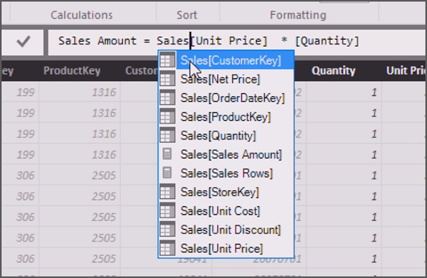
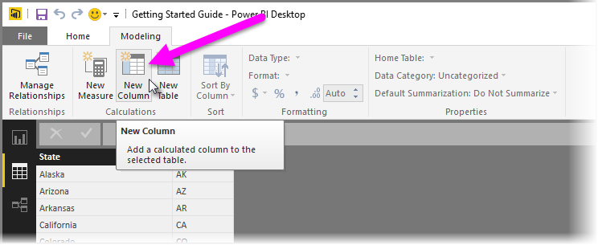
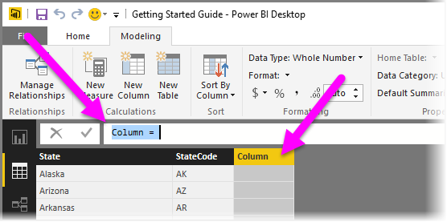
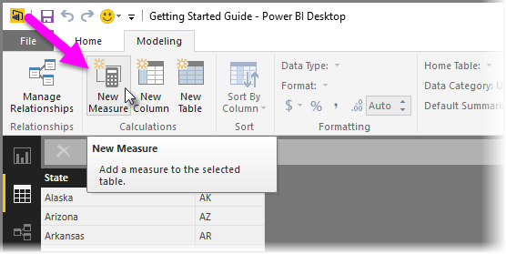
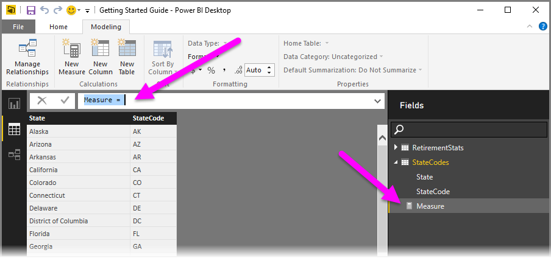

<properties
   pageTitle="DAX Calculation Types"
   description="Create calculated columns and measures in Power BI using DAX formulas"
   services="powerbi"
   documentationCenter=""
   authors="davidiseminger"
   manager="erikre"
   backup=""
   editor=""
   tags=""
   qualityFocus="no"
   qualityDate=""
   featuredVideoId="BVlijY68wp8"
   courseDuration="22m"/>

<tags
   ms.service="powerbi"
   ms.devlang="NA"
   ms.topic="get-started-article"
   ms.tgt_pltfrm="NA"
   ms.workload="powerbi"
   ms.date="06/06/2017"
   ms.author="davidi"/>

# DAX Calculation types

There are two primary calculations you can create using DAX:

-   **calculated columns**
-   **calculated measures**

Before digging into creating either of those, it's good to have a firm grasp on DAX syntax for tables and columns, which you will use when creating either **calculated columns** or **calculated measures**.

## DAX table and column name syntax

Whether you're creating a new column or measure, it's important to know the general format of table names in DAX:

    'Table Name'[ColumnName]

If there are spaces in the table name (as shown above), the single quotes around the table name are mandatory. If the table name has no spaces, the single quotes can be omitted, so the syntax looks like the following:

    TableName[ColumnName]

The following image shows a DAX formula being created in Power BI:

You can also omit the table name completely and just use the column name, but this is poor practice for writing clear functions (and thus, for clear DAX code). Column names must always include the square brackets.

It's best practice to *always* do the following:

-   No spaces in table names
-   Always include the table name in formulas (don't omit it, even though DAX lets you)

## Creating calculated columns

**Calculated columns** are useful when you want to slice or filter on the value, or if you want a calculation for every row in your table.

You can create calculated columns in Power BI Desktop by selecting **New Column** from the **Modeling** tab. It's best to be in **Data** view (rather than **Report** or **Relationships** view), since you can see the new column created and the **Formula Bar** is populated and ready for your DAX formula.

Once you select the **New Column** button, the **Formula Bar** is populated with a basic column name (which you change to suit your formula, of course) and the **=** operator, and the new column appears in the data grid, as shown in the following image.

The required elements for a calculated column are the following:

-   a new column name
-   at least one function or expression

If you reference a table or column in your calculated column formula, you do not need to specify a row in the table - Power BI calculates the column for the current row for each calculation.

## Creating calculated measures

Use a **calculated measure** when you are calculating percentages or ratios, or you need complex aggregations. To create a measure using a DAX formula, select the **New Measure** button from the **Modeling** tab. Again, it's best to be in the **Data** view of Power BI Desktop since it shows the **Formula Bar** and makes it easy to write your DAX formula.

With **measures**, you see a new measure icon appear in the **Fields** pane with the name of the measure. The **Formula Bar** is again populated with the name of your DAX formula (this time, with your measure).

The required elements for a calculated measure are the same as they are for a calculated column:

-   a new measure name
-   at least one function or expression

>   Video content courtesy of [Alberto Ferrari, SQLBI](http://www.sqlbi.com/learning-dax/?utm_source=powerbi&utm_medium=marketing&utm_campaign=after-summit)
