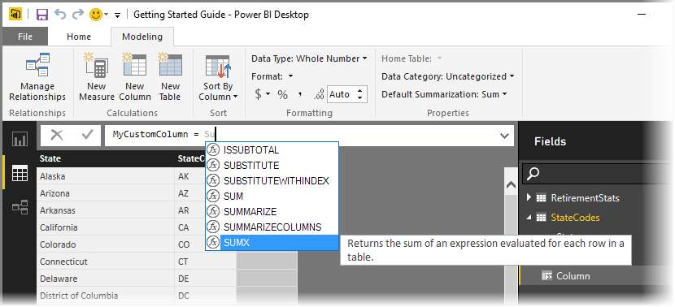

<properties
   pageTitle="DAX Functions"
   description="An overview of the breadth of functions available in DAX"
   services="powerbi"
   documentationCenter=""
   authors="davidiseminger"
   manager="mblythe"
   backup=""
   editor=""
   tags=""
   qualityFocus="no"
   qualityDate=""
   featuredVideoId="siTnzquk1SU"
   courseDuration="17m"/>

<tags
   ms.service="powerbi"
   ms.devlang="NA"
   ms.topic="get-started-article"
   ms.tgt_pltfrm="NA"
   ms.workload="powerbi"
   ms.date="06/09/2016"
   ms.author="davidi"/>

# DAX Functions

With DAX, there are many functions available to shape, form, or otherwise analyze your data. These functions can be grouped into a handful of categories:

-   **Aggregation** functions
-   **Counting** functions
-   **Logical** functions
-   **Information** functions
-   **Text** functions
-   **Date** functions

Similar to Excel, when you start typing your formula into the Power BI Desktop **Formula Bar**, a list of available functions appears to help you determine which available function you want to select. And by using the **up** and **down** arrow keys on your keyboard, you can highlight any of the available functions, and a brief description is displayed.

Power BI displays the functions that match the letters you've typed so far, so if you type *S* only functions that begin with *S* appear in the list. If you type *Su*, only functions that *contain* the letter sequence *Su* in their name appear in the list (they don't have to start with *Su*, they just have to contain that letter sequence).

It's easy to experiment with DAX in this way, and to find each of the various DAX functions that are available in Power BI. All you have to do is start typing, and Power BI helps you along.

Now that we know how to get that DAX formula started, let's take a look at each of these function categories in turn.

## Aggregation functions

DAX has a number of **aggregation** functions, including the following commonly used functions:

-   SUM
-   AVERAGE
-   MIN
-   MAX
-   SUMX (and other *X* functions)

These functions work only on numeric columns, and generally can aggregate only one column at a time.

However, special aggregation functions that end in **X**, such as **SUMX**, can work on multiple columns. These functions iterate through the table, and evaluate the expression for each row.

## Counting functions

Often-used **counting** functions in DAX include the following:

-   COUNT
-   COUNTA
-   COUNTBLANK
-   COUNTROWS
-   DISTINCTCOUNT

These functions count different elements, such as distinct values, non-empty values, and table rows.

## Logical functions

The collection of **logical** functions in DAX include:

-   AND
-   OR
-   NOT
-   IF
-   IFERROR

These special functions can also be expressed with *operators*. For example, **AND** can be typed as (replaced with) **&&** in your DAX formula.

You can use operators (such as **&&**) when you need more than two conditions in your formula, but otherwise, it's best practice use the function name itself (such as **AND**) for readability of your DAX code.

## Information functions

**Information** functions in DAX include:

-   ISBLANK
-   ISNUMBER
-   ISTEXT
-   ISNONTEXT
-   ISERROR

While these functions can be situationally useful, there is value in knowing the data type of your columns ahead of time, rather than depending on these functions to provide the data type.

DAX uses the **MAX** and **MIN** functions to both *aggregate* values, and to *compare* values.

## Text functions
The **text** functions in DAX include the following:

-   CONCATENTATE
-   REPLACE
-   SEARCH
-   UPPER
-   FIXED

These **text** work very similarly to the Excel functions that have the same name, so if you're familiar with how Excel handles text functions, you're already a step ahead. If not, you can always experiment with these functions in Power BI, and learn more about how they behave.

## Date functions

DAX includes the following **Date** functions:

-   DATE
-   HOUR
-   NOW
-   EOMONTH
-   WEEKDAY

While these functions are useful to calculate and extract information from *date* values, they do not apply to time intelligence, which uses a date table.

>   Video content courtesy of [Alberto Ferrari, SQLBI](http://www.sqlbi.com/learning-dax/?utm_source=powerbi&utm_medium=marketing&utm_campaign=after-summit)
