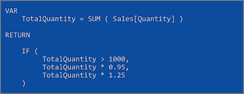

<properties
   pageTitle="Using variables in DAX expressions"
   description="How to use variables in DAX"
   services="powerbi"
   documentationCenter=""
   authors="davidiseminger"
   manager="erikre"
   backup=""
   editor=""
   tags=""
   qualityFocus="no"
   qualityDate=""
   featuredVideoId="kd4tgKxhRTU"
   courseDuration="4m"/>

<tags
   ms.service="powerbi"
   ms.devlang="NA"
   ms.topic="get-started-article"
   ms.tgt_pltfrm="NA"
   ms.workload="powerbi"
   ms.date="06/06/2017"
   ms.author="davidi"/>

# Using variables in DAX expressions

Using **variables** are an extremely powerful part of a DAX expression.

You can define a variable anywhere in a DAX expression, using the following syntax:

    VARNAME = RETURNEDVALUE

Variables can be any data type, including entire tables.

Keep in mind that each time you reference a variable in your DAX expression, Power BI must recalculate its value according to your definition. For this reason, it's good practice to avoid repeating variables in your function.

>   Video content courtesy of [Alberto Ferrari, SQLBI](http://www.sqlbi.com/learning-dax/?utm_source=powerbi&utm_medium=marketing&utm_campaign=after-summit)
