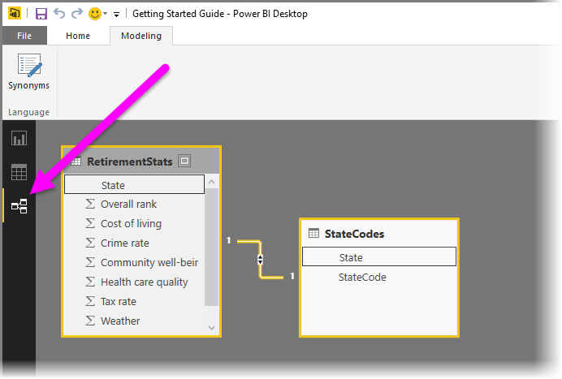
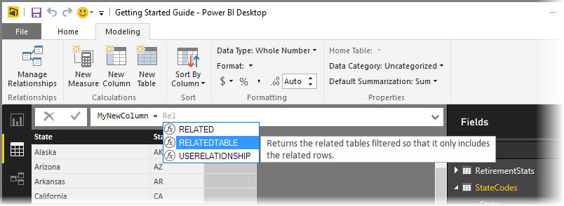

<properties
   pageTitle="Table Relationships and DAX"
   description="Create expressions across multiple tables with relational functions"
   services="powerbi"
   documentationCenter=""
   authors="davidiseminger"
   manager="mblythe"
   backup=""
   editor=""
   tags=""
   qualityFocus="no"
   qualityDate=""
   featuredVideoId="yec1f5A08mc"
   courseDuration="13m"/>

<tags
   ms.service="powerbi"
   ms.devlang="NA"
   ms.topic="article"
   ms.tgt_pltfrm="NA"
   ms.workload="powerbi"
   ms.date="06/09/2016"
   ms.author="davidi"/>

# Table Relationships and DAX

Power BI lets you create relationships among multiple tables, including tables that come from completely different data sources. You can see those relationships for any data model in the **Relationships** view of Power BI Desktop.

## DAX relational functions

DAX has **relational functions** that enable you to interact with tables that have established relationships.

You can return the value of a column, or you can return all rows in a relationship using DAX functions.

For example, the **TABLE** function follows relationships and returns the value of a column, while **RELATEDTABLE** follows relationships, and returns an entire table that is filtered to include only related rows.

The **RELATED** function works on *many-to-one* relationships, while **RELATEDTABLE** is for *one-to-many* relationships.

You can use relational functions to build expressions that include values across multiple tables. DAX will return a result with these functions, regardless of the length of the chain of the relationship.
