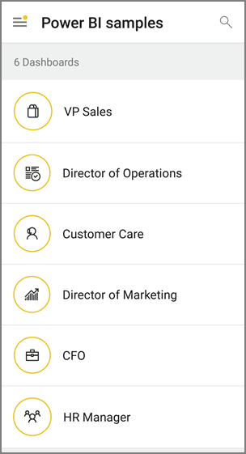
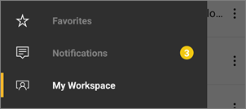

<properties 
   pageTitle="Get started with the Power BI for Android app"
   description="The Android app for Microsoft Power BI brings Power BI to your pocket, with up-to-date, touch-enabled mobile access to business information."
   services="powerbi" 
   documentationCenter="" 
   authors="maggiesMSFT" 
   manager="mblythe" 
   backup=""
   editor=""
   tags=""
   qualityFocus="monitoring"
   qualityDate="05/18/2016"/>
 
<tags
   ms.service="powerbi"
   ms.devlang="NA"
   ms.topic="article"
   ms.tgt_pltfrm="NA"
   ms.workload="powerbi"
   ms.date="08/09/2016"
   ms.author="maggies"/>
# Get started with the Power BI for Android app

The Android app for Microsoft Power BI brings Power BI to your pocket, with up-to-date, touch-enabled mobile access to your business information. View and interact with your company dashboards from anywhere.

You [create dashboards and reports in the Power BI service](powerbi-service-get-started.md) with your data. 

Then interact with your dashboards and reports, explore the data, and share them, all from the iPad app for Power BI.
## First things first

-   **Get the app**  [Get the Power BI for Android app](http://go.microsoft.com/fwlink/?LinkID=544867) from Google Play.

    >**Note:** Power BI can run on a number of different Android phones. Your phone needs to be running the Android 4.4 operating system, or later. To check on your phone, go to **Settings** > **About device** > **Android version**. 

-   **Start when you open the app**    Even without signing up or signing in, after you open the app you can flip through the sign-in pages for a quick overview of things you can do with the Power BI app on your Android phone. Tap **Skip** to view and explore the samples, and get hands-on experience with the app. You can go back to the samples whenever you want from the dashboards home page.

-   Find out [what's new in the Power Bi mobile apps](powerbi-mobile-whats-new-in-the-mobile-apps.md).

## Sign up for the Power BI service on the web

If you haven't signed up yet, go to the [Power BI service (http://powerbi.com/)](http://powerbi.com/) to sign up for your own account for creating and storing dashboards and reports, and bringing your data together. Then sign in to Power BI from your Android phone to see your own dashboards from anywhere.

1.  In the Power BI service, tap [Sign up](http://go.microsoft.com/fwlink/?LinkID=513879) to create a Power BI account.

2.   Start [creating your own dashboards and reports](powerbi-service-get-started.md).

## Get started with the Power BI app on your phone

2.  On your Android phone, from the start screen open the Power BI for Android app.

    

3.  To view your Power BI dashboards and reports, tap **Power BI**.  
   To view your Reporting Services mobile reports and KPIs, tap **SQL Server Reporting Services**.

    

## Try the Power BI and Reporting Services samples  
Even without signing up, you can play with the Power BI and Reporting Services samples. After you download the app, you can view the samples or get started. Go back to the samples whenever you want from the dashboards home page.

### Power BI samples

1.   Tap the options icon  in the upper-left corner.
  
2.   Tap **Power BI samples**, then pick a role and explore the sample dashboard for that role.  

    

    >**Note**:  Not all features are available in the samples. For example, you can't view the sample reports that underlie the dashboards. 

### Reporting Services mobile report samples

1.   Tap the options icon  in the upper-left corner.

2.  Tap **Reporting Services samples**, then open either the Retail Reports or the Sales Reports folder to explore their KPIs and mobile reports.

    

## What next?

See what else you can do in the Android phone app for Power BI with dashboards and reports in Power BI, and Reporting Services mobile reports and KPIs in the Reporting Services web portal

### Power BI dashboards

-   View your [dashboards](powerbi-mobile-dashboards-in-the-android-app.md).
-   Explore the [tiles on your dashboards](powerbi-mobile-tiles-in-the-android-app.md).
-   View [report page tiles](powerbi-mobile-report-page-tiles-in-the-android-app.md).
-   Open [Power BI reports](powerbi-mobile-reports-in-the-android-app.md).
-   View [your groups](powerbi-mobile-groups-in-the-android-app.md).
-   [Annotate and share tiles](powerbi-mobile-annotate-and-share-a-tile-from-the-android-app.md).
-   Share [dashboards](powerbi-mobile-share-a-dashboard-from-the-android-app.md).
-   [Scan a Power BI QR code](powerbi-mobile-qr-code-for-tile.md) from your Android phone to open a related dashboard. 
-   View [notifications about updates to your Power BI account](powerbi-mobile-notification-center.md), such as dashboards that colleagues share with you.

    

### Reporting Services mobile reports and KPIs

- [View Reporting Services mobile reports and KPIs](powerbi-mobile-android-kpis-mobile-reports.md) in the Android phone app for Power BI.
- Create [KPIs on the Reporting Services web portal](https://msdn.microsoft.com/library/mt683632.aspx).
- [Create your own mobile reports with the SQL Server Mobile Report Publisher](https://msdn.microsoft.com/library/mt652547.aspx), and publish them to the Reporting Services web portal.

### See also

-  [Download the Android app](http://go.microsoft.com/fwlink/?LinkID=544867) from the Android app store.
-  [Get started with Power BI](powerbi-service-get-started.md)

