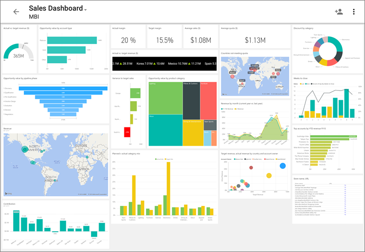
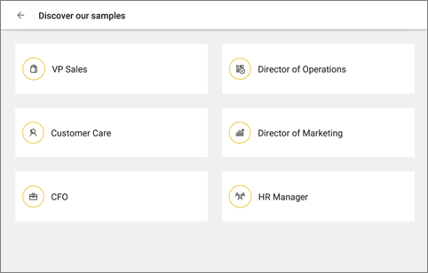
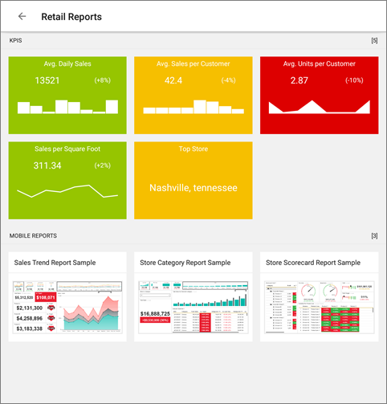
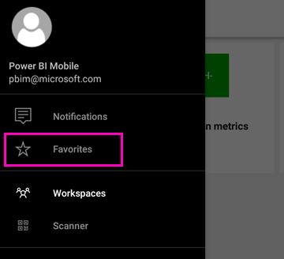
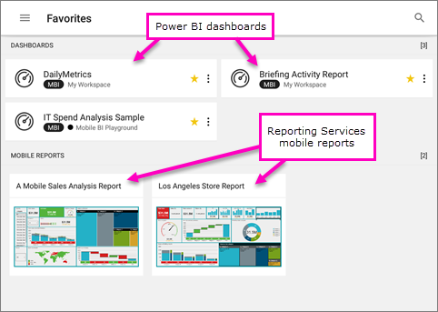
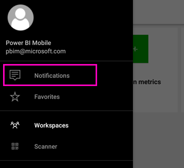

<properties 
   pageTitle="Get started with the Power BI mobile app for Android tablets"
   description="Learn how the Power BI mobile app for Android tablets brings Power BI to you anywhere, with up-to-date, touch-enabled mobile access to business information."
   services="powerbi" 
   documentationCenter="" 
   authors="maggiesMSFT" 
   manager="erikre" 
   backup=""
   editor=""
   tags=""
   qualityFocus="no"
   qualityDate=""/>
 
<tags
   ms.service="powerbi"
   ms.devlang="NA"
   ms.topic="article"
   ms.tgt_pltfrm="NA"
   ms.workload="powerbi"
   ms.date="12/12/2016"
   ms.author="maggies"/>

# Get started with the Power BI mobile app for Android tablets

The Power BI mobile app for Android tablets brings Power BI to you anywhere, with up-to-date, touch-enabled mobile access to your business information. View and interact with your company dashboards on the go.

You [create dashboards and reports in the Power BI service](powerbi-service-get-started.md) with your data. 

Then interact with your dashboards and reports, explore the data, and share them, all from the Android app for Power BI.

## First things first

-   **Get the app**  [Get the Power BI for Android app](http://go.microsoft.com/fwlink/?LinkID=544867) from Google Play.

    >**Note:** Power BI can run on a number of different Android tablets. Your tablet needs to be running the Android 5.0 operating system, or later. To check on your tablet, go to **Settings** > **About device** > **Android version**. 

-   **Start when you open the app**    Even without signing up or signing in, after you open the app you can flip through the sign-in pages for a quick overview of things you can do with the Power BI app on your Android tablet. Tap **Skip** to view and explore the samples, and get hands-on experience with the app. You can go back to the samples whenever you want from the dashboards home page.

-   Find out [what's new in the Power Bi mobile apps](powerbi-mobile-whats-new-in-the-mobile-apps.md).

## Sign up for the Power BI service on the web

If you haven't signed up yet, go to the [Power BI service (http://powerbi.com/)](http://powerbi.com/) to sign up for your own account for creating and storing dashboards and reports, and bringing your data together. Then sign in to Power BI from your Android tablet to see your own dashboards from anywhere.

1.  In the Power BI service, tap [Sign up](http://go.microsoft.com/fwlink/?LinkID=513879) to create a Power BI account.

2.   Start [creating your own dashboards and reports](powerbi-service-get-started.md).

## Get started with the Power BI app on your tablet

1.  On your Android tablet, from the start screen open the Power BI for Android app.

    

3.  To view your Power BI dashboards and reports, tap **Power BI**.  

    >**Important**: If you get a message that Power BI can't sign you in, see [Getting a "Could not authenticate because your corporate SSL certificate is untrusted" message](powerbi-mobile-android-could-not-sign-you-in.md) for details on how to resolve the issue.

    To view your Reporting Services mobile reports and KPIs, tap **SQL Server Reporting Services**.

    

    Give your SSRS server sign-in information to [view Reporting Services mobile reports and KPIs](powerbi-mobile-android-tablet-kpis-mobile-reports.md) in the Android tablet app for Power BI.

## Try the Power BI and Reporting Services samples  
Even without signing up, you can play with the Power BI and Reporting Services samples. After you download the app, you can view the samples or get started. Go back to the samples whenever you want from the dashboards home page.

### Power BI samples

You can view and interact with the Power BI dashboard samples, but there are a few things you can't do with them. You can't open the reports behind the dashboards, share the samples with others, or make them your favorites.

1.   Tap the global navigation button  in the upper-left corner.
  
2.   Tap **Power BI samples**, then pick a role and explore the sample dashboard for that role.  

    

    >**Note**:  Not all features are available in the samples. For example, you can't view the sample reports that underlie the dashboards. 

### Reporting Services mobile report samples

1.   Tap the global navigation button  in the upper-left corner.

2.  Tap **Reporting Services samples**, then open either the Retail Reports or the Sales Reports folder to explore their KPIs and mobile reports.

    

## Search for a dashboard or report

* Tap the magnifying glass in the upper-right corner , then type the term to find.

    

    By default it searches all dashboards and reports, but you can search just one or the other.

## View your favorite dashboards, KPIs, and reports

You can view all of your favorite Power BI dashboards, together with Reporting Services KPIs and mobile reports, on the Favorites page in the mobile apps. When you make a dashboard a *favorite* in the Power BI mobile app, you can access it from all of your devices, including the Power BI service in your browser. 

-  Tap **Favorites**.

    
   
    Your Power BI favorites and your favorites from the Reporting Services web portal are all on this page.

    

Read more about [favorites in the Power BI mobile apps](powerbi-mobile-favorites.md).

## Enterprise support for the Power BI mobile apps

Organizations can use Microsoft Intune to manage devices and applications, including the Power BI mobile apps for Android and iOS.

Microsoft Intune lets organizations control items like requiring an access pin, controlling how data is handled by the application, and even encrypting application data when the app isn't in use.

Read more about [configuring Power BI mobile apps for Android with Microsoft Intune](powerbi-admin-mobile-intune.md). 

## What next?

See what else you can do in the Android tablet app for Power BI with dashboards and reports in Power BI, and Reporting Services mobile reports and KPIs in the Reporting Services web portal

### Power BI dashboards and reports

-   View your [dashboards](powerbi-mobile-dashboards-in-the-android-tablet-app.md).
-   Explore the [tiles on your dashboards](powerbi-mobile-tiles-in-the-android-tablet-app.md).
-   Open [Power BI reports](powerbi-mobile-reports-in-the-android-tablet-app.md).
-   View [your groups](powerbi-mobile-groups-in-the-android-tablet-app.md).
-   [Annotate and share tiles](powerbi-mobile-annotate-and-share-a-tile-from-the-android-tablet-app.md).
-   Share [dashboards](powerbi-mobile-share-a-dashboard-from-the-android-tablet-app.md).
-   [Scan a Power BI QR code](powerbi-mobile-qr-code-for-android-tablet.md) from your Android tablet.
-   View [notifications about updates to your Power BI account](powerbi-mobile-notification-center.md), such as dashboards that colleagues share with you.

    

### Reporting Services mobile reports and KPIs

- [View Reporting Services mobile reports and KPIs](powerbi-mobile-android-tablet-kpis-mobile-reports.md) in the Android tablet app for Power BI.
- Create [KPIs on the Reporting Services web portal](https://msdn.microsoft.com/library/mt683632.aspx).
- [Create your own mobile reports with SQL Server Mobile Report Publisher](https://msdn.microsoft.com/library/mt652547.aspx), and publish them to the Reporting Services web portal.

## See also

-  [Download the Android app](http://go.microsoft.com/fwlink/?LinkID=544867) from the Android app store.
-  [Get started with Power BI](powerbi-service-get-started.md)
- Questions? [Try asking the Power BI Community](http://community.powerbi.com/)
