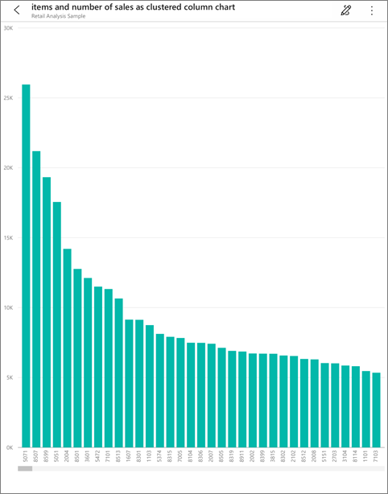
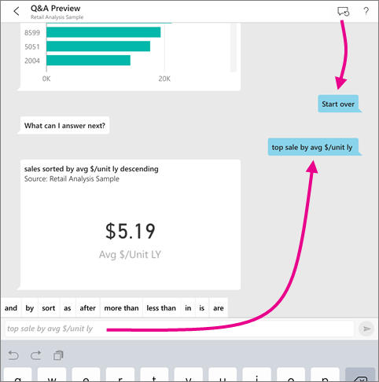
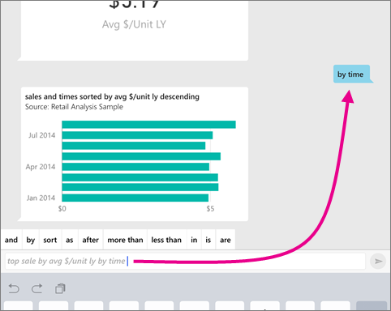
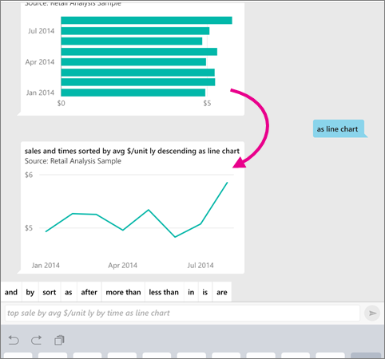

<properties 
   pageTitle="Ask questions about your data in the iOS mobile apps (Tutorial)"
   description="Try asking questions of sample data in your own words with Q&A on your iPad, iPhone, and iPod Touch."
   services="powerbi" 
   documentationCenter="" 
   authors="maggiesMSFT" 
   manager="erikre" 
   backup=""
   editor=""
   tags=""
   qualityFocus="no"
   qualityDate=""/>
 
<tags
   ms.service="powerbi"
   ms.devlang="NA"
   ms.topic="article"
   ms.tgt_pltfrm="NA"
   ms.workload="powerbi"
   ms.date="02/28/2017"
   ms.author="maggies"/>

# Ask questions about your data in the iOS mobile apps (Tutorial)

Applies to:

|  |  |
|:------------------------|:----------------------------|
| iPhones | iPads |

The easiest way to learn about your data in to ask questions about it in your own words. You can already do that in the Power BI service at [https://powerbi.com](http://powerbi.com) by typing a question in the Q&A box at the top of a dashboard. Now you can do the same in the Microsoft Power BI app for iOS on iPads, iPhones, and iPod Touch devices. In this tutorial, you can ask questions with sample data.

## Download the Retail Analysis sample

If you haven't already downloaded the Retail Analysis sample on the Power BI server, that's the first step.

* In your workspace on the Power BI service ([https://powerbi.com](https://powerbi.com)), select **Get Data** > **Samples** > **Retail Analysis Sample** > **Connect**. 
* Or click this link to [add the sample to your workspace](https://app.powerbi.com/groups/me/getdata/samples/retail-analysis-sample). If you don't have an account or you're not signed in, follow the prompts.

## Try asking questions on your iPhone or iPad

1. On your iPhone or iPad, open the Power BI app and navigate to the Retail Analysis Sample dashboard.
2. Tap the Q&A icon  from the action menu at the bottom of the page (at the top of the page on an iPad).
3. Tap **show** from the keywords at the bottom of the screen, tap **sales** from the suggestion list > **Send** .

    

4. Tap **by** from the keywords, then tap **item** from the suggestion list > **Send** .

    

5. Tap **as** from the keywords, tap the column chart icon , then tap **Send** .

6. Long-tap the resulting chart, then tap **Expand**.

    

    The chart opens in focus mode in the app.

    

7. Tap the arrow in the upper-left corner to go back to the Q&A chat window. 
 
9. Tap the X at the right of the text box to delete the text and start over.

8. Try a new question: Tap **top** from the keywords, tap **sale by avg $/unit ly** > **Send** .

    

9. Choose **by** from the keywords, tap **time** from the suggestion list at the top > **Send** .

    

10. Type **as**, pick the line chart icon  from the suggestion list > **Send** .

    

## Help and feedback

- Need help? Just say "Hi" or "Help", and you'll get assistance with starting a new question.

- Care to provide feedback on the results? Long-tap a chart or other result, then tap the smiley or frowny face.

    

    Your feedback is anonymous, and helps us improve our answers to questions.

## Enhance your Q&A results

You can improve the results you and your customers get when they use Q&A on a dataset, either by asking more targeted questions or by enhancing the dataset. 

### How to ask questions
- Follow these [tips for asking questions in Q&A](powerbi-service-q-and-a-tips.md), in the Power BI service or in your iOS mobile app.

### How to enhance the dataset  
- Enhance the dataset in Power BI Desktop or in the Power BI service to [make your data work well with Q&A](powerbi-service-make-your-data-work-well-with-q-and-a.md). 

## See also

- [Q&A in the Power BI service](powerbi-service-q-and-a.md)
- Questions? Check the [Mobile apps section of the Power BI Community](https://go.microsoft.com/fwlink/?linkid=839277)
