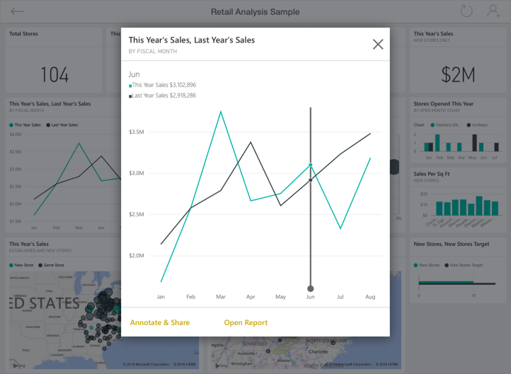

<properties 
   pageTitle="Get started with the iPad app"
   description="The Microsoft Power BI for iOS app on the iPad is a key part of the mobile BI experience for Power BI and Reporting Services."
   services="powerbi" 
   documentationCenter="" 
   authors="maggiesMSFT" 
   manager="mblythe" 
   backup=""
   editor=""
   tags=""
   qualityFocus="identified"
   qualityDate="08/08/2016"/>
 
<tags
   ms.service="powerbi"
   ms.devlang="NA"
   ms.topic="article"
   ms.tgt_pltfrm="NA"
   ms.workload="powerbi"
   ms.date="08/09/2016"
   ms.author="maggies"/>

# Get started with the iPad app (Power BI for iOS)  

The iPad app for Microsoft Power BI for iOS is part of the mobile BI experience for Power BI and Reporting Services. With live, touch-enabled mobile access to your important business information on premises and in the cloud, you can view and interact with your company dashboards and reports easily, from anywhere. Explore the data in dashboards, and share them with your colleagues in email or text messages.  

You [create dashboards and reports in the Power BI service](powerbi-service-get-started.md) with your data. 

Then interact with your dashboards and reports, explore the data, and share them, all from the iPad app for Power BI.

You can also [view Reporting Services KPIs and mobile reports for your on-premises data](powerbi-mobile-ipad-kpis-mobile-reports.md) in the iPad app for Power BI. You [create those KPIs and mobile reports with the SQL Server Mobile Report Publisher](https://msdn.microsoft.com/library/mt652547.aspx).

Find out [what's new in the Power Bi mobile apps](powerbi-mobile-whats-new-in-the-mobile-apps.md).

## Download the iOS app for the iPad  
[Download the iPad app](http://go.microsoft.com/fwlink/?LinkId=522062) from the Apple App Store.

>**Note:** Your iPad needs to be running at least iOS 9.0. 

## Sign up for the Power BI service

Go to [Power BI to sign up](http://go.microsoft.com/fwlink/?LinkID=513879) for the service, if you haven't already. It's free.

## Get started with the Power BI app 

1.  In the iPad, open the Power BI app.
  
2.  To view your Power BI dashboards and reports, tap **Power BI**. Sign in with the same credentials as your Power BI account on the web. 

    To view your Reporting Services mobile reports and KPIs, tap **SQL Server Reporting Services**. Sign in with your SQL Server Reporting Services credentials.

    

    >**Tip**: When you're in the app, tap the global navigation button  in the upper-left corner to go between the two services. 

## Try the Power BI and Reporting Services samples  
Even without signing up, you can play with the Power BI and Reporting Services samples. After you download the app, you can view the samples or get started. Go back to the samples whenever you want from the dashboards home page.

### Power BI samples

You can view and interact with the Power BI dashboard samples, but there are a few things you can't do with them. You can't open the reports behind the dashboards, share the samples with others, or make them your favorites.

1.   Tap the global navigation button  in the upper-left corner.
  
2.   Tap **Power BI samples**, then pick a role and explore the sample dashboard for that role.  

    

    >**Note**:  Not all features are available in the samples. For example, you can't view the sample reports that underlie the dashboards. 

### Reporting Services mobile report samples

1.   Tap the options icon  in the upper-left corner.

2.  Tap **Reporting Services samples**, then open either the Retail Reports or the Sales Reports folder to explore their KPIs and mobile reports.

    

## More with dashboards and reports in Power BI  
See what else you can do in the iPad app with dashboards and reports in Power BI, and Reporting Services mobile reports and KPIs in the Reporting Services web portal.

-   View your [Power BI dashboards](powerbi-mobile-dashboards-on-the-ipad-app.md).
-   Interact with [tiles on your Power BI dashboards](powerbi-mobile-tiles-in-the-ipad-app.md).
-   Open [Power BI reports](powerbi-mobile-reports-on-the-ipad-app.md) from your dashboard.
-   [Share Power BI dashboards](powerbi-mobile-share-dashboards-from-the-ipad-app.md).
-   [Annotate and share a snapshot](powerbi-mobile-annotate-and-share-a-snapshot-from-the-ipad-app.md) of a tile.
-   View your [groups' Power BI dashboards and reports](powerbi-service-mobile-groups-in-the-ipad-app.md).
-   View [notifications about updates to your Power BI account](powerbi-mobile-notification-center.md), such as dashboards that colleagues share with you.
   
    

## More with Reporting Services mobile reports and KPIs

- [View Reporting Services mobile reports and KPIs](powerbi-mobile-ipad-kpis-mobile-reports.md) on the Reporting Services web portal.
- Create [KPIs on the Reporting Services web portal](https://msdn.microsoft.com/library/mt683632.aspx).
- [Create your own mobile reports with the SQL Server Mobile Report Publisher](https://msdn.microsoft.com/library/mt652547.aspx), and publish them to the Reporting Services web portal.

### See also  
- [Get started with the iPhone app for Power BI](powerbi-mobile-ipad-app-get-started.md)  
- [Get started with Power BI](powerbi-service-get-started.md)  
- Questions? Try asking the [Power BI Community](http://community.powerbi.com/)

