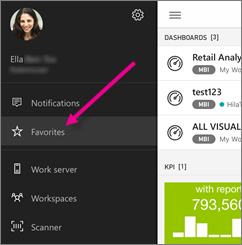

<properties 
   pageTitle="Get started with the Power BI app for iOS on an iPhone"
   description="The Microsoft Power BI app for iOS on the iPhone or iPod Touch is part of the mobile BI experience for Power BI and Reporting Services."
   services="powerbi" 
   documentationCenter="" 
   authors="maggiesMSFT" 
   manager="erikre" 
   backup=""
   editor=""
   tags=""
   qualityFocus="complete"
   qualityDate="05/02/2016"/>
 
<tags
   ms.service="powerbi"
   ms.devlang="NA"
   ms.topic="article"
   ms.tgt_pltfrm="NA"
   ms.workload="powerbi"
   ms.date="01/05/2017"
   ms.author="maggies"/>

# Get started with the Power BI app for iOS on an iPhone or iPod Touch

The Microsoft Power BI for iOS app, on the iPhone or iPod Touch, is part of the mobile BI experience for Power BI and Reporting Services. With live, touch-enabled mobile access to your important business information on premises and in the cloud, you can view and interact with your company dashboards easily, from anywhere. Explore the data in dashboards, and share them with your colleagues in email or text messages. And keep up to date with your most timely data on your [Apple Watch](powerbi-mobile-apple-watch.md).  

You [create dashboards and reports in the Power BI service](powerbi-service-get-started.md) with your data. 

Then interact with your dashboards and reports, explore the data, and share them, all from the iPhone app for Power BI.

You can also [view Reporting Services KPIs and mobile reports for your on-premises data](powerbi-mobile-ipad-kpis-mobile-reports.md) in the iPhone app for Power BI. You [create those KPIs and mobile reports with the SQL Server Mobile Report Publisher](https://msdn.microsoft.com/library/mt652547.aspx).

Find out [what's new in the Power Bi mobile apps](powerbi-mobile-whats-new-in-the-mobile-apps.md).

## Download the app

[Download the iOS app](http://go.microsoft.com/fwlink/?LinkId=522062 "Download the iPhone app")  from the Apple App Store to your iPhone or iPod Touch.

>**Note**: You can run the Power BI for iOS app on iPhone 5 and above, with iOS 9.0 or later. You can also run it on an iPod Touch with iOS 9.0 or later.

## Sign up for the Power BI service

Go to [Power BI to sign up](http://go.microsoft.com/fwlink/?LinkID=513879) for the service, if you haven't already. It's free.

## Get started with the Power BI app 

1.  In the iPhone, open the Power BI app.
  
2.  To view your Power BI dashboards, tap **Power BI**.  
   To view your Reporting Services mobile reports and KPIs, tap **SQL Server Reporting Services**.

    

    >**Tip**: When you're in the app, tap the global navigation button  in the upper-left corner to go between the two. 

## Try the Power BI and Reporting Services samples  
Even without signing up, you can play with the Power BI and Reporting Services samples. After you download the app, you can view the samples or get started. Go back to the samples whenever you want from the global navigation.

### Power BI samples

You can view and interact with the Power BI dashboard samples, but there are a few things you can't do with them. You can't open the reports behind the dashboards, share the samples with others, or make them your favorites.

1.   Tap the global navigation button  in the upper-left corner.
  
2.   Tap **Power BI samples**, then pick a role and explore the sample dashboard for that role.  

    

    >**Note**:  Not all features are available in the samples. For example, you can't view the sample reports that underlie the dashboards. 

### Reporting Services mobile report samples

1.   Tap the global navigation button  in the upper-left corner.

2.  Tap **Reporting Services samples**, then open either the Retail Reports or the Sales Reports folder to explore their KPIs and mobile reports.

    

## View your favorite dashboards, KPIs, and reports

You can view all of your favorite Power BI dashboards, together with Reporting Services KPIs and mobile reports, on the Favorites page in the mobile apps. When you make a dashboard a *favorite* in the Power BI mobile app, you can access it from all of your devices, including the Power BI service in your browser. 

-  Tap **Favorites**.

    
   
    Your Power BI favorites and your favorites from the Reporting Services web portal are all on this page.

    

Read more about [favorites in the Power BI mobile apps](powerbi-mobile-favorites.md).

## Enterprise support for the Power BI mobile apps

Organizations can use Microsoft Intune to manage devices and applications, including the Power BI mobile apps for Android and iOS.

Microsoft Intune lets organizations control items like requiring an access pin, controlling how data is handled by the application, and even encrypting application data when the app isn't in use.

>**Note**: If you use the Power BI mobile app on your iPhone and your organization has configured Microsoft Intune MAM, then background data refresh is turned off. The next time you enter the app, Power BI refreshes the data from the Power BI service on the web.

Read more about [configuring Power BI mobile apps with Microsoft Intune](powerbi-admin-mobile-intune.md). 

## What next?

See what else you can do in the iPhone app with dashboards in Power BI, and Reporting Services mobile reports and KPIs in the Reporting Services web portal.

### Power BI dashboards and reports

-   View your [Power BI dashboards](powerbi-mobile-dashboards-in-the-iphone-app.md).
-   Interact with [tiles](powerbi-mobile-tiles-in-the-iphone-app.md) on your dashboards.
-   View your Power BI tiles on your [Apple Watch](powerbi-mobile-apple-watch.md).
-   Set [data alerts](powerbi-mobile-set-data-alerts-in-the-iphone-app.md) for your data.
-   Share [Power BI dashboards](powerbi-mobile-share-a-dashboard-from-the-iphone-app.md).
-   [Annotate and share](powerbi-mobile-annotate-and-share-a-tile-from-the-iphone-app.md) a tile, report, or visualization.
-   [Scan a Power BI QR code](powerbi-mobile-qr-code-for-tile.md)  to open a related dashboard tile or report.
-   [Create picture tiles](powerbi-mobile-picture-tiles-in-the-iphone-app.md) with your iPhone app.
-   View [notifications about updates to your Power BI account](powerbi-mobile-notification-center.md), such as dashboards that colleagues share with you.

### Reporting Services mobile reports and KPIs

- [View Reporting Services mobile reports and KPIs](powerbi-mobile-iphone-kpis-mobile-reports.md) on your iPhone.
- Create [KPIs on the Reporting Services web portal](https://msdn.microsoft.com/library/mt683632.aspx).
- Create [your own mobile reports with the SQL Server Mobile Report Publisher](https://msdn.microsoft.com/library/mt652547.aspx), and publish them to the Reporting Services web portal.

## See also

- [Get started with Power BI](powerbi-service-get-started.md)
- Questions? [Try asking the Power BI Community](http://community.powerbi.com/)