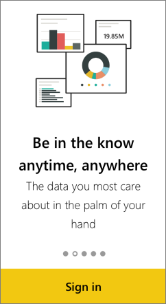

<properties 
   pageTitle="Get started with the iPhone app"
   description="Get started with the iPhone app (Power BI for iOS)"
   services="powerbi" 
   documentationCenter="" 
   authors="maggiesMSFT" 
   manager="mblythe" 
   editor=""
   tags=""/>
 
<tags
   ms.service="powerbi"
   ms.devlang="NA"
   ms.topic="article"
   ms.tgt_pltfrm="NA"
   ms.workload="powerbi"
   ms.date="01/06/2016"
   ms.author="maggies"/>

# Get started with the iPhone app (Power BI for iOS)

The iPhone app for Microsoft Power BI for iOS is part of the mobile BI experience for Power BI and Reporting Services. With live, touch-enabled mobile access to your important business information on premises and in the cloud, you can view and interact with your company dashboards easily, from anywhere. Explore the data in dashboards, and share them with your colleagues in email or text messages.  

Maybe a colleague sent you a link to a Power BI dashboard? Now you can view it on your iPhone.

You can [create dashboards and reports in the Power BI service](powerbi-service-get-started.md) with your own data. Then interact with your dashboards, explore the data, and share them, all from the iPhone app for Power BI.

You can also [view SQL Server KPIs and mobile reports for your on-premises data](powerbi-mobile-ipad-kpis-mobile-reports.md) in the iPhone app for Power BI. You [create those KPIs and mobile reports with the SQL Server Mobile Report Publisher](https://msdn.microsoft.com/library/mt652547.aspx).

Find out [what's new in the Power Bi mobile apps](powerbi-mobile-whats-new-in-the-mobile-apps.md).

## Download the app

[Download the iPhone app](http://go.microsoft.com/fwlink/?LinkId=522062 "Download the iPhone app") from the Apple App Store.

>**NOTE**: Your iPhone needs to be at least an iPhone 5, running at least iOS 8.0.

## Sign up for the Power BI service

Go to [Power BI to sign up](http://go.microsoft.com/fwlink/?LinkID=513879) for the service, if you haven't already. It's free.

## Get started with the Power BI app 

1.  In the iPhone, open the Power BI app.
  
2.  To view your Power BI dashboards, tap **Power BI**.  
   To view your SQL Server mobile reports and KPIs, tap **Reporting Services**.

    

    >Tip: When you're in the app, tap the options icon  in the upper-left corner to go between the two. 

## Start with samples

Even without signing up, you can play with the Power BI samples. After you download the app you can view the samples or get started. Go back to the samples whenever you want from the dashboards home page.

-   Tap **Samples**, then pick a role and explore the sample dashboard for that role.  

    

## What next?

See what else you can do in the iPhone app with dashboards in Power BI, and SQL Server mobile reports and KPIs in the Reporting Services web portal.

### Power BI dashboards

-   View your [Power BI dashboards](powerbi-mobile-dashboards-in-the-iphone-app.md).
-   Interact with [tiles](powerbi-mobile-tiles-in-the-iphone-app.md) on your dashboards.
-   Create [favorites](powerbi-mobile-favorites-in-the-iphone-app.md).
-   Set [data alerts](powerbi-mobile-set-data-alerts-in-the-iphone-app.md) for your data.
-   Share [Power BI dashboards](powerbi-mobile-share-a-dashboard-from-the-iphone-app.md).
-   Annotate and [share tiles](powerbi-mobile-annotate-and-share-a-tile-from-the-iphone-app.md).
-   [Scan a Power BI QR code](powerbi-mobile-qr-code-for-tile.md) from your iPhone
-   [Create picture tiles](powerbi-mobile-picture-tiles-in-the-iphone-app.md) with your iPhone app
-   [Turn on smart ordering for tiles](powerbi-mobile-dashboard-smart-order-in-the-iphone-app.md) in the app

### SQL Server mobile reports and KPIs

- [View SQL Server mobile reports and KPIs](powerbi-mobile-iphone-kpis-mobile-reports.md) on the Reporting Services web portal.
- Create KPIs on the Reporting Services web portal.
- [Create your own mobile reports with the SQL Server Mobile Report Publisher](https://msdn.microsoft.com/library/mt652547.aspx), and publish them to the Reporting Services web portal.

### See also

[Get started with the iPad app for Power BI](powerbi-mobile-iphone-app-get-started.md)

[Get started with Power BI](powerbi-service-get-started.md)
