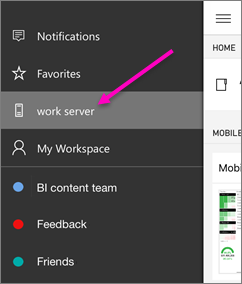
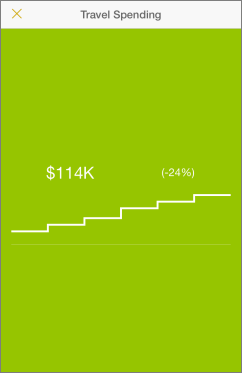

<properties 
   pageTitle="View Reporting Services mobile reports and KPIs in the iPhone app"
   description="The iPhone app (Power BI for iOS) offers live, touch-enabled mobile access to your important on-premises business information."
   services="powerbi" 
   documentationCenter="" 
   authors="maggiesMSFT" 
   manager="mblythe" 
   backup=""
   editor=""
   tags=""
   qualityFocus="no"
   qualityDate=""/>
 
<tags
   ms.service="powerbi"
   ms.devlang="NA"
   ms.topic="article"
   ms.tgt_pltfrm="NA"
   ms.workload="powerbi"
   ms.date="09/30/2016"
   ms.author="maggies"/>

# View SQL Server Reporting Services mobile reports and KPIs in the iPhone app (Power BI for iOS)  

The iPhone app for Microsoft Power BI for iOS offers live, touch-enabled mobile access to your important on-premises business information. 

 

[Create Reporting Services mobile reports](https://msdn.microsoft.com/library/mt652547.aspx) with SQL Server Mobile Report Publisher and publish them to the [Reporting Services web portal](https://msdn.microsoft.com/library/mt637133.aspx). Create KPIs right in the web portal. Organize them in folders and mark your favorites, so you can find them easily. 

Then in the iPhone app for Power BI, view the mobile reports and KPIs, organized in folders or collected as favorites. 

>**Note**: Your iPhone needs to be at least an iPhone 5, running at least iOS 8.0.

## Explore samples without an SSRS server

Even if you don't have access to a Reporting Services web portal, you can still explore the features of Reporting Services mobile reports. 

1. Tap the global navigation button  in the upper-left corner, scroll down and tap **Reporting Services samples**.

2.  Browse to interact with the sample KPIs and mobile reports.

    

## Connect to a server to view Reporting Services mobile reports 

1.  In the iPhone, open the Power BI app.
  
2.  To view your Reporting Services mobile reports and KPIs, tap **SQL Server Reporting Services**.

    

    If you're already in the Power BI app, tap the global navigation button  in the upper-left corner, and tap **Connect Server**.

    

4. Fill in the server address and your user name and password.

    >**Note**: Include **http** or **https** in front of the connection string. For example, http://*servername*.com/reports.

    Tap **Advanced option** to give the server a name, if you'd like.

5.  Now you see the server in the left navigation bar--in this example, called "work server."

    

>**Tip**: Tap the global navigation button  anytime to go between your Reporting Services mobile reports and your dashboards in the Power BI service. 

## View Reporting Services KPIs and mobile reports in the Power BI app

Reporting Services KPIs and mobile reports are displayed in the same folders they're in on the Reporting Services web portal. 

- Tap a KPI to see it in focus mode.

    

- Tap a mobile report to open and interact with it in the Power BI app.

    

## View your favorite KPIs and reports

You can mark KPIs and mobile reports as favorites on your Reporting Services web portal, and then view them in one convenient folder on your iPhone, along with your Power BI favorite dashboards and reports.

-  Tap **Favorites**.

    
   
    Your favorites from the web portal are all on this page.

    

## Remove a connection to a report server

You can only be connected to one report server at a time from your iPhone app. If you want to connect to a different server, you need to disconnect from the current one.

1. At the bottom of the left navigation bar, tap **Settings**.
2. Tap the server name you don't want to be connected to.
3. Tap **Remove Server**.

## Create Reporting Services mobile reports and KPIs

You don't create Reporting Services KPIs and mobile reports in the Power BI mobile app. You create them in SQL Server Mobile Report Publisher and a SQL Server 2016 Reporting Services web portal.

- [Create your own Reporting Services mobile reports](https://msdn.microsoft.com/library/mt652547.aspx), and publish them to the Reporting Services web portal.
- Create [KPIs on the Reporting Services web portal](https://msdn.microsoft.com/library/mt683632.aspx)

### See also  
- [Get started with the iPhone app for Power BI](powerbi-mobile-iphone-app-get-started.md)  
- [Get started with Power BI](powerbi-service-get-started.md)  
- Questions? [Try asking the Power BI Community](http://community.powerbi.com/)