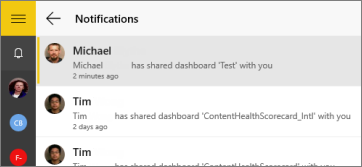
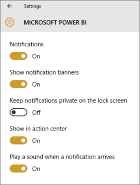

<properties
   pageTitle="Get notifications in the Power BI mobile apps"
   description="The Notification Center brings information related to your Power BI experience right to you on your mobile device."
   services="powerbi"
   documentationCenter=""
   authors="maggies"  
   manager="mblythe"
   backup=""
   editor=""
   tags=""
   qualityFocus="no"
   qualityDate=""/>

<tags
   ms.service="powerbi"
   ms.devlang="NA"
   ms.topic="article"
   ms.tgt_pltfrm="NA"
   ms.workload="powerbi"
   ms.date="06/15/2016"
   ms.author="maggies"/>

# Get notifications in the Power BI mobile apps

Notifications bring information related to your Power BI experience right to you, in the Power BI service or on your mobile device. When you open Notifications, you see a sequential feed of messages about new dashboards that have been shared with you, changes to your Group space, information about Power BI events and meetings, and more.

>**Note**: On an iOS device, the first time you sign in to the [updated version of the Power BI apps](https://powerbi.microsoft.com/mobile/), you see a message asking if you'd like Power BI to send notifications. You can also configure how Power BI notifies you in **Settings** for your device. 
  
1.  When you receive notifications on your mobile device, by default Power BI makes a sound and shows a notification banner.

    

    You can change how Power BI notifies you.

2.  If you've received notifications, when you sign in to Power BI on your mobile device you see a yellow dot on main menu icon  (Android) or on the **Notifications** icon. 
  
    

3.  Select the Notifications icon  (Windows 10).

     Notifications are displayed with the most recent on top and unread messages highlighted. Notifications are retained for 90 days unless you delete them or reach the maximum limit of 100.

    

4.  To dismiss a notification, tap and hold it and select **Dismiss**.

## Change or turn off notifications on your mobile device

You can change how Power BI notifies you.

1. On an iPhone, go to **Settings** > **Notifications**. 

    On an Android phone, go to **Notification Settings**.

    On a Windows device, in **Settings** go to **System** > **Notifications & actions**.

2. In the list of apps, select **Power BI**. 

3. Here you can turn notifications off completely or choose which notifications you want.

     **On an iPhone**

    

    **On an Android phone**

    

    **On a Windows 10 device**

    

### See also
- [Download the latest version of the Power BI apps](https://powerbi.microsoft.com/mobile/) for mobile devices
- [Power BI Notification Center](powerbi-service-notification-center.md)