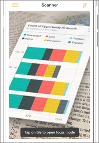
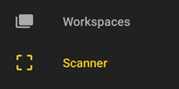

<properties
   pageTitle="Scan a Power BI QR code from your mobile device"
   description="QR codes in Power BI can connect anything in the real world directly to related BI information in the Power BI mobile app for iPhones and Android devices."
   services="powerbi"
   documentationCenter=""
   authors="maggiesMSFT"
   manager="erikre"
   backup=""
   editor=""
   tags=""
   qualityFocus="no"
   qualityDate=""/>

<tags
   ms.service="powerbi"
   ms.devlang="NA"
   ms.topic="article"
   ms.tgt_pltfrm="NA"
   ms.workload="powerbi"
   ms.date="10/12/2017"
   ms.author="maggies"/>

# Scan a Power BI QR code from your mobile device

Applies to:

|  |  |  |
|:------------------------|:----------------------------|:----------------------------|:----------------------------------------|
| iPhones | Android phones | Android tablets |

QR codes in Power BI can connect any item in the real world directly to related BI information &#151; no navigation or search needed.

Say a colleague has [created a QR code in the Power BI service](powerbi-service-qr-code-for-tile.md) for a report or for a tile in a dashboard, shared the dashboard or report with you, and placed the QR code in a key location &#151; for example, in an email or on a specific item. 

You can scan the QR code for immediate access to the relevant tile or report, right from your phone, using either the scanner in the Power BI app, or any other scanner installed on your phone. 

> [AZURE.NOTE] If your colleague hasn't shared the dashboard or report with you, you can request access directly from the mobile app.

## Scan a Power BI QR code on your iPhone with the Power BI scanner

1. In the Power BI mobile app open the global navigation menu  in the upper left. 

2. Scroll down to **Scanner** and select it. 

    

3. If your camera is not enabled, you need to approve the Power BI app to use the camera. This is a one-time approval. 

4. Point the scanner at the Power BI QR code. 

    

5. The tile or report appears to hover over the background in augmented reality.

    

6. Tap the report or the tile to open it in focus mode, or go back to the scanner.

### Scan a QR code from an external scanner on your iPhone

1. From any scanner installed on your phone, point the scanner to the relevant Power BI QR code for immediate access to the tile or report. 

2. If you don’t have the Power BI app installed, you are redirected to the [Apple App Store to download it](http://go.microsoft.com/fwlink/?LinkId=522062) on your iPhone.

## Scan a Power BI QR code on your Android device with the Power BI scanner

1. In the Power BI mobile app open the global navigation button  in the upper left. 

2. Scroll down to **QR Scanner** and select it.

    

3. If your camera isn't enabled, you need to approve the Power BI app to use the camera. This is a one-time approval. 

4. Point the scanner at the Power BI QR code. 

    

5. The tile or report opens automatically in Power BI.

    

### Scan a QR code from an external scanner on your Android device

1. From any scanner installed on your Android device, point the scanner to the relevant Power BI QR code for immediate access to the tile or report. 

2. If you don’t have the Power BI app installed, you are redirected to [Google Play to download it](http://go.microsoft.com/fwlink/?LinkID=544867). 

## Next steps

-  [Connect to Power BI data from the real world](powerbi-mobile-data-in-real-world-context.md) with the mobile apps
-  [Create a QR code for a tile in the Power BI service](powerbi-service-qr-code-for-tile.md)
-  [Create a QR code for a report in the Power BI service](powerbi-service-qr-code-for-report.md)
-  Questions? [Try asking the Power BI Community](http://community.powerbi.com/)
