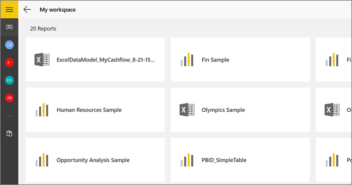
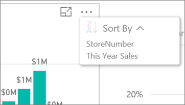
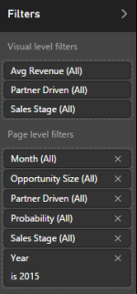
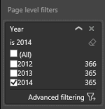

<properties 
   pageTitle="Reports in the Power BI mobile app for Windows 10"
   description="Reports in the Power BI mobile app for Windows 10"
   services="powerbi" 
   documentationCenter="" 
   authors="maggiesMSFT" 
   manager="mblythe" 
   editor=""
   tags=""/>
 
<tags
   ms.service="powerbi"
   ms.devlang="NA"
   ms.topic="article"
   ms.tgt_pltfrm="NA"
   ms.workload="powerbi"
   ms.date="01/14/2016"
   ms.author="maggies"/>
# Reports in the Power BI mobile app for Windows 10

A report is an interactive view of your data, with visuals representing different findings and insights from that data. You [create and customize reports](powerbi-service-create-a-new-report.md) in the Power BI service [(https://powerbi.com)](https://powerbi.com).

Then you view and interact with those reports in the [Power BI mobile app for Windows 10](powerbi-mobile-win10phone-app-get-started.md).

## Open a Power BI report

-   In **My workspace** or in a group, tap a report.

    

    >**Note**: If you [import whole Excel files into Power BI](powerbi-bring-in-whole-excel-files.md), they have an Excel icon. When you tap them in the app, they open in the [Power BI service](https://powerbi.com) in a browser window.

-   Or: On a dashboard, tap a tile, then tap the Open Report icon .

    >**Note**: Not all tiles can open in a report. For example, tiles you create by asking a question in the Q&A box don't open reports when you tap them.
	Also, to open the sample reports, you need to sign in to Power BI.

## See other pages in a Power BI report

-   Tap the tabs at the bottom of the page. 

## Sort a chart in a Power BI report

1.  Tap the chart. 

2.  Tap the ellipsis (...) in the upper-right corner, tap the **Sort by** arrow, then tap the field name.

    

3.  To reverse the sort order, tap **A\>Z** or **Z\>A**. 

## Cross-filter and highlight a Power BI report page

-   Tap a value in a chart.

    

    Tapping the red "030-Kids" bubble in the bubble chart highlights related values in the other charts. Because the column chart in the upper-right shows percentages, some highlighted values are larger than the total values, and some are smaller. 

## Filter a Power BI report

You can always filter individual visuals in a Power BI report by using the fields in the visual itself as filters. You can also filter whole pages in a report, if you or the report creator has [added filters to the page](powerbi-service-add-a-filter-to-a-report.md) in the Power BI service ([https://powerbi.com](http://powerbi.com/)). In the Power BI service, you can also add other fields as filters for a specific visual. 

> **Note**  If you don't have Edit permission for a report, you can change the filters, but you can't save those changes. 

1. In a report, expand the Filters pane, if it's collapsed.

    

    If the report creator has set page-level filters, when you select a visual you see filters for the page and the visual.

    

2. Select check boxes for the values you want.

    

3. Or you can switch the filtering mode. Tap **Advanced filtering**  at the end of the list of values, to select values using expressions instead.

 -   Number fields offer expressions such as **is less than**, **is greater than**, **is not**, and **is blank**.

        

 -   Text fields offer expressions such as **contains**, **doesn't start with**, and **is not**.

4.  To add other fields to the Filters pane, go to the Power BI service ([https://powerbi.com](http://powerbi.com/)), [add filters to the page](powerbi-service-add-a-filter-to-a-report.md), and save the report.

## Drill down and up in a chart

In charts with up and down arrows in the upper corners, you can drill down to see the values that make up one part of the chart. To [add drill down to a visual](powerbi-service-drill-down-in-a-visualization.md), edit the report in the Power BI service ([https://powerbi.com](http://powerbi.com/)).

-   Tap the arrow in the upper-right corner to turn on drill-down.
   
    

-   Double-tap a bar, column, or other part of a chart to drill into the details for that part — in this case, the OH column for stores in Ohio.

-   To drill back up, tap and hold or right-click the chart, and tap the up arrow in the upper-right corner.

    

### See also

[Get started with the Power BI app for Windows 10 devices](powerbi-service-windows-app-get-started.md).

