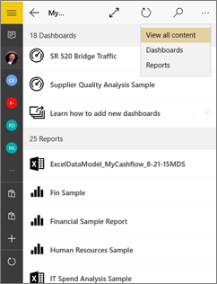
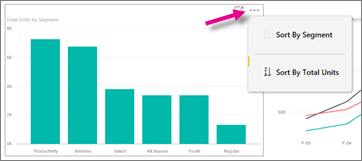

<properties 
   pageTitle="Reports in the Power BI mobile app for Windows 10"
   description="Learn about viewing reports in the Power BI mobile app for Windows 10. You create reports in the Power BI service, then interact with them in the mobile apps. "
   services="powerbi" 
   documentationCenter="" 
   authors="maggiesMSFT" 
   manager="mblythe" 
   backup=""
   editor=""
   tags=""
   qualityFocus="no"
   qualityDate=""/>
 
<tags
   ms.service="powerbi"
   ms.devlang="NA"
   ms.topic="article"
   ms.tgt_pltfrm="NA"
   ms.workload="powerbi"
   ms.date="10/12/2016"
   ms.author="maggies"/>
# Reports in the Power BI mobile app for Windows 10

A report is an interactive view of your data, with visuals representing different findings and insights from that data. You [create and customize reports](powerbi-service-create-a-new-report.md) in the Power BI service [(https://powerbi.com)](https://powerbi.com).

Then you view and interact with those reports in the [Power BI mobile app for Windows 10](powerbi-mobile-win10phone-app-get-started.md).

## Open a Power BI report

You can open reports in **My workspace** or in a group on your Windows 10 phone in several ways: 

-   Scroll down to your reports, or 
-   Tap **View all content** > **Reports**. 
    
    

-   Or tap the search icon  to see the list of reports you've visited recently or to search for it by name.

    

    > [AZURE.NOTE]  If you [import whole Excel files into Power BI](powerbi-bring-in-whole-excel-files.md), they have an Excel icon. When you tap them in the app, they open in the [Power BI service](https://powerbi.com) in a browser window.

-   Or on a dashboard, tap the vertical ellipsis on the tile, then tap the **Open Report** icon .

    

    > [AZURE.NOTE]  Not all tiles can open in a report. For example, tiles you create by asking a question in the Q&A box don't open reports when you tap them.   

## See other pages in a Power BI report

-   Tap the tabs at the bottom of the page. 

## Sort a chart in a Power BI report

> [AZURE.NOTE]  Sorting isn't available on Windows 10 phones.

1.  Tap the chart. 

2.  Tap the ellipsis (...) in the upper-right corner, tap the **Sort by** arrow, then tap the field name.

    

3.  To reverse the sort order, tap the **Sort by** arrow, then tap the same field name again. 

## Cross-filter and highlight a Power BI report page

-   Tap a value in a chart.

    

    Tapping the red "030-Kids" bubble in the bubble chart highlights related values in the other charts. Because the column chart in the upper-right shows percentages, some highlighted values are larger than the total values, and some are smaller. 

## Use slicers to filter the report page

When designing a report in the Power BI service [(https://powerbi.com)](https://powerbi.com), you can [add slicers to a report page](powerbi-service-tutorial-slicers.md). Then when you or your colleagues view your reports on your mobile devices, you can use the slicers to filter the page.

-   Select a value in a slicer on the report page.

    

## Filter a Power BI report

You can always filter individual visuals in a Power BI report by using the fields in the visual itself as filters. You can also filter whole pages in a report, if you or the report creator has [added filters to the page](powerbi-service-add-a-filter-to-a-report.md) in the Power BI service ([https://powerbi.com](http://powerbi.com/)). In the Power BI service, you can also add other fields as filters for a specific visual. 

> [AZURE.NOTE]  
> 
> - If you don't have Edit permission for a report, you can change the filters, but you can't save those changes. 
> - Report filtering isn't available on Windows 10 phones. However, slicers are available on phones. See [Use slicers to filter the report page](powerbi-mobile-reports-in-the-windows-app.md#use-slicers-to-filter-the-report-page).

1. In a report, expand the Filters pane.

    

    If the report creator has set page-level filters, when you select a visual you see *visual-level filters* for that visual, and *page-level filters* for the whole page.

    

2. Select check boxes for the values you want.

3. Or you can switch the filtering mode. Tap **Basic filtering** and select **Advanced filtering** to select values using expressions instead.

    

    Number fields offer expressions such as **is less than**, **is greater than**, **is not**, and **is blank**.

       

    Text fields offer expressions such as **contains**, **doesn't start with**, and **is not**.

4.  To add other fields to the Filters pane, go to the Power BI service ([https://powerbi.com](http://powerbi.com/)), [add filters to the page](powerbi-service-add-a-filter-to-a-report.md), and save the report.

## Drill down and up in a chart

In charts with up and down arrows in the upper corners, you can drill down to see the values that make up one part of the chart. To [add drill down to a visual](powerbi-service-drill-down-in-a-visualization.md), edit the report in the Power BI service ([https://powerbi.com](https://powerbi.com/)).

> [AZURE.NOTE]  Drill down and up isn't available on Windows 10 phones.

1.   Tap the arrow in the upper-right corner to turn on drill-down.
   
    

2.   Double-tap a bar, column, or other part of a chart to drill into the details for that part — in this case, the OH column for stores in Ohio.

3.   To drill back up, tap and hold or right-click the chart, and tap the up arrow in the upper-right corner.

    

## Go back to My Workspace

-  Tap the back arrow, or tap the report name > **My Workspace**.

    

### See also

- [Get started with the Power BI app for Windows 10 devices](powerbi-service-windows-app-get-started.md)
- Questions? [Try asking the Power BI Community](http://community.powerbi.com/)

