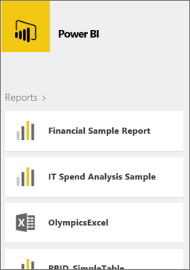
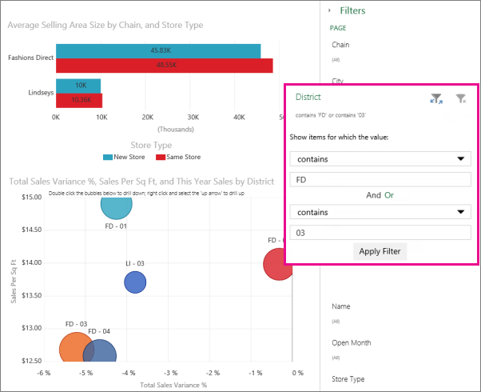

<properties 
   pageTitle="Reports in the Power BI for Windows app"
   description="Reports in the Power BI for Windows app"
   services="powerbi" 
   documentationCenter="" 
   authors="pcw3187" 
   manager="mblythe" 
   editor=""
   tags=""/>
 
<tags
   ms.service="powerbi"
   ms.devlang="NA"
   ms.topic="article"
   ms.tgt_pltfrm="NA"
   ms.workload="powerbi"
   ms.date="10/14/2015"
   ms.author="v-pawrig"/>
# Reports in the Power BI for Windows app

A report is an interactive view of your data, with visuals representing different findings and insights from that data. You [create and customize reports in the Power BI service (https://powerbi.com)](powerbi-service-reports.md).

Then you view and interact with those reports in the [Power BI for Windows app](powerbi-service-windows-app-get-started.md).

## Open a Power BI report

-   On the Windows app home page or the reports page, tap a report.

    

    >**NOTE**: If you have [brought whole Excel files into Power BI](powerbi-bring-in-whole-excel-files.md), when you tap them in the app, they open in your browser.

-   Or: On a dashboard, tap a tile and then tap the Reports icon.

    

    >**NOTE**: Not all tiles can open in a report. For example, tiles you create by asking a question in the Q&A box don't open reports when you tap them.
	Also, to open the sample reports, you need to sign in to Power BI.

## See other pages in a Power BI report

-   Tap the arrows at the bottom of the page. 

## Sort a chart in a Power BI report

1.  Tap and hold, or right-click the chart. 

2.  Tap the down arrow next to **Sort by**, then tap the field name.

    

3.  To reverse the sort order, tap **A\>Z** or **Z\>A**. 

## Select more than one item in a chart

1.  Tap and hold, or right-click the chart. 

2.  Tap the multiselect icon in the upper-right corner of the chart.

    

3.  When the icon is grayed , you can select more than one column at a time.

    

## Cross-filter and highlight a Power BI report page

-   Tap a bar or column in a chart.

    

    Tapping the three bubbles in the bubble chart highlights related values in the other charts. Because the bar chart in the upper-right shows percentages, some highlighted values are larger than the total values and some are smaller. 

## Filter a Power BI report

You can always filter visuals in a Power BI report, because you can use the fields in the visual itself as filters. You can also filter whole pages in a report, if you or someone else has [added filters to the page](powerbi-service-add-a-filter-to-a-report.md) in the Power BI service ([https://powerbi.com](http://powerbi.com/)). You can also add other fields to a visual as filters in the Power BI service. 

In a report, expand the Filters pane, if it's collapsed.

When filtering fields, you can select check boxes for the values you want.

Or you can switch the filtering mode. Tap **Change filter type**  to select values using expressions instead.

-   Number fields offer expressions such as **is less than**, **is greater than**, **is not**, and **is blank**.

-   Text fields offer expressions such as **contains**, **doesn't start with**, and **is not**.

### Filter a visual in a Power BI report

When you filter a visual, such as a chart, you can always filter it by one of the fields in the chart. 

1.  On a report page, select a chart or other visual and tap **Filters** in the upper-right corner to expand the Filters pane.

    

    You see a list of the fields in the visual, and maybe other fields, if you added them in the Power BI service ([https://powerbi.com](http://powerbi.com)).

2.  Tap the name of the field to expand it, and select the values you want to filter.

### Filter a page in a Power BI report

You can only filter a whole page if you or someone else has added a filter to the page in [t](http://powerbi.com/)he Power BI service ([https://powerbi.com](http://powerbi.com/)).

1.  In a report page, without selecting any visuals on the page, tap **Filters** in the upper-right corner.

    

2.  If there are fields under the Page heading, you can set filters for the page.

3.  if there are no fields in the Filters pane or you want other fields go to the Power BI service ([https://powerbi.com](http://powerbi.com/)), [add filters to the page](powerbi-service-add-a-filter-to-a-report.md), and save the report.

## Drill down and up in a chart

You can drill down in some charts to see the values that make up one part of the chart. To [add drill down to a visual](powerbi-service-drill-down-in-a-visualization.md), edit the report in the Power BI service ([https://powerbi.com](http://powerbi.com/)).

-   Double-tap a bar, column, or other part of a chart to drill into the details for that part — in this case, the red **FD-02 **bubble.

    

-   To drill back up, tap and hold or right-click the chart, and tap the up arrow in the upper-right corner.

    

More about the [Power BI for Windows app](powerbi-service-windows-app-get-started.md).

