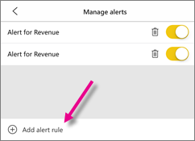
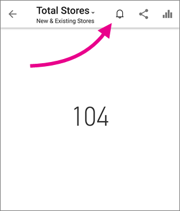
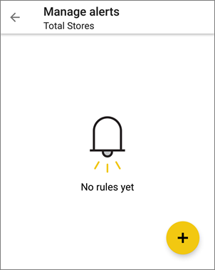
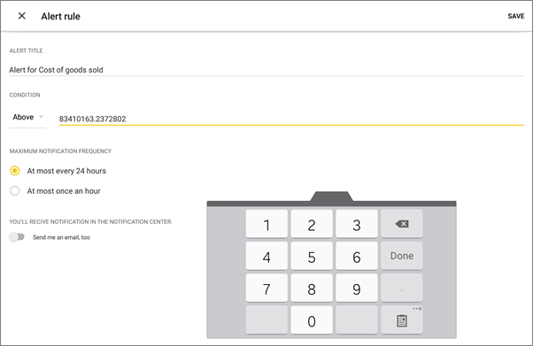
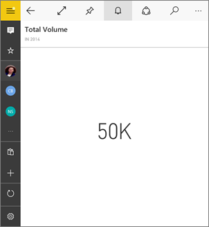
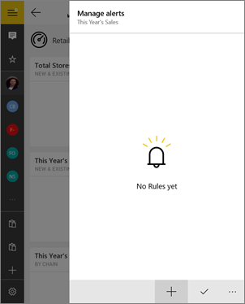
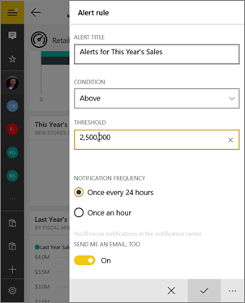
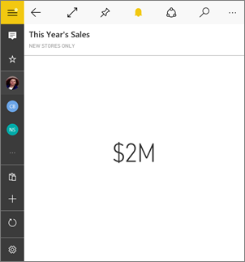

<properties
   pageTitle="Set data alerts in the Power BI mobile apps"
   description="Learn to set alerts in the Power BI mobile apps and in the Power BI service to notify you when data in a dashboard changes beyond limits you set."
   services="powerbi"
   documentationCenter=""
   authors="maggiesMSFT"
   manager="erikre"
   backup=""
   editor=""
   tags=""
   qualityFocus="no"
   qualityDate=""/>

<tags
   ms.service="powerbi"
   ms.devlang="NA"
   ms.topic="article"
   ms.tgt_pltfrm="NA"
   ms.workload="powerbi"
   ms.date="07/19/2017"
   ms.author="maggies"/>

# Set data alerts in the Power BI mobile apps

Applies to:

|  |  |  |  |  |
|:------------------------|:----------------------------|:----------------------------|:----------------------------------------|:-----------------|
| iPhones | iPads | Android phones | Android tablets | Windows 10 devices |

You can set alerts in the Power BI mobile apps and in the Power BI service to notify you when data in a dashboard changes beyond limits you set. Alerts work for tiles featuring a single number, such as cards and gauges, but not with streaming data. You can set data alerts on your mobile device and see them in the Power BI service, and vice versa. Only you can see the data alerts you set, even if you share a dashboard or a snapshot of a tile.

> [AZURE.WARNING] Data-driven alert notifications provide information about your data. If your device gets stolen, we recommend going to the Power BI service to turn off all data-driven alert rules. 
> 
> Learn more about [managing data alerts in the Power BI service](powerbi-service-set-data-alerts.md).

## Data alerts on an iPhone or iPad

### Set an alert on an iPhone or iPad

1.  Tap a number or gauge tile in a dashboard to open it in focus mode.  

    

2.  Tap the bell icon  to add an alert.  

3.  Tap **Add alert rule**.

    

4.  Choose to receive alerts above or below a value, then set the value.

    

4.  Decide whether to receive hourly or daily alerts, and whether to also receive an email when you get the alert.

    > [AZURE.NOTE] You don't receive alerts every hour or every day unless the data has actually refreshed in that time.

6.  You can change the alert title, too.

6.  Tap **Save**.

7.  A single tile can have alerts for values both above and below thresholds. In **Manage alerts**, tap **Add alert rule**.

    

### Manage alerts on your iPhone or iPad

You can manage individual alerts on your mobile device or [manage all your alerts in the Power BI service](powerbi-service-set-data-alerts.md).

1.  In a dashboard, tap a number or gauge tile that has an alert.  

    

2.  Tap the bell icon .  

3. Tap the name of the alert to edit it, tap the slider to turn off email alerts, or tap the garbage can to delete the alert.

    

## Data alerts on an Android device

### Set an alert on an Android device

1.  In a Power BI dashboard, tap a number or gauge tile to open it.  

2.  Tap the bell icon  to add an alert.  

    

3.  Tap the plus icon (+).

    

4.  Choose to receive alerts above or below a value, and type the value.

    

4.  Tap **Done**.

5.  Decide whether to receive hourly or daily alerts, and whether to also receive an email when you get the alert.

    > [AZURE.NOTE] You don't receive alerts every hour or every day unless the data has actually refreshed in that time.

6.  You can change the alert title, too.

6.  Tap **Save**.

### Manage alerts on an Android device

You can manage individual alerts in the Power BI mobile app or [manage all your alerts in the Power BI service](powerbi-service-set-data-alerts.md).

1.  In a dashboard, tap a card or gauge tile that has an alert.  

2.  Tap the solid bell icon .  

3. Tap the alert to change a value or turn it off.

    

4. Tap the plus icon (+) to add another alert to the same tile.

4. To delete the alert altogether, tap the garbage can icon .

## Data alerts on a Windows device

### Set data alerts on a Windows device

1.  Tap a number or gauge tile in a dashboard to open it.  

2.  Tap the bell icon  to add an alert.  

    

3.  Tap the plus icon (+).

    

4.  Choose to receive alerts above or below a value, and type the value.

    

4.  Decide whether to receive hourly or daily alerts, and whether to also receive an email when you get the alert.

    > [AZURE.NOTE] You don't receive alerts every hour or every day unless the data has actually refreshed in that time.

6.  You can change the alert title, too.

6.  Tap the check mark.

7.  A single tile can have alerts for values both above and below thresholds. In **Manage alerts**, tap the plus sign (+).

    

### Manage alerts on a Windows device

You can manage individual alerts in the Power BI mobile app or [manage all your alerts in the Power BI service](powerbi-service-set-data-alerts.md).

1.  In a dashboard, tap a card or gauge tile that has an alert.  

2.  Tap the bell icon .  

    

3. Tap the alert to change a value or turn it off.

    

4. To delete the alert altogether, right-click or tap and hold > **Delete**.

## Receiving alerts

You receive alerts in the Power BI [Notification Center](powerbi-mobile-notification-center.md) on your mobile device or in the Power BI service, along with notifications about new dashboards that someone has shared with you.

Data sources are often set to refresh daily, although some refresh more often. When the data in the dashboard is refreshed, if the data being tracked reaches one of the thresholds you've set, several things will happen.

1.  Power BI checks to see if it's been more than an hour or more than 24 hours (depending on the option you selected) since the last alert was sent.

    As long as the data is past the threshold, you'll get an alert every hour or every 24 hours.

2.  If you've set the alert to send you an email, you'll find something like this in your Inbox.

    

3.  Power BI adds a message to your **Notification center** and adds a new alert icon to the applicable tile .

4. Tap the global navigation button  to [open your **Notification center**](powerbi-mobile-notification-center.md) and see the alert details.

      

> [AZURE.NOTE] Alerts only work on data that is refreshed. When data refreshes, Power BI looks to see if an alert is set for that data. If the data has reached an alert threshold, an alert is triggered.

## Tips and troubleshooting
- Alerts currently aren't supported for Bing tiles or card tiles with date/time measures.
- Alerts only work with numeric data.
- Alerts only work on data that is refreshed. They don't work on static data.
- Alerts don't work with tiles that contain streaming data.

## Next steps 
- [Manage your alerts in the Power BI service](powerbi-service-set-data-alerts.md)
- [Power BI Mobile Notification Center](powerbi-mobile-notification-center.md)
- Questions? [Try asking the Power BI Community](http://community.powerbi.com/)
