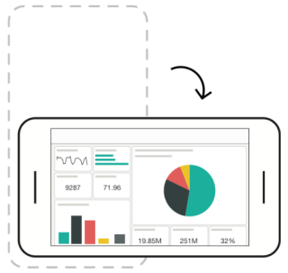

<properties 
   pageTitle="What's new in the mobile apps for Power BI"
   description="What's new in the mobile apps for Power BI"
   services="powerbi" 
   documentationCenter="" 
   authors="maggiesMSFT" 
   manager="mblythe" 
   editor=""
   tags=""/>
 
<tags
   ms.service="powerbi"
   ms.devlang="NA"
   ms.topic="article"
   ms.tgt_pltfrm="NA"
   ms.workload="powerbi"
   ms.date="01/06/2016"
   ms.author="maggies"/>

# What's new in the mobile apps for Power BI  

## December 2015
The Power BI team ended 2015 strong, with several major additions and updates.

### SQL Server 2016 Reporting Services mobile reports in iOS
Now you can view your SQL Server mobile reports in the Power BI app on your iOS device, be it iPad or iPhone. Read more:

-   [SQL 16 SSRS on Power BI app for iOS](http://blogs.msdn.com/b/powerbi/archive/2015/12/30/sql-16-ssrs-on-power-bi-app-for-ios.aspx) blog post
-   View [SQL Server mobile reports and KPIs in the iPad app](powerbi-mobile-ipad-kpis-mobile-reports.md) documentation
-   View [SQL Server mobile reports and KPIs in the iPhone app](powerbi-mobile-iphone-kpis-mobile-reports.md) documentation

### Power BI app for Windows 10 phones
The new Power BI app for Windows 10 phones is optimized for touch and mobile productivity. Explore dashboards and reports, invite colleagues to view data, and share insights over email to engage your team. Plus you can [pin Power BI dashboards to your Windows phone Start screen](powerbi-mobile-pin-dashboard-from-win10phone-app.md).

-   Read the [Power BI app for Windows 10 phones blog post](http://blogs.msdn.com/b/powerbi/archive/2015/12/30/announcing-the-power-bi-app-for-windows-10-mobile.aspx).
-   [Get started with the Power BI app for Windows 10 phones](powerbi-mobile-win10phone-app-get-started.md).

### Other additions
Read the [Power BI mobile apps December blog post](http://blogs.msdn.com/b/powerbi/archive/2015/12/30/power-bi-mobile-apps-update-_2d00_-december-2015.aspx) for more details.

-   Receive notifications when a colleague shares a dashboard with you. (iOS)
-   View entire [pinned report pages in your dashboards](powerbi-mobile-report-page-tiles-in-the-iphone-app.md). (iOS and Android)
-   [Scan a QR code](http://blogs.msdn.com/b/powerbi/archive/2015/12/08/bridge-the-gap-between-your-physical-world-and-your-bi-using-qr-codes.aspx) and go directly to a relevant tile on your Android phone.

## November 2015

Read the [November 2015 Power BI mobile blog post](http://blogs.msdn.com/b/powerbi/archive/2015/11/24/power-bi-mobile-apps-update-_2d00_-november-2015.aspx).

### All Power BI mobile apps

- A new welcome experience.
- Improved chart data capacity.

### iPhone mobile app

- [Add a picture tile to a dashboard](powerbi-mobile-picture-tiles-in-the-iphone-app.md) directly from your iPhone.
- [Create QR codes in the Power BI service](powerbi-service-qr-code-for-tile.md), then scan them from your iPhone to open the Power BI app to a specific tile.

### The Power BI app for Windows devices

- [Link directly from a tile to a specific URL](powerbi-service-edit-a-tile-in-a-dashboard.md#hyperlink).

## October 2015

Read the [mid-October Power BI mobile blog post](http://blogs.msdn.com/b/powerbi/archive/2015/10/21/power-bi-mobile-mid-october-updates-are-here.aspx).

### All Power BI mobile apps 

- Line charts with a percentage-based Y-axis now calculate the visual range according to your actual data. The graph now starts from the lowest data point in the chart, instead of from a default value.

- Line, column, and bar charts can now have data labels. 

    

### iPhone
- Stay up to date with your groups' newest dashboards -- receive notifications on your iPhone each time a team member adds a dashboard to one of your groups.

    

- You can now view dashboards horizontally, just by turning your phone. Read more about [landscape mode in the iPhone app](http://blogs.msdn.com/b/powerbi/archive/2015/11/02/enjoy-the-landscape-with-the-power-bi-iphone-app.aspx).

    

## September 2015  
Improvements in the Power BI mobile apps -- Android, iOS (iPhone and iPad), and Windows. Read the [mid-September Power BI mobile blog post](http://blogs.msdn.com/b/powerbi/archive/2015/09/23/power-bi-mobile-mid-september-updates-are-here.aspx).

### Android  
-   Support for group workspaces: Collaborate with colleagues in group workspaces. 

-   Support for non-authenticated users:  For the few scenarios when users fail or can’t sign in to the app, we added a fast, convenient way to contact support and send feedback.

-   Improved user experience when accessing dashboards using role-based security.          

-   Improved data formatting of charts and alignment of all dashboard tiles. 

### iOS (iPhone and iPad)  
-   New & improved navigation: New drawer navigation maximizes screen real estate and improves navigation throughout the app. 

-   Group workspaces: Collaborate with colleagues in group workspaces. 

-   Authentication process upgrade Quality, performance, and functionality improvements enhance the app authentication process, including support for SSO (Single Sign-On). 

-   Improved data representation of line chart tiles to better compress the x-axis.

-   Improved user experience when using with role-based security.

-   Touch-optimized improvements for matrix chart tiles: Now you can easily scroll through your matrix data and view all its data easily and intuitively.

-   Improved data formatting of charts and alignments of dashboard tiles. 

-   Removal of iOS 7 support: To maintain highest security standards for Power BI, we will no longer support iOS 7 installed devices. iOS 8 and above is required. 

-   Send feedback and rating added in app: Added in-app capability to send feedback and provide ratings so that we can increase the community’s influence on our roadmap and promote issues easily and directly from the app.

### Windows   
-   Improved map tile rendering in in-focus mode to maximize screen real estate.

-   Improved user experience when accessing dashboards using role-based security. 

-   A new capability allows you to browse back and forth through dashboard tiles exploring them directly in in-focus mode without the need to return to the dashboard to select the next tile.

-   Additional stability and performance improvements. 