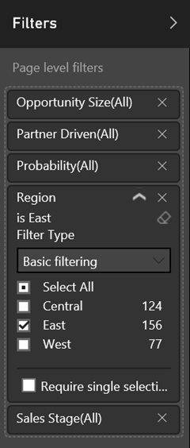

<properties 
   pageTitle="View Power BI presentation mode on Surface Hub & Windows 10"
   description="Read about displaying Power BI reports in Surface Hub, and displaying Power BI dashboards, reports, and tiles in full-screen mode on Windows 10 devices."
   services="powerbi" 
   documentationCenter="" 
   authors="maggiesMSFT" 
   manager="erikre" 
   backup=""
   editor=""
   tags=""
   qualityFocus="no"
   qualityDate=""/>
 
<tags
   ms.service="powerbi"
   ms.devlang="NA"
   ms.topic="article"
   ms.tgt_pltfrm="NA"
   ms.workload="powerbi"
   ms.date="01/23/2017"
   ms.author="maggies"/>

# View Power BI presentation mode on Surface Hub & Windows 10

You can display reports in presentation mode on Surface Hub, and display dashboards, reports, and tiles in full-screen mode on Windows 10 devices. 

Presentation and full-screen modes are useful for displaying Power BI at a meeting or conference, or on a dedicated projector in an office, or even just for maximizing space on a small screen. 

In full-screen mode in the Power BI mobile app, all the "chrome" such as the navigation and menu bars is removed, except the page tabs and filter pane in reports.

When you display a report in presentation mode on Surface Hub, you can draw on the pages with different colors of ink and navigate between the pages of the report.

You can also [display dashboards and reports in full-screen mode from the Power BI service](powerbi-service-dash-and-reports-fullscreen.md) on the web.

**Note**: Presentation mode is different from [focus mode for tiles](powerbi-mobile-tiles-in-the-win10phone-app.md).

## Display dashboards, reports, and tiles in full-screen mode

1. In the Power BI mobile app on a dashboard, report, or tile, tap the **Full screen** icon  to go to full-screen mode.

2. In presentation mode, you can filter a report, or search for other dashboards and reports.

    Expand the Filters pane to set or remove filters.

    

     Tap the search icon  to look for other dashboards.

    

4. To exit full-screen mode, tap the icon with two inward-facing arrows  on the toolbar, or swipe down from the top and tap the two inward-facing arrows .

## Turn on presentation mode for Surface Hub

Presentation mode is on by default in Surface Hub, but if it's turned off, you can turn it back on.

1. Tap the Settings icon  at the bottom of the left navigation bar.

2. Tap **Options**, then slide **Enable Microsoft Surface Hub presentation mode** to **On**.

    

## Display and draw on reports on Surface Hub

1. In a report, tap the **Full screen** icon  to go to Surface Hub presentation mode.

    You see a collapsible action bar on both sides of the screen. 

     -    To open it, swipe in or tap the handle.
     -    To close it, swipe out or tap the X at the top.

     >**Note**: Currently when you enable Microsoft Surface Hub presentation mode on a laptop, the action bars are always open and can't collapsed. This is temporary.

2. On devices that support writing with a pen, you can start writing immediately. 

3. To change the ink color, tap the pen in the left or right action bar.

    

3. Tap the eraser or the undo arrow to remove some or all of the ink.

4. Tap the circular arrow to refresh the report content.

4. Tap the sideways arrows to go to other pages in the report.

    

2. To exit full-screen mode, swipe down from the top and tap the two inward-facing arrows .

## See also

- [Display dashboards and reports in full-screen mode from the Power BI service](powerbi-service-dash-and-reports-fullscreen.md)
- [Download the Power BI app](http://go.microsoft.com/fwlink/?LinkID=526478) from the Windows Store  
- [Get started with Power BI](powerbi-service-get-started.md)
- Questions? [Try asking the Power BI Community](http://community.powerbi.com/)

