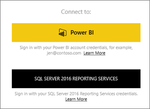
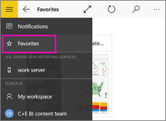
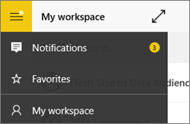

<properties 
   pageTitle="Get started with the Power BI mobile app for Windows 10"
   description="The Power BI mobile app for Windows 10 brings up-to-date, touch-enabled mobile access to your business information on your tablet or phone."
   services="powerbi" 
   documentationCenter="" 
   authors="maggiesMSFT" 
   manager="mblythe" 
   backup=""
   editor=""
   tags=""
   qualityFocus="no"
   qualityDate=""/>
 
<tags
   ms.service="powerbi"
   ms.devlang="NA"
   ms.topic="article"
   ms.tgt_pltfrm="NA"
   ms.workload="powerbi"
   ms.date="09/28/2016"
   ms.author="maggies"/>

# Get started with the Power BI mobile app for Windows 10

The Power BI mobile app for Windows 10 brings Power BI to your tablet or phone, with up-to-date, touch-enabled mobile access to your business information. View and interact with your company dashboards from anywhere &#151; right on your [Windows Start screen](powerbi-mobile-pin-dashboard-from-win10phone-app.md).

You [create dashboards and reports in the Power BI service](powerbi-service-get-started.md) with your data. 

Then interact with your dashboards and reports, explore the data, and share them, all from the Power BI mobile app for Windows 10.

## First things first

-   [**Get the Power BI mobile app for Windows 10**](http://go.microsoft.com/fwlink/?LinkID=526478) from the Windows Store.

    >**Note:** Your device needs to be running Windows 10. The app works best on devices with at least 2 GB RAM and 8 GB internal storage. It can run on devices with at least 1 GB RAM.

-   Find out [what's new in the Power Bi mobile apps](powerbi-mobile-whats-new-in-the-mobile-apps.md).

## Sign up for the Power BI service on the web

If you haven't signed up yet, go to the [Power BI service](http://powerbi.com/) to sign up for your own account for creating and storing dashboards and reports, and bringing your data together. Then sign in to Power BI from your Windows 10 device to see your own dashboards from anywhere.

1.  In the Power BI service, tap [Sign up](http://go.microsoft.com/fwlink/?LinkID=513879) to create a Power BI account.

2.    Start [creating your own dashboards and reports](powerbi-service-get-started.md).

## Get started with the Power BI app 

1.  On the Start screen of your Windows 10 device, open the Power BI app.

    
  
2.  To view your Power BI dashboards and reports, tap **Power BI**. Sign in with the same credentials as your Power BI account on the web. 

    To view your Reporting Services mobile reports and KPIs, tap **SQL Server 2016 Reporting Services**. Sign in with your SQL Server Reporting Services credentials.

    

4.  Tap **Start exploring**  to view your own dashboards.

## Try the Power BI and Reporting Services samples  
Even without signing up, you can play with the Power BI and Reporting Services samples. After you download the app, you can view the samples or get started. Go back to the samples whenever you want from the dashboards home page.

### Power BI samples

1.   Tap the global navigation button  in the upper-left corner.
  
2.   Tap **Power BI samples**, then pick a role and explore the sample dashboard for that role.  

    

    >**Note**:  Not all features are available in the samples. For example, you can't view the sample reports that underlie the dashboards. 

### Reporting Services mobile report samples

1.   Tap the global navigation button  icon  in the upper-left corner.

2.  Tap **Reporting Services samples**, then open either the Retail Reports or the Sales Reports folder to explore their KPIs and mobile reports.

    

## Search for dashboards, reports, and groups

Find your dashboards, reports, and groups quickly by typing in the search box, always at the top of the app.

1.  Tap the search icon in the upper-right corner.

    

    Power BI displays your most recent dashboards, reports, and groups.

    

2.  As you start typing, Power BI displays all relevant results.

    

## View your favorite dashboards, KPIs, and reports

You can view all of your favorite Power BI dashboards, together with Reporting Services KPIs and mobile reports, on the Favorites page in the mobile apps. When you make a dashboard a *favorite* in the Power BI mobile app, you can access it from all of your devices, including the Power BI service. 

-  Tap **Favorites**.

    
   
    Your favorites from the web portal are all on this page.

    

Read more about [favorites in the Power BI mobile apps](powerbi-mobile-favorites.md).

## What more?

See what more you can do in the Power BI app for Windows 10 devices with dashboards and reports in Power BI, and Reporting Services mobile reports and KPIs in the Reporting Services web portal

### Power BI dashboards

-   View your [dashboards](powerbi-mobile-dashboards-in-the-win10phone-app.md).
-   [Pin Power BI tiles and dashboards](powerbi-mobile-pin-dashboard-from-win10phone-app.md) to your device's Start screen as live tiles.
-   Explore the [tiles on your dashboards](powerbi-mobile-tiles-in-the-win10phone-app.md).
-   Explore your [reports](powerbi-mobile-reports-in-the-windows-app.md).
-   [Share tiles](powerbi-mobile-share-a-tile-from-the-win10phone-app.md).
-   Share [dashboards](powerbi-mobile-share-a-dashboard-from-the-win10phone-app.md).
-   View your [groups' dashboards and reports](powerbi-mobile-groups-in-the-win10phone-app.md).
-   View [notifications about updates to your Power BI account](powerbi-mobile-notification-center.md), such as dashboards that colleagues share with you.

     

### Reporting Services mobile reports and KPIs

- [View Reporting Services mobile reports and KPIs](powerbi-mobile-win10-kpis-mobile-reports.md) in the Power BI app for Windows 10 devices.
- Create [KPIs on the Reporting Services web portal](https://msdn.microsoft.com/library/mt683632.aspx).
- [Create your own mobile reports with the SQL Server Mobile Report Publisher](https://msdn.microsoft.com/library/mt652547.aspx), and publish them to the Reporting Services web portal.

### See also

- [Download the Power BI app](http://go.microsoft.com/fwlink/?LinkID=526478) from the Windows Store  
- [Get started with Power BI](powerbi-service-get-started.md)
- Questions? [Try asking the Power BI Community](http://community.powerbi.com/)

