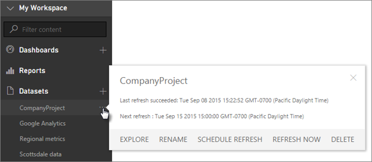
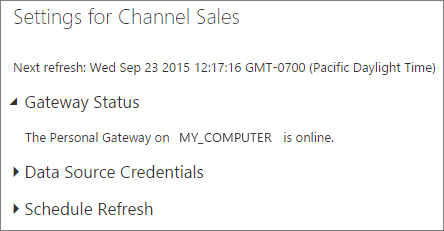
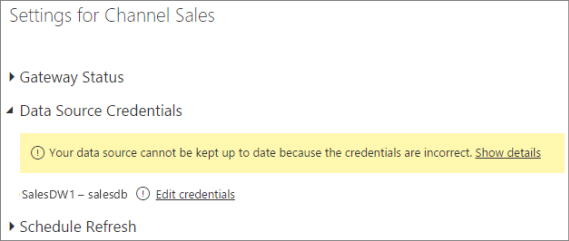
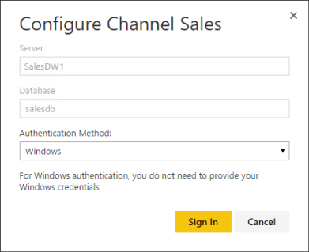
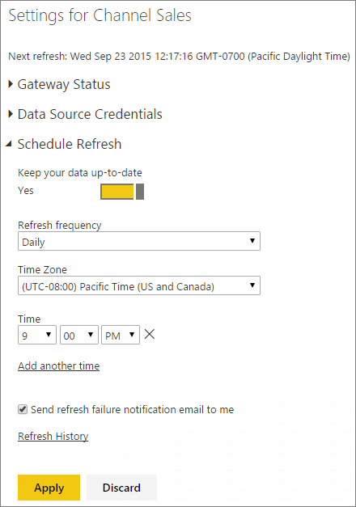

<properties
   pageTitle="Data refresh in Power BI"
   description="Data refresh in Power BI"
   services="powerbi"
   documentationCenter=""
   authors="guyinacube"
   manager="mblythe"
   editor=""
   tags=""/>

<tags
   ms.service="powerbi"
   ms.devlang="NA"
   ms.topic="article"
   ms.tgt_pltfrm="NA"
   ms.workload="powerbi"
   ms.date="01/06/2016"
   ms.author="asaxton"/>

# Data refresh in Power BI  

Making sure you’re always getting the latest data is often critical in making the right decisions. You’ve probably already used Get Data in Power BI to connect to and upload some data, created some reports and a dashboard. Now, you want to make sure your data really is the latest and greatest.

In many cases, you don’t need to do anything at all. Some data, like from a Salesforce or Marketo content pack is automatically refreshed for you. And, when you connect to an Analysis Services database, there’s a live connection, so you’re always seeing the latest data. But, in other cases, like with an Excel workbook or Power BI Desktop file that connect to an external online or on-premises data source, you’ll need to refresh manually or setup a refresh schedule so Power BI can refresh the data in your reports and dashboards for you.

This article, along with a few others, are meant to help you understand how data refresh in Power BI really works, whether or not you need to setup a refresh schedule, and what needs to be in-place to refresh your data successfully.

## Data refresh by subscription type  
Before we go any further, it’s important to know how data refresh works depending on your Power BI subscription type. There are two different types of user subscriptions, Power BI (free) and Power BI Pro. Power BI Pro provides additional refresh frequency and capacity.

|**Data Refresh**|**Power BI (free)**|**Power BI Pro**|
|---|---|---|
|Datasets scheduled to refresh|Daily|Hourly*|
|Streaming data in your dashboards and reports using Microsoft Power BI REST API or Microsoft Stream Analytics.|10k rows/hour|1M rows/hour|
|Live data sources with full interactivity (Azure SQL Database, Azure SQL Data Warehouse, Spark on HDInsight)| | |
|On-premises data sources requiring a Power BI Personal Gateway and on-premises SQL Server Analysis Services requiring Analysis Services Connector.| | |

\* Up to eight times (hours) per day.

## Understanding data refresh  
Before setting up refresh, it’s important to understand what it is you’re refreshing and where you’re getting your data.

A *data source* is where the data you explore in your reports and dashboards really comes from; for example, an online service like Google Analytics or QuickBooks, a database in the cloud like Azure SQL Database, or a database or file on a local computer or server in your own organization. These are all data sources. The type of data source determines how data from it is refreshed. We’ll go into refresh for each type of data source a little later in the What can be refreshed? section.

A *dataset* is automatically created in Power BI when you use Get Data to connect to and upload data from a content pack, file, or you connect to a live data source. In Power BI Desktop and Excel 2016, you can also publish your file right to your Power BI site, which is just like using Get Data.

In each case, a dataset is created and appears in the My Workspace pane of your Power BI site in your browser. When you click the Open Menu icon for a dataset, you can explore the data in a report, edit settings, and setup refresh.  

A dataset can get data from one or more data sources. For example, you can use Power BI Desktop to get data from a SQL Database in your organization, and get other data from an OData feed online. Then, when you publish the file to Power BI, a single dataset is created, but it will have data sources for both the SQL Database and the OData feed.

A dataset contains information about the data sources, data source credentials, and in most cases, a sub-set of data copied from the data source. When you create visualizations in reports and dashboards, you’re looking at data in the dataset, or in the case of a live connection like Azure SQL Database or  Analysis Services, the dataset defines the data you see right from the data source.

Now, this is really important:  

Whenever you refresh data in a dataset, whether by using Refresh Now or by setting up a refresh schedule, Power BI uses information in the dataset to connect to the data sources defined for it, query for updated data, and then loads the updated data into the dataset. Any visualizations in your reports or dashboards based on the data are updated automatically.

Before we go any further, there’s something else that's very important to understand: *Regardless of how often you refresh the dataset, or how often you look at live data, it is the data at the data source that must be up-to-date first.*

Most organizations process their data once a day, usually in the evening. If you schedule refresh for a dataset created from a Power BI Desktop file that connects to an on-premises database, and your IT department runs processing on that SQL database once in the evening, then you only need to setup scheduled refresh to run once-a-day. For example, after processing on the database happens, but before you come into work. Of course, this isn’t always the case. Power BI provides many ways to connect to data sources that are updated frequently or even real-time.

## What can be refreshed?  
In Power BI, you’ll typically use Get Data to import data from a a file on a local drive or OneDrive, publish a report from Power BI Desktop, or connect directly to a database in the cloud or an Analysis Services database in your own organization. Just about any data in Power BI can be refreshed, but whether or not you need to depends on what your dataset was created from and the data sources it connects to. Let’s look at how each of these refresh data.

Before we go further, here are some important definitions to understand:

**Automatic refresh**  - This means no user configuration is necessary in order for the dataset to be refreshed on a regular basis. Data refresh settings are configured for you by Power BI. For online service providers, refresh usually occurs once-a-day. For files loaded from OneDrive, automatic refresh occurs about every hour for data that does not come from an external data source. While you can configure different schedule refresh settings and manually refresh, you probably don’t need to.

**User configured manual or scheduled refresh** – This means you can manually refresh a dataset by using Refresh Now or setup a refresh schedule by using Schedule Refresh in a dataset’s settings. This type of refresh is required for Power BI Desktop files and Excel workbooks that connect to external online and on-premises data sources.

> **Note**: When you configure a time for scheduled refresh, there can be a delay of up to one hour before it begins.

**Live/DirectQuery** – This means there is a live connection between Power BI and the data source. Admins will need to have an enteprise gateway configured, but user interaction may not be needed.

## Local files

This is the probably the most common way of getting your data into Power BI. Data refresh is supported for Power BI Desktop files and Excel workbooks that connect to external online or on-premises data sources.

### Power BI Desktop file on a local drive  

|**Data source**|**Automatic refresh**|**User-configured manual or scheduled refresh**|**Gateway required**|
|---|---|---|---|
|Get Data (on the ribbon) is used to connect to and query data from any listed online data source.|No|Yes|No|
|Get Data is used to connect to and explore live an Analysis Services database.|Yes|No|Yes|
|Get Data is used to connect to and query data from any listed on-premises data source except for Hadoop file (HDFS) and Microsoft Exchange.|No|Yes|Yes|

For details, see [Refresh a dataset created from a Power BI Desktop file on a local drive](powerbi-refresh-desktop-file-local-drive.md).

### Excel workbook on a local drive

|**Data source**|**Automatic refresh**|**User-configured manual or scheduled refresh**|**Gateway required**|
|---|---|---|---|
|Tables of data in a worksheet not loaded into the Excel data model.|No|No|N/A|
|Tables of data in a worksheet linked to a table in the Excel data model (linked tables).|No|No|N/A|
|Power Query* is used to connect to and query data from any listed online data source and load data into the Excel data model.|No|Yes|No|
|Power Query* is used to connect to and query data from any listed on-premises data source except for Hadoop file (HDFS) and Microsoft Exchange and load data into the Excel data model.|No|Yes|Yes|
|Power Pivot is used to connect to and query data from any listed online data source and load data into the Excel data model.|No|Yes|No|
|Power Pivot is used to connect to and query data from any listed on-premises data source and load data into the Excel data model.|No|Yes|Yes|

    \* Power Query is known as Get & Transform Data in Excel 2016.

For more detailed information, see [Refresh a dataset created from an Excel workbook on a local drive](powerbi-refresh-excel-file-local-drive.md).

## Files on OneDrive – Personal or OneDrive for Business  
Keeping your files on OneDrive and connecting to them from Power BI provides a great amount of flexibility. But with all that flexibility, it also makes it one of the most challenging to understand.

### Power BI Desktop file on OneDrive

|**Data source**|**Automatic refresh**|**User configured manual or scheduled refresh**|**Gateway required**|
|---|---|---|---|
|Get Data (on the ribbon) is used to connect to and query data from any listed online data source.|No|Yes|No|
|Get Data is used to connect to and explore live an Analysis Services database.|Yes|No|Yes|
|Get Data is used to connect to and query data from an Azure SQL Database, Azure SQL Data Warehouse, Azure HDInsight Spark.|Yes (hourly)|Yes|No|
|Get Data is used to connect to and query data from any listed  on-premises data source except for Hadoop file (HDFS) and Microsoft Exchange.|No|Yes|Yes|

For details, see [Refresh a dataset created from a Power BI Desktop file on OneDrive](powerbi-refresh-desktop-file-onedrive.md).

### Excel workbook on OneDrive

|**Data source**|**Automatic refresh**|**User configured manual or scheduled refresh**|**Gateway required**|
|---|---|---|---|
|Tables of data in a worksheet not loaded into the Excel data model.|Yes, hourly|Manual only|No|
|Tables of data in a worksheet linked to a table in the Excel data model (linked tables).|Yes, hourly|Manual only|No|
|Power Query* is used to connect to and query data from any listed online data source and load data into the Excel data model.|No|Yes|No|
|Power Query* is used to connect to and query data from any listed on-premises data source except for Hadoop file (HDFS) and Microsoft Exchange and load data into the Excel data model.|No|Yes|Yes|
|Power Pivot is used to connect to and query data from any listed online data source and load data into the Excel data model.|No|Yes|No|
|Power Pivot is used to connect to and query data from any listed on-premises data source and load data into the Excel data model.|No|Yes|Yes|

\* Power Query is known as Get & Transform Data in Excel 2016.

For more detailed information, see [Refresh a dataset created from an Excel workbook on OneDrive](powerbi-refresh-excel-file-onedrive.md).

### Comma separated value (.csv) file on OneDrive

|**Data source**|**Automatic refresh**|**User configured manual or scheduled refresh**|**Gateway required**|
|---|---|---|---|
|Simple comma separated value|Yes, hourly|Manual only|No|

For more detailed information, see Refresh a dataset created from a comma separated value file on OneDrive.

## Content packs  
There are two types of content packs in Power BI:

Content packs from online services - like Adobe Analytics, SalesForce, and Dynamics CRM Online. Datasets created from online services are refreshed automatically once a day. While it’s probably not necessary, you can manually refresh or setup a refresh schedule. Because online services are in the cloud, a Personal Gateway is not required.

Organizational content packs - created and shared by users in your own organization. Content pack consumers cannot setup a refresh schedule or manually refresh. Only the content pack creator can setup refresh for the datasets in the content pack. Refresh settings are inherited with the dataset.

### Content packs from online services

|**Data source**|**Automatic refresh**|**User configured manual or scheduled refresh**|**Gateway required**|
|---|---|---|---|
|Online services in Get Data &gt; Services|Yes|Yes|No|

## Organizational content packs

|**Data source**|**Automatic refresh**|**User configured manual or scheduled refresh**|**Gateway required**|
|---|---|---|---|
|Any supported data source|Depends on the data source|Depends on the data source. Only by the content pack creator|Depends on the data source. Only  the content pack creator would require a gateway.|

To learn more, see [Introduction to organizational content packs](powerbi-service-organizational-content-packs-introduction.md).

## Live connections and DirectQuery to on-premises data sources 
With the enterprise gateway, you can issue queries from Power BI to your on-premises data sources. When you interact with a visualization, queries are sent from Power BI directly to the database. Updated data is then returned and visualizations are updated. Because there is a direct connection between Power BI and the database, there is no need to schedule refresh. 

When you configure a data source with the enterprise gateway, you also have the option to configure scheduled refresh for imported datasets. [Learn more](powerbi-gateway-enterprise.md)

> **Note**: If your dataset is configured for a live or DirectQuery connection, you will not have the option to use scheduled refresh. Scheduled refresh is only available for imported datasets.

|**Data source**|**Live/DirectQuery**|**User configured manual or scheduled refresh**|**Gateway required**|
|---|---|---|---|
|Analysis Services Tabular|Yes|Yes|Yes|
|Analysis Services Multidimensional|Yes|Yes|Yes|
|SQL Server|Yes|Yes|Yes|
|SAP HANA|Yes|Yes|Yes|
|Oracle|Yes|Yes|Yes|
|Teradata|Yes|Yes|Yes|

To learn more, see [Power BI Gateway - Enterprise](powerbi-gateway-enterprise.md)

## Databases in the cloud  
With direct query, there is a live connection between Power BI and the database in the cloud. When you interact with a visualization, queries are sent from Power BI directly to the database. Updated data is then returned and visualizations are updated. If there is no user interaction in a visualization, like in a dashboard, data is refreshed automatically about every fifteen minutes. Because there is a direct connection between Power BI and the database, there is no need to manually refresh or setup a refresh schedule for the dataset. And, because both the Power BI service and the data source are in the cloud, there is no need for a Personal Gateway.

|**Data source**|**Live/DirectQuery**|**User configured manual or scheduled refresh**|**Gateway required**|
|---|---|---|---|
|SQL Azure Database|Yes|No|No|
|SQL Azure Data Warehouse|Yes|No|No|
|Spark on HDInsight|Yes|No|No|

To learn more, see [Azure and Power BI](powerbi-azure-and-power-bi.md).

## Real-time dashboards  
Real-time dashboards use the Microsoft Power BI REST API or Microsoft Stream Analytics to make sure the data is up-to-date. Since real time dashboards do not require users to configure refresh, they are outside the scope of this article.

|**Data source**|**Automatic**|**User configured manual or scheduled refresh**|**Gateway required**|
|---|---|---|---|
|Custom apps developed with the Power BI Rest API or Microsoft Stream Analytics|Yes, live streaming|No|No|

To learn more, see [Create a real-time dashboard in Power BI](https://msdn.microsoft.com/library/mt267603.aspx).

## Dataset settings for refresh  
If your dataset supports user configured refresh by using Refresh Now and Schedule Refresh, there are a few requirements and settings important for refresh to be successful. These are Power BI Personal Gateway, Data Source Credentials, and Schedule Refresh. Let’s take a closer look at each.

### Power BI Gateway - Personal  
The Power BI personal gateway installs and runs as a service on your computer. It acts as a bridge, providing secure data transfer between the Power BI service and on-premises data sources that support refresh. A gateway is only required if you connect to and upload an Excel workbook file or Power BI Desktop file that connects to an on-premises data source and you want to be able to refresh the dataset manually or setup a refresh schedule.

When Power BI refreshes a dataset with updated data from an on-premises data source, the gateway assures the account you signed into Power BI with has the right permissions to connect to and query data from the data source, which most often require a Windows user account.

When a gateway is installed, any dataset that connects to an on-premises data source will show Gateway Status in Settings.  

The gateway must be running and online in order for refresh to occur. If for any reason the gateway is offline, refresh will fail.

A gateway can require two different sets of credentials: If you’re an administrator on your computer, during installation and setup, you’ll enter a user account and password the service uses to run on your computer. It’s important the service runs using an account that is kept up-to-date. For example, if you configure the gateway to run using your Windows account, you then change your password sometime later, you’ll also need to update the password for the gateway service, otherwise the gateway service won’t run. Gateway Status will show that it is offline and refresh for any datasets that use it will fail.

The Gateway also has to sign into your Power BI account in order to update the data in your datasets. During installation and setup, you’ll be asked to sign in to Power BI. The gateway then retains your account info in order to sign into Power BI whenever the gateway service starts, like after you restart your computer. If your Power BI account changes, or for some reason the gateway cannot sign in to Power BI, Gateway Status will show that it is offline and refresh for any datasets that use it will fail.

We’ve just covered the most important things to know about the gateway here. If you want to learn more, be sure to see [Power BI Personal Gateway](powerbi-personal-gateway.md). If you’re having trouble with your gateway, be sure to check out [Troubleshooting Power BI Personal Gateway](powerbi-admin-troubleshooting-power-bi-personal-gateway.md).

### Power BI Gateway - Enterprise
Power BI Gateway - Enterprise provides IT departments the ability to deploy and manage central gateways to serve large groups of users. Instead of each employee installing and configuring a Power BI Gateway - Personal, IT can configure, manage and maintain a group of gateways to transparently refresh data uploaded to Power BI for users requiring up-to-date data. To learn more, see [Power BI Gateway - Enterprise](powerbi-personal-enterprise.md)

### Data Source Credentials  
Each dataset requires credentials in order for Power BI to connect to the data sources on your behalf and query for updated data. In some cases, like when you get data from a content pack from an online service, data source credentials are retained from when you signed into the service to get the content pack. In other cases, like when you connect to and upload an Excel workbook or Power BI Desktop file into Power BI, in order for Power BI to refresh your new dataset, you will need to sign in to any data sources included in the dataset. You only need to sign in to your data sources once, after you’ve uploaded your file, but before you setup refresh. This is because the password you used when you connected to a data source from Excel or Power BI Desktop is not uploaded to the dataset along with the connection settings and data.

Let’s look at an example. Here we’ve just published a Power BI Desktop file named Channel Sales to our Power BI site. The file connects to an on-premises SQL Data Warehouse database. In our Channel Sales dataset’s settings, if we try to setup a refresh schedule, we’ll get an error saying the credentials are incorrect.  

In order to refresh our Channel Sales dataset, we need to click on Edit credentials, and then sign in to our SalesDW1 - salesdb data source.  

You’re only required to sign in to data sources the first time you use refresh on that dataset. Once entered, those credentials are retained with the dataset.

Keep in-mind, for some authentication methods, if the password you use to sign into a data source expires or is changed, you'll need to change it for the data source in Data Source Credentials too.

When things go wrong, the problem usually has something to do with either the gateway being offline because it could not sign in to Windows and start the service, or Power BI could not sign in to the data sources in order to query for updated data. If refresh fails, check the dataset’s settings. If the gateway service is offline, Gateway Status is where you’ll see the error. If Power BI cannot sign into the data sources, you’ll see an error in Data Source Credentials.

### Schedule Refresh  
Schedule Refresh is where you can, well, setup your refresh schedule. If a gateway is required (because your dataset connects to on-premises data sources) and it’s online, and you’ve signed in to the data sources, you’ll be able to setup a refresh schedule. These settings are pretty straight-forward, so we won’t go into them in detail here.  

## Common data refresh scenarios  
Sometimes the best way to learn about data refresh in Power BI to look at examples. Here are some of the more common data refresh scenarios:

### Excel workbook with tables of data  
You have an Excel workbook with several tables of data, but none of them are loaded into the Excel data model. You use Get Data to upload the workbook file from your local drive into Power BI, and create a dashboard. But, now you’ve made some changes to a couple of the workbook’s tables on your local drive, and you want to update your dashboard in Power BI with the new data.

Unfortunately, refresh is not supported in this scenario. In order to refresh the dataset for your dashboard, you will have to re-upload the workbook. However, there’s a really great solution: Put your workbook file on OneDrive!

When you connect to a file on OneDrive, your reports and dashboards will show data as it is in the file. In this case, your Excel workbook. Power BI automatically checks the file on OneDrive every hour for updates. If you make changes to the workbook (stored in OneDrive), those changes are reflected in your dashboard and reports within an hour. You don’t need to setup refresh at all. However, if you need to see your updates in Power BI immediately, you can manually refresh the dataset by using Refresh Now.

To learn more, see [Excel data in Power BI](powerbi-service-excel-data.md),[Replace an Excel, Power BI Desktop, or CSV file in Power BI](powerbi-replace-an-excel-power-bi-desktop-or-csv-file.md), [Refresh a dataset created from an Excel workbook on OneDrive](powerbi-refresh-excel-file-onedrive.md).

### Excel workbook connects to a SQL database in your company  
Let’s say you have an Excel workbook named SalesReport.xlsx on your local computer. Power Query in Excel was used to connect to a SQL database on a server in your company and query for sales data that is loaded into the data model. Each morning, you open the workbook and hit Refresh to update your PivotTables.

Now you want to explore your sales data in Power BI, so you use Get Data to connect to and upload the SalesReport.xlsx workbook from your local drive.

In this case, you can manually refresh the data in the SalesReport.xlsx dataset or setup a refresh schedule. Because the data really comes from the SQL database in your company, you’ll need to download and install a Power BI Personal Gateway. Once you’ve installed and configured the gateway, you’ll need to go into the SalesReport dataset’s settings and sign in to the data source; but you’ll only have to do this once. You can then setup a refresh schedule so Power BI automatically connects to the SQL database and gets updated data. Your reports and dashboards will also be updated automatically.

To learn more, see  [Excel data in Power BI](powerbi-service-excel-data.md), [Power BI Personal Gateway](powerbi-personal-gateway.md), [Refresh a dataset created from an Excel workbook on a local drive](powerbi-refresh-excel-file-local-drive.md).

### Power BI Desktop file with data from an OData feed  
In this case, you use Get Data in Power BI Desktop to connect to and import census data from an OData feed.  You create several reports in Power BI Desktop, then name the file WACensus and save it on a share in your company. You then publish the file to your Power BI Site.

In this case, you can manually refresh the data in the WACensus dataset or setup a refresh schedule. Because the data in the data source comes from an OData feed online, you do not need to install a Power BI Personal Gateway, but you will need to go into the WACensus dataset’s settings and sign in to the OData data source. You can then setup a refresh schedule so Power BI automatically connects to the OData feed and gets updated data. Your reports and dashboards will also be updated automatically.

To learn more, see [Publish from Power BI Desktop](powerbi-desktop-upload-desktop-files.md), [Refresh a dataset created from a Power BI Desktop file on a local drive](powerbi-refresh-desktop-file-local-drive.md), [Refresh a dataset created from a Power BI Desktop file on OneDrive](powerbi-refresh-desktop-file-onedrive.md).

### Shared content pack from another user in your organization  
You’ve connected to an organizational content pack. It includes a dashboard, several reports, and a dataset.

In this scenario, you cannot setup refresh for the dataset. The data analyst who created the content pack is responsible for making sure the dataset is refreshed, depending on the data sources used.

If your dashboards and reports from the content pack aren’t updating, you’ll want to talk to the data analyst who created the content pack.

To learn more, see [Introduction to organizational content packs](powerbi-service-organizational-content-packs-introduction.md), [Work with organizational content packs](powerbi-service-organizational-content-packs-use-and-work-with.md).

### Content pack from Salesforce  
In Power BI you used Get Data to connect to and import your sales data in Salesforce. Well, not much to do here. Your Salesforce data set is automatically scheduled to refresh once a day. 

Like most online service providers, Salesforce updates data once a day, usually at night. You can manually refresh your Salesforce dataset, or setup a refresh schedule, but it’s not necessary because Power BI will automatically refresh the dataset and your reports and dashboards will be updated too.

To learn more, see [Salesforce content pack for Power BI](powerbi-content-pack-salesforce.md).

## Troubleshooting  
When things go wrong, it’s usually because Power BI can’t sign into data sources, or the dataset connects to an on-premises data source and the Power BI Personal Gateway is offline. Make sure Power BI can sign into data sources. If a password you use to sign into a data source changes, or Power BI gets signed out from a data source, be sure to try signing into your data sources again in Data Source Credentials.

For more information about troubleshooting, see [Tools for troubleshooting refresh issues](powerbi-refresh-tools-for-troubleshooting-issues.md) and [Troubleshooting refresh scenarios](powerbi-refresh-troubleshooting-refresh-scenarios.md).

## See also

[Tools for troubleshooting refresh issues](powerbi-refresh-tools-for-troubleshooting-issues.md)  

[Troubleshooting refresh scenarios](powerbi-refresh-troubleshooting-refresh-scenarios.md)  
