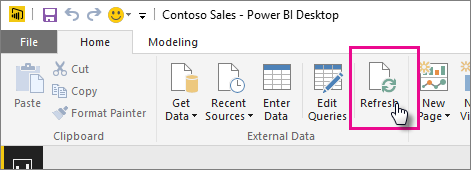

<properties
   pageTitle="Refresh a dataset created from a Power BI Desktop file - local"
   description="Refresh a dataset created from a Power BI Desktop file on a local drive"
   services="powerbi"
   documentationCenter=""
   authors="guyinacube"
   manager="mblythe"
   backup=""
   editor=""
   tags=""
   qualityFocus="monitoring"
   qualityDate="04/01/2016"/>

<tags
   ms.service="powerbi"
   ms.devlang="NA"
   ms.topic="article"
   ms.tgt_pltfrm="NA"
   ms.workload="powerbi"
   ms.date="04/01/2016"
   ms.author="asaxton"/>

# Refresh a dataset created from a Power BI Desktop file on a local drive  

## What’s supported?  
In Power BI, Refresh Now and Schedule Refresh is supported for datasets created from Power BI Desktop files imported from a local drive where Get Data/Query Editor is used to connect to and load data from any of the following data sources:  

### Power BI Gateway - Personal
-   All online data sources shown in Power BI Desktop’s Get Data and Query Editor.
-   All on-premises data sources shown in Power BI Desktop’s Get Data and Query Editor except for Hadoop file (HDFS) and Microsoft Exchange.

### Power BI Gateway - Enterprise

|**Data source**|
|---|
|Analysis Services Tabular|
|Analysis Services Multidimensional|
|SQL Server|
|SAP HANA|
|Oracle|
|Teradata|
|File|
|Folder|
|SharePoint list (on-premises)|
|Web|
|OData|
|IBM DB2|
|MySQL|
|Sybase|

> **Note:** A gateway must be installed and running in order for Power BI to connect to on-premises data sources and refresh the dataset.

You can perform a one-time, manual refresh right in Power BI Desktop by selecting Refresh on the Home ribbon. When you select Refresh here, the data in the *file’s* model is refreshed with updated data from the original data source. This kind of refresh, entirely from within the Power BI Desktop application itself, is different from manual or scheduled refresh in Power BI, and it’s important to understand the distinction.

When you import your Power BI Desktop file from a local drive, data, along with other information about the model is loaded into a dataset in the Power BI service. In the Power BI service, not Power BI Desktop, you want to refresh data in the dataset because that is what your reports, in the Power BI service, are based on. Because the data sources are external, you can manually refresh the dataset by using **Refresh now** or you can setup a refresh schedule by using **Schedule Refresh**.

When you refresh the dataset, Power BI does not connect to the file on the local drive to query for updated data. It uses information in the dataset to connect directly to the data sources to query for updated data it then loads into the dataset. 

> **Note**: Refreshed data in the dataset is not synchronized back to the file on the local drive.

## How do I schedule refresh?  
When you setup a refresh schedule, Power BI will connect directly to the data sources using connection information and credentials in the dataset to query for updated data, then load the updated data into the dataset. Any visualizations in reports and dashboards based on that dataset in the Power BI service are also updated.

For details on how to setup schedule refresh, see [Configure Schedule Refresh](powerbi-refresh-scheduled-refresh.md).

## When things go wrong  
When things go wrong, it’s usually because Power BI can’t sign into data sources, or if the dataset connects to an on-premises data source, the gateway is offline. Make sure Power BI can sign into data sources. If a password you use to sign into a data source changes, or Power BI gets signed out from a data source, be sure to try signing into your data sources again in Data Source Credentials.

Be sure to leave the **Send refresh failure notification email to me** checked. You’ll want to know right away if a scheduled refresh fails.

To learn more about how to troubleshoot refresh issues, see [Troubleshooting refresh.scenarios](powerbi-refresh-troubleshooting-refresh-scenarios.md)and [Tools for troubleshooting refresh issues](powerbi-refresh-tools-for-troubleshooting-issues.md).
