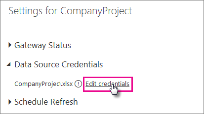

<properties
   pageTitle="Refresh a dataset created from a Power BI Desktop file on a local drive"
   description="Refresh a dataset created from a Power BI Desktop file on a local drive"
   services="powerbi"
   documentationCenter=""
   authors="guyinacube"
   manager="mblythe"
   editor=""
   tags=""
   qualityFocus="no"
   qualityDate=""/>

<tags
   ms.service="powerbi"
   ms.devlang="NA"
   ms.topic="article"
   ms.tgt_pltfrm="NA"
   ms.workload="powerbi"
   ms.date="01/06/2016"
   ms.author="asaxton"/>

# Refresh a dataset created from a Power BI Desktop file on a local drive  

## What’s supported?  
In Power BI, Refresh Now and Schedule Refresh is supported for datasets created from Power BI Desktop files imported from a local drive where Get Data/Query Editor is used to connect to and load data from any of the following data sources:  

### Power BI Gateway - Personal
-   All online data sources shown in Power BI Desktop’s Get Data and Query Editor.
-   All on-premises data sources shown in Power BI Desktop’s Get Data and Query Editor except for Hadoop file (HDFS) and Microsoft Exchange.

### Power BI Gateway - Enterprise

|**Data source**|
|---|
|Analysis Services Tabular|
|Analysis Services Multidimensional|
|SQL Server|
|SAP HANA|
|Oracle|
|Teradata|
|File|
|Folder|
|SharePoint list (on-premises)|
|Web|
|OData|
|IBM DB2|
|MySQL|
|Sybase|

> **Note:** A gateway must be installed and running in order for Power BI to connect to on-premises data sources and refresh the dataset.

With Power BI Desktop, any data you load into the file’s model must come from an external data source. You can perform a one-time, manual refresh right in Power BI Desktop by clicking Refresh on the Home ribbon. When you click Refresh here, a connection is made, data sources are queried for updates, and the data in the *file’s* model is refreshed with updated data. This kind of refresh, entirely from within the Power BI Desktop application itself, is different from manual or scheduled refresh in Power BI, and it’s important to understand the distinction.

When you import your Power BI Desktop file from a local drive, data, along with other information about the model is loaded into a dataset in Power BI. In Power BI (not Power BI Desktop) you want to refresh data in the dataset because that is what your reports in your Power BI site are based on. Because the data sources are external, you can manually refresh the dataset by using Refresh Now or you can setup a refresh schedule by using Schedule Refresh.

When you refresh the dataset, Power BI does not connect to the file on the local drive to query for updated data. It uses information in the dataset to connect directly to the data sources to query for updated data it then loads into the dataset. This refreshed data in the dataset is not synchronized back to the file on the local drive.

## How do I schedule refresh?  
When you setup a refresh schedule, Power BI will connect directly to the data sources using connection information and credentials in the dataset to query for updated data, then load the updated data into the dataset. Any visualizations in reports and dashboards based on that dataset in your Power BI site are also updated. Before you can setup a refresh schedule, you’ll need to do a couple of things first:

### Make sure your gateway (if required) is online  
If your dataset connects to on-premises data sources, a [Power BI Personal Gateway](powerbi-personal-gateway.md), or [Power BI Gateway - Enterprise](powerbi-gateway-enterprise.md), must be installed and online before you can setup a refresh schedule.

In **My Workspace** &gt; **Datasets** &gt; **dataset** &gt;  **SCHEDULE REFRESH** or **REFRESH NOW** to open the Settings page, then expand **Gateway Status**. Make sure your gateway is online before trying to setup a refresh schedule.  
	

### Sign into data sources  
In Power BI, when you import your file from your local drive, Power BI does not copy the credentials you used when you connected to and loaded data into the Power BI Desktop file, so you’ll need to sign into the data sources again in Power BI. You only need to do this once. After that, Power BI retains the credentials as part of the dataset’s settings and uses them to sign into the data sources to query for updated data.

1. In **My Workspace** &gt; **Datasets** &gt; **dataset** &gt;  **SCHEDULE REFRESH** or **REFRESH NOW** to open the Settings page.  
	

2. Expand **Data Source Credentials**, and then click **Edit Credentials**.  
	

3. Select the Authentication Method, and enter account credentials if needed, then click Sign In. The type of authentication and credentials depend on the type of data source being connected to. In most cases, you won’t need to specify a different Authentication Method. It will be automatically selected for you based on the data source.  
	

>**Note:**  
>If your dataset has more than one data source, you’ll have to sign into each one.

### Setup a refresh schedule  
In **Schedule Refresh** &gt; **Keep your data up-to-date** &gt; **Yes**. Select a Refresh frequency, Time zone, and Time, and then click **Apply**.  
	

## When things go wrong  
When things go wrong, it’s usually because Power BI can’t sign into data sources, or if the dataset connects to an on-premises data source, the Power BI Personal Gateway is offline. Make sure Power BI can sign into data sources. If a password you use to sign into a data source changes, or Power BI gets signed out from a data source, be sure to try signing into your data sources again in Data Source Credentials.

Be sure to leave the **Send refresh failure notification email to me** checked. You’ll want to know right away if a scheduled refresh fails.

To learn more about how to troubleshoot refresh issues, see [Troubleshooting refresh.scenarios](powerbi-refresh-troubleshooting-refresh-scenarios.md)and [Tools for troubleshooting refresh issues](powerbi-refresh-tools-for-troubleshooting-issues.md).
