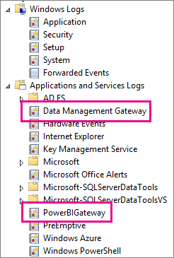

<properties 
   pageTitle="Tools for troubleshooting refresh issues"
   description="Tools for troubleshooting refresh issues"
   services="powerbi" 
   documentationCenter="" 
   authors="guyinacube" 
   manager="mblythe" 
   editor=""
   tags=""/>
 
<tags
   ms.service="powerbi"
   ms.devlang="NA"
   ms.topic="article"
   ms.tgt_pltfrm="NA"
   ms.workload="powerbi"
   ms.date="12/02/2015"
   ms.author="asaxton"/>

# Tools for troubleshooting refresh issues  

The following can be used for general troubleshooting when you encounter an issue with performing a refresh within the Power BI service.

## Update to the latest version  
A lot of issues can surface when the gateway version is out of date.  It is a good general practice to make sure you are on the latest version.  If you haven't updated the gateway for a month, or longer, you may want to consider installing the latest version of the gateway.

## Refresh History  
**Refresh History** can help you see what errors have occurred, as well as provide useful data if you should need to create a support request. You can view both scheduled, as well as on demand, refreshes. Here is how you can get to the **Refresh History**.

1.  In the Power BI navigation pane, in **Datasets**, select a dataset &gt; Open Menu &gt; **Schedule Refresh**.
    

2.  In **Settings for...** &gt; **Schedule Refresh**, select **Refresh History**.  
    
  
    

## Event Logs  
There are several event logs that can provide information. The first two, **Data Management Gateway** and **PowerBIGateway**, are present if you are an admin on the machine.  If you are not an admin, and you are using the Personal Gateway, you will see the log entries within the **Application** log.

The **Data Management Gateway** and **PowerBIGateway** logs are present under **Application and Services Logs**.

## Fiddler Trace  
[Fiddler](http://www.telerik.com/fiddler) is a free tool from Telerik that monitors HTTP traffic.  You can see the back and forth with the Power BI service from the client machine. This may show errors and other related information.

## Setup Logs  
If the **Personal Gateway**, or **Analysis Services Connector**, fails to install, you will see a link to show the setup log.  This could show you details about the failure.  

Alternatively, you can go to your **Temp folder** (%temp%) and look for files that start with **Power\_BI\_**.

>**Note:**  
>Going to %temp% may take you to a subfolder of temp.  The **Power\_BI\_** files will be in the root of the temp directory.  You may need to go up a level or two.

## See also

[Data Refresh](powerbi-refresh-data.md)  

[Troubleshooting refresh scenarios](powerbi-refresh-troubleshooting-refresh-scenarios.md)

[Troubleshooting tile errors](powerbi-refresh-troubleshooting-refresh-scenarios.md) 

[Troubleshooting the Power BI Gateway - Personal](powerbi-admin-troubleshooting-power-bi-personal-gateway.md)

[Troubleshooting the Power BI Gateway - Enterprise (Preview)](powerbi-gateway-enterprise-tshoot.md)