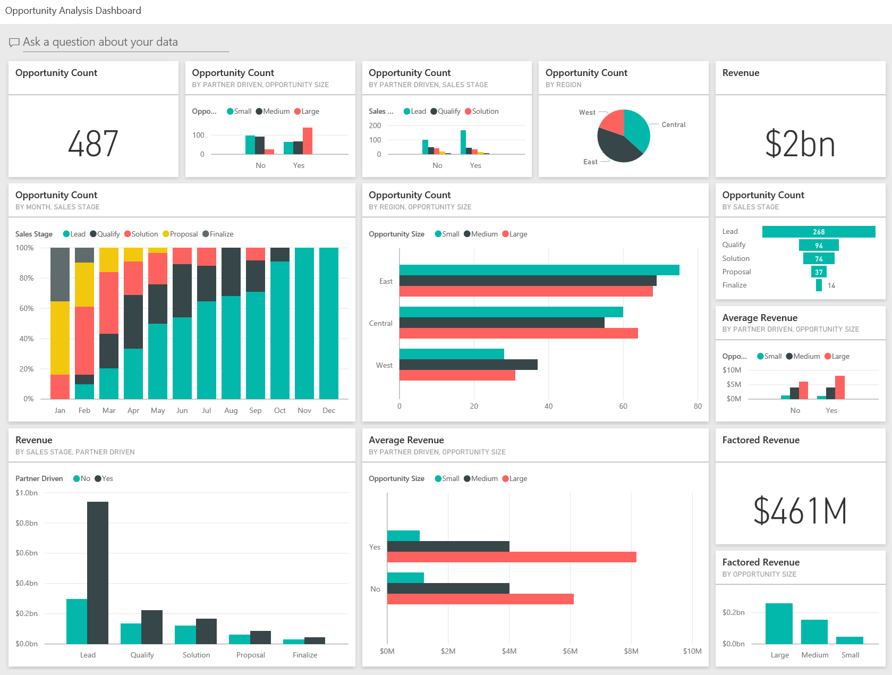
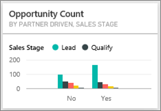

<properties
   pageTitle="Opportunity Analysis sample for Power BI: Take a tour"
   description="Opportunity Analysis sample for Power BI: Take a tour"
   services="powerbi"
   documentationCenter=""
   authors="mihart"
   manager="erikre"
   backup=""
   editor=""
   tags=""
   qualityFocus="no"
   qualityDate=""/>

<tags
   ms.service="powerbi"
   ms.devlang="NA"
   ms.topic="article"
   ms.tgt_pltfrm="NA"
   ms.workload="powerbi"
   ms.date="10/29/2017"
   ms.author="mihart"/>

# Opportunity Analysis sample for Power BI: Take a tour  

The **Opportunity Tracking Sample** contains a dashboard (and associated report) for a software company that has 2 sales channels: *direct* and *partner*. The Sales Manager created this dashboard to track opportunities and revenue by region, deal size, and channel.

The Sales Manager relies on 2 measures of revenue:

-   **Revenue** – this is a salesperson’s estimate of what he believes the revenue will be.
-   **Factored Revenue** – this is calculated as Revenue X Probability% and is generally accepted as being a more-accurate predictor of actual sales revenue. Probability is determined by the deal’s current ***Sales Stage***.
    -   Lead – 10%  
    -   Qualify – 20%  
    -   Solution – 40%  
    -   Proposal – 60%  
    -   Finalize – 80%

This sample is part of a series that illustrates how you can use Power BI with business-oriented data, reports and dashboards. This is real data from obviEnce ([www.obvience.com)](http://www.obvience.com/) that has been anonymized.

You can also [download just the dataset (Excel workbook) for this sample](http://go.microsoft.com/fwlink/?LinkId=529782).  

## What is our dashboard telling us?  
Our Sales Manager has created a dashboard to track those metrics most important to her. When she sees something interesting, she can select a tile to dig into the data.

1.  Company revenue is $2 billion and factored revenue is $461 million.

2.  Opportunity count and revenue follow a familiar funnel pattern, with totals decreasing each subsequent stage.

3.  Most of our opportunities are in the East region. 

4.  The large opportunities generate more revenue than the medium or small opportunities.

5.  Partner large deals generate more revenue: $8M on average versus $6M for direst sales. 

Since the effort to land a deal is the same whether the deal is classified as large, medium, or small; our company should dig into the data to learn more about large opportunities. 

Select the **Opportunity Count by Partner Driven and Sales Stage** tile to open page 1 of the report.  

## Explore the pages in the report  
### Page 1 of our report is titled “Opportunity Count Overview.”    

-   East is our biggest region in terms of opportunity counts.  
-   On the pie chart, select each region one at a time to filter the page. For each region, partners are pursuing significantly more large opportunities.   
-   The Opportunity Count by Partner Driven and Opportunity Size column chart clearly shows that most of the large opportunities are partner-driven and more of the small and medium opportunities are not partner-driven. 
-   Select each Sales Stage in the bar chart in the bottom left to see the difference in regional count and notice that even though East is our biggest region in terms of counts, in the Solution, Proposal and Finalize stages all 3 regions have comparable counts. This means we close a higher percent of deals in Central and West. 

### Page 2 of our report is titled “Revenue Overview.”  
This page takes a similar look at the data but using a revenue perspective instead of count.  

-   East is our biggest region not only in opportunity count but in revenue also.  
-   Filtering by Partner driven (select **Yes** in the legend in the top right) reveals revenue of $1.5B and $294M. Compare this to $644B and $166M for non-partner driven revenue.  
-   Average revenue for large accounts is larger (8M) if the opportunity is partner driven as compared to 6M for non-partner driven business.  
-   For partner driven business, average revenue for large opportunities is almost double that of medium sized opportunities (4M).  
-   Average revenue for small and medium businesses is comparable for both partner driven and non-partner driven business.   

Clearly our partners are doing a better job selling to customers.  It might make sense to funnel more deals through our partners.

### Page 3 of our report is titled "Region Stage Counts"  
This page looks at similar data but breaks it down by region and stage.  

-   Filtering by East (select **East** in the pie chart) reveals that the opportunities in the east are split almost equal between partner driven and non-partner driven. 
-   Large opportunities are most common in the central region, small opportunities are most common in the east region, and medium opportunities are most common in the west region. 

### Page 4 of our report is titled “Upcoming Opportunities”  
Again, we’re looking at similar factors, but this time from a date/time perspective.  

Our CFO uses this page to manage workload. By looking at the revenue opportunities by sales stage and month, she can plan appropriately.

-   Average revenue for the Finalize stage is the highest. Closing these deals is a top priority.
-   Filtering by month (by selecting the month name in the left slicer) shows that January has a high proportion of large deals in the Finalize stage with factored revenue of $75M. February, on the other hand, has mostly medium deals in Solution and Proposal stage.
-   In general, the factored revenue numbers fluctuate based on sales stage, number of opportunities, and deal size. Add filters (using the filter pane on the right) for these factors to discover further insights.

This is a safe environment to play in. You can always choose not to save your changes. But if you do save them, you can always go to **Get Data** for a new copy of this sample.

## Next steps: Connect to your data  
We hope this tour has shown how Power BI dashboards, Q&A, and reports can provide insights into opportunity tracking data. Now it’s your turn — connect to your own data. With Power BI you can connect to a wide variety of data sources. Learn more about [getting started with Power BI](powerbi-service-get-started.md).

[Download samples](powerbi-sample-datasets.md)  
