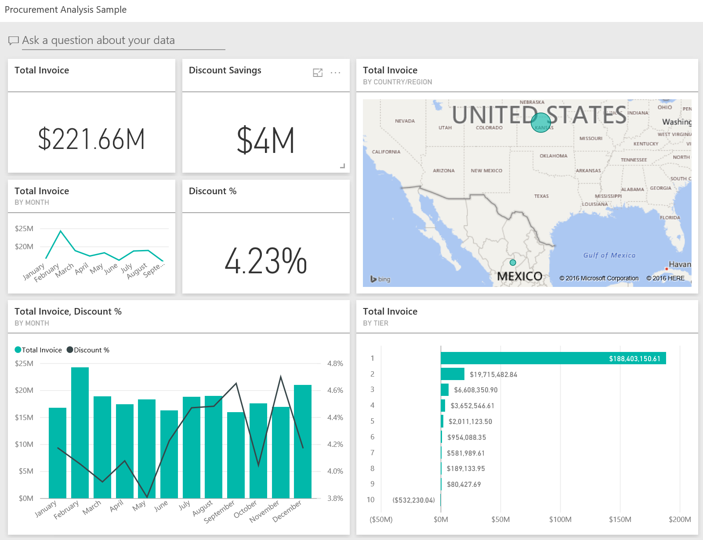

<properties 
   pageTitle="Procurement Analysis sample for Power BI: Take a tour"
   description="Procurement Analysis sample for Power BI: Take a tour"
   services="powerbi" 
   documentationCenter="" 
   authors="maggiesMSFT" 
   manager="mblythe" 
   editor=""
   tags=""/>
 
<tags
   ms.service="powerbi"
   ms.devlang="NA"
   ms.topic="article"
   ms.tgt_pltfrm="NA"
   ms.workload="powerbi"
   ms.date="11/06/2015"
   ms.author="maggies"/>

# Procurement Analysis sample for Power BI: Take a tour 

This industry sample dashboard and underlying report analyze a manufacturing company’s spending on vendors by category and location. In the sample, we explore these areas:

-   Who the top vendors are
-   What categories we spend most on
-   Which vendors give us the highest discount and when

This sample is part of a series that illustrates how you can use  Power BI with business-oriented data, reports and dashboards. This is real data from obviEnce ([www.obvience.com)](http://www.obvience.com/) that has been anonymized. You can also [download just the dataset (Excel workbook) for this sample](http://go.microsoft.com/fwlink/?LinkId=528592).

## Spending trends

Let’s first look for trends in spending by category and location. Select the dashboard tile **Total Invoice by Country/Region**. It opens to the "Spend Overview" page of the “Procurement Analysis Sample” report.

Notice:

-   The **Direct** category has pretty consistent spending,
    **Logistics** has a peak in December, and **Other** has a spike
    in Feb.
-   Most of our spending is in the USA.
-   **Hardware** and **Indirect Goods & Services** are the biggest
    spend categories.
-   Most of our business is done with our Tier 1 (top 10) vendors. This
    helps in managing vendor relationships better.

Let’s explore the spending areas in Mexico:

1.  In the pie chart, select the **Mexico** bubble in the map. Notice
    that in the “Total Invoice by Sub Category” column chart, most of it
    is in the **Indirect Goods & Services** sub category.\
    
2.  Drill down into the **Indirect Goods & Services** column by
    selecting the drill down arrow on the top right of the chart and
    then clicking the column. Select the arrow again to turn drill down
    off.  Select Mexico in the map to see that the biggest commodity for
    Mexico is maintenance and repair.
3.  Select the up arrow on the top left of the chart drill back up .

We can use filters to evaluate different cities.

1.  Click the arrow in the upper-right corner to expand the Filters pane.
2.  Click **City** to see the list of cities.
3.  Select the different cities to see how they compare. Almost all of Miami’s invoices are in hardware, from Tier 1 vendors.
4.  Select **Power BI** in the top navigation bar to go back to
    the dashboard.

## Vendor discounts

Let’s also explore the discounts available from vendors, and the time
periods when we get most discounts. Select the dashboard tile **Total
Invoice, Discount % By Month**. The
report opens to the “Discount Analysis” page. 

Let’s explore these
questions:
-   Are discounts different month by month, or are discounts the same every month?
-   Do some cities get more discounts than others?

### Discount by month

Looking at the **Total Invoice and Discount % by Month** combo chart, we see that **Feb** is the busiest month, and **Jan** and **June** the least busy months. Now look at the discount percent during these months.
Note that when volume goes up, the discount shrinks, and when volume is low, the discount goes up. The more we need the discount, the worse deal we get.

### Discount by city

Another area to explore is discount by city. Click on each city in the treemap and see how the other charts change. 

-   St. Louis, MO had a big spike in total invoice in February and a big dip in discount savings in April.
-   Mexico City, Mexico has the highest discount % (11.05%) and Atlanta, GA has the smallest (0.08%).

**Edit the report**

Select **Edit Report** in the upper-left corner and explore in Editing View.

-   See how the pages are made.
-   Add pages and charts based on the same data.
-   Change the visualization type for a chart – for example, change the treemap to a donut chart.
-   Pin them to your dashboard.

This is a safe environment to play in. You can always choose not to save your changes. But if you do save them, you can always go to **Get Data** for a new copy of this sample.

## Next steps: Connect to your data 

We hope this tour has shown how Power BI dashboards, Q&A, and reports
can provide insights into procurement data. Now it’s your turn - connect to your own data. With Power BI you can connect to a wide variety of data sources. Learn more about [getting started with Power BI](https://support.office.com/article/Get-Started-with-Power-BI-Preview-0f0237e2-f74f-49ab-82ea-1990c3c3deb8).
