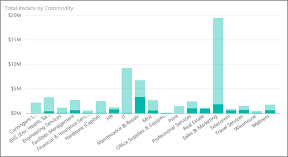
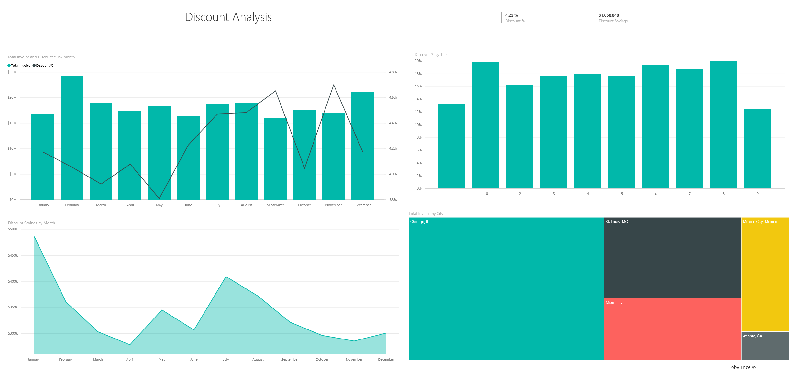
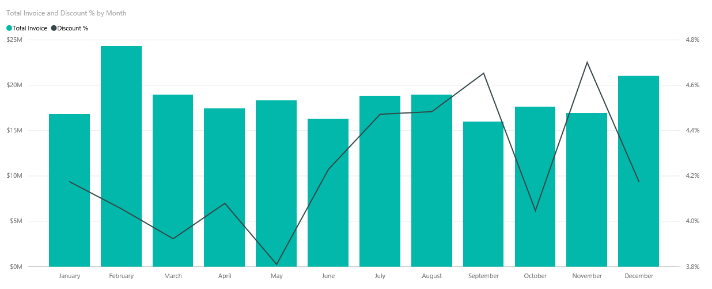
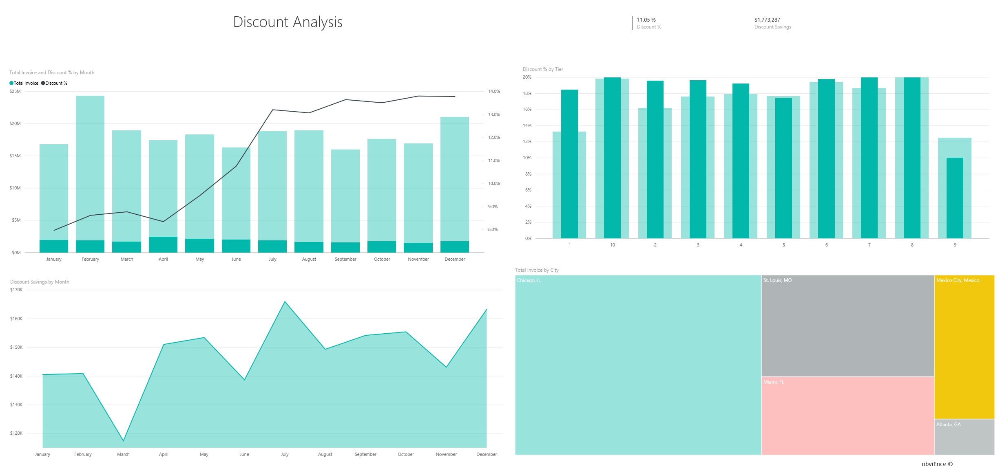

<properties
   pageTitle="Procurement Analysis sample: Take a tour"
   description="Procurement Analysis sample for Power BI: Take a tour"
   services="powerbi"
   documentationCenter=""
   authors="mihart"
   manager="erikre"
   backup=""
   editor=""
   tags=""
   qualityFocus="no"
   qualityDate=""/>

<tags
   ms.service="powerbi"
   ms.devlang="NA"
   ms.topic="article"
   ms.tgt_pltfrm="NA"
   ms.workload="powerbi"
   ms.date="05/09/2017"
   ms.author="mihart"/>

# Procurement Analysis sample for Power BI: Take a tour

This industry sample dashboard and underlying report analyze a manufacturing company’s spending on vendors by category and location. In the sample, we explore these areas:

-   Who the top vendors are
-   What categories we spend most on
-   Which vendors give us the highest discount and when

This sample is part of a series that illustrates how you can use  Power BI with business-oriented data, reports and dashboards. This is real data from obviEnce ([www.obvience.com)](http://www.obvience.com/) that has been anonymized.

Want to follow along? In the [Power BI service](https://powerbi.com), go to **Get Data > Samples > Procurement Analysis Sample > Connect** to get your own copy of the sample.

You can also [download just the dataset (Excel workbook)](http://go.microsoft.com/fwlink/?LinkId=529784) for this sample.

## Spending trends

Let’s first look for trends in spending by category and location.  

1. From your workspace, open the **Dashboards** tab and select the Procurement Analysis dashboard.

2. Select the dashboard tile **Total Invoice by Country/Region**. It opens to the "Spend Overview" page of the “Procurement Analysis Sample” report.

Notice a few things:

-   In the **Total Invoice by Month and Category** line chart: The **Direct** category has pretty consistent spending, **Logistics** has a peak in December, and **Other** has a spike in February.
-   In the **Total Invoice by Country/Region** map: Most of our spending is in the USA.
-   In the **Total Invoice by Sub Category** column chart: **Hardware** and **Indirect Goods & Services** are the biggest spend categories.
-   In the Total Invoice by Tier bar chart: Most of our business is done with our Tier 1 (top 10) vendors. This helps in managing vendor relationships better.

## Spending in Mexico

Let’s explore the spending areas in Mexico.

1.  In the pie chart, select the **Mexico** bubble in the map. Notice that in the “Total Invoice by Sub Category” column chart, most of it is in the **Indirect Goods & Services** sub category.

    

2.  Drill down into the **Indirect Goods & Services** column:
    -  Select the drill-down arrow  in the upper-right corner of the chart.
    -  Select the **Indirect Goods & Services** column.

        By far the biggest spend in this category overall is Sales & Marketing.
    -  Select **Mexico** in the map again.

        The biggest spend in this category in Mexico is Maintenance & Repair.

        

3.  Select the up arrow on the upper-left corner of the chart to drill back up .

4.  Select the arrow again to turn drill down off.  

5.  Select **Power BI** in the top navigation bar to return to your workspace.

## Evaluate different cities

We can use highlighting to evaluate different cities.

1.  Select the dashboard tile **Total Invoice, Discount % By Month**. The report opens to the “Discount Analysis” page.

2.  Select the different cities in the **Total Invoice by City** treemap, to see how they compare. Almost all of Miami’s invoices are from Tier 1 vendors.

    

## Vendor discounts

Let’s also explore the discounts available from vendors, and the time periods when we get most discounts. 

Specifically, these questions:

-   Are discounts different month by month, or are discounts the same every month?
-   Do some cities get more discounts than others?

### Discount by month

Looking at the **Total Invoice and Discount % by Month** combo chart, we see that **February** is the busiest month, and **September** the least busy month. Now look at the discount percent during these months.
Note that when volume goes up, the discount shrinks, and when volume is low, the discount goes up. The more we need the discount, the worse deal we get.

### Discount by city

Another area to explore is discount by city. Select each city in the treemap and see how the other charts change. 

-   St. Louis, MO had a big spike in total invoice in February and a big dip in discount savings in April.
-   Mexico City, Mexico has the highest discount % (11.05%) and Atlanta, GA has the smallest (0.08%).

### Edit the report

Select **Edit report** in the upper-left corner and explore in Editing View.

-   See how the pages are made
-   Add pages and charts based on the same data
-   Change the visualization type for a chart – for example, change the treemap to a donut chart
-   Pin them to your dashboard

This is a safe environment to play in. You can always choose not to save your changes. If you do save them, you can always go to **Get Data** for a new copy of this sample.

## Next steps: Connect to your data

We hope this tour has shown how Power BI dashboards and reports
can provide insights into procurement data. Now it’s your turn &#151; connect to your own data. With Power BI you can connect to a wide variety of data sources. Learn more about [getting started with Power BI](powerbi-service-get-started.md).
