<properties pageTitle="Retail Analysis sample for Power BI: Take a tour" description="Retail Analysis sample for Power BI: Take a tour" services="powerbi" documentationCenter="" authors="v-anpasi" manager="mblythe" editor=""/>
<tags ms.service="powerbi" ms.devlang="NA" ms.topic="article" ms.tgt_pltfrm="NA" ms.workload="powerbi" ms.date="06/26/2015" ms.author="v-anpasi"/>
# Retail Analysis sample for Power BI: Take a tour

[← Samples](https://support.powerbi.com/knowledgebase/topics/75672-samples)

This industry sample dashboard and underlying report analyze retail sales data of items sold across multiple stores and districts. The metrics compare this year’s performance to last year’s in these areas:  sales, units, gross margin, and variance, as well as new store analysis. This is real data from obviEnce (<http://www.obvience.com/>) that has been anonymized. You can watch a [video tour of the Retail Analysis sample](https://www.youtube.com/watch?v=H50WG0o1Nf0&feature=youtu.be).

[Download the Retail Analysis sample content pack](https://support.powerbi.com/knowledgebase/articles/640117), with a dashboard, report, and dataset.

 > **NOTE**: You can also [download the Retail Analysis sample workbook](http://go.microsoft.com/fwlink/?LinkId=528592) that the dashboard is based on.

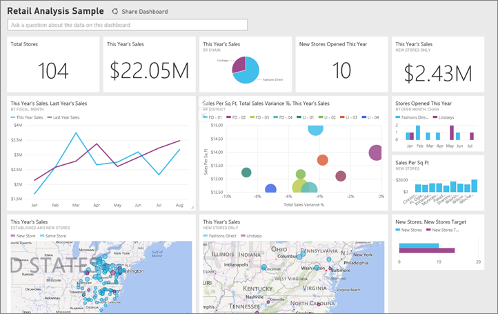

1.  On the dashboard, click the Total Stores tile:

    

    This takes you to the Store Sales Overview page. You see we have 104 total stores, 10 of them new. We have two chains, Fashions Direct and Lindseys. Fashions Direct stores are larger on average.
2.  In the pie chart, click Fashions Direct.

    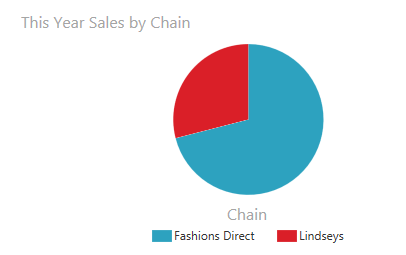

    Notice the result in the scatter chart:
 
    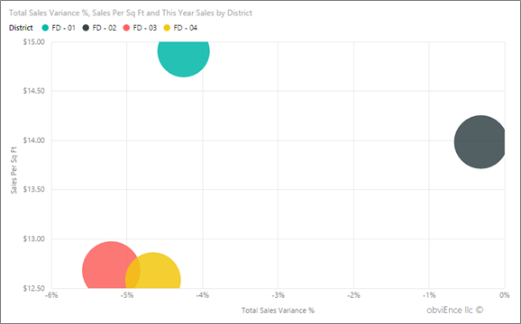

    FD-01 district has the highest Average Sales per Square Foot, FD-02 has the lowest Variance in Sales compared to last year, FD-03 and FD-04 are worst performers overall. Let’s investigate FD-03 to see what’s going on there.  

3.  Double-click on the **FD-03** bubble. This drills down to the store level in this chart.

    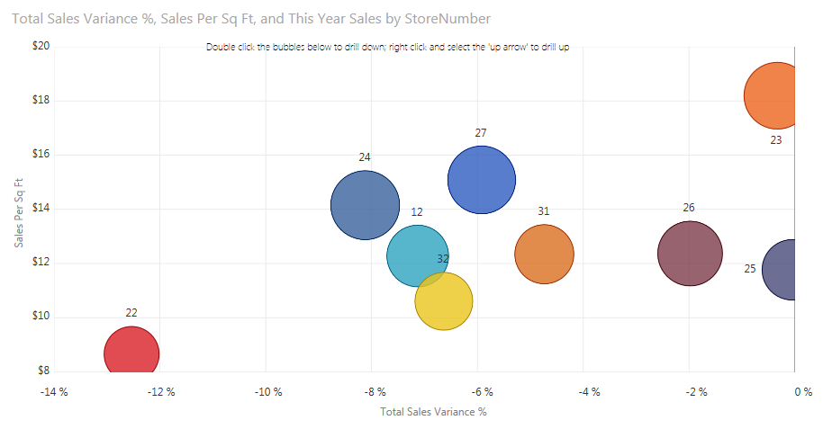

    Notice not all stores perform poorly in that district FD-03. Store 23 has great average sales per square foot and also best variance to last year. But Store 22 is opposite, low average, big negative variance and low volume (based on size)

4.  Click some of the individual bubbles or the other charts to see cross highlighting revealing the impact of your selections.

5.  Click the Power BI icon at the top left corner of the page to return to the dashboard:

    

6.  On the dashboard, click  the tile that has This Year’s Sales.

    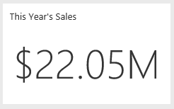

    This is equivalent to typing ‘This year sales’ in the question box.

    
    
    You see this screen:

    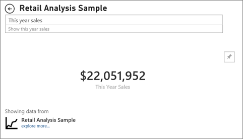

Let’s get more specific.

1.  Add “this year sales **by district**” onto the question. Observe the result: It automatically put the answer in a nice chart:

    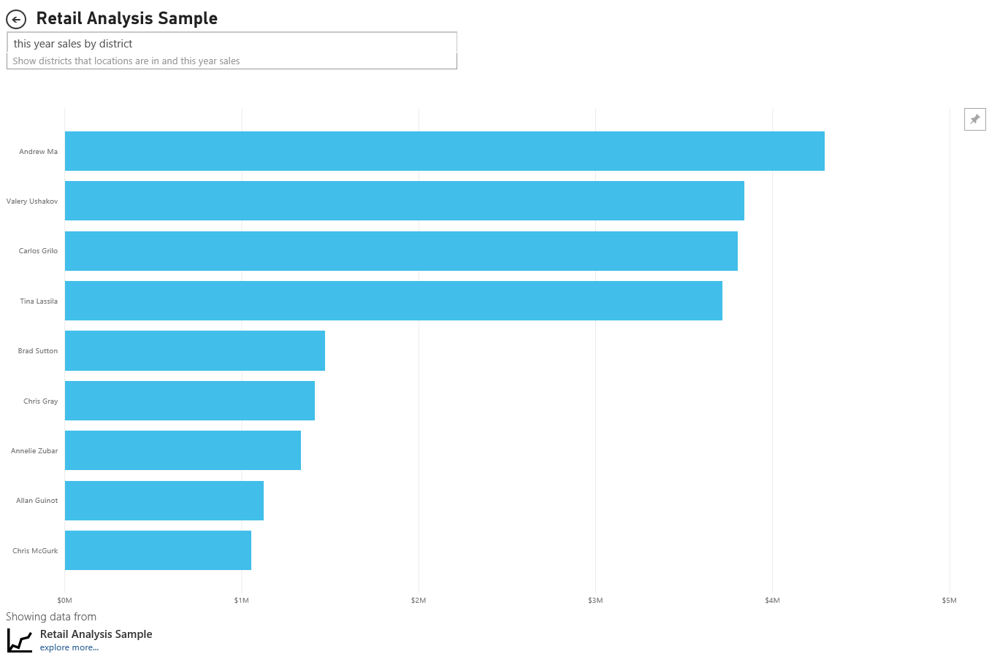
    
2.  Now change the question to “this year sales **by zip and chain**”.  
    Notice how it answers the question as you type with the appropriate charts.

3.  Play around with more questions and see what kind of results you get.

4.  When you’re ready, return to the dashboard the same way you did before.

Now let's explore on a more detailed level, looking at the districts' performances.

1.  On the dashboard, click on the tile comparing this year's sales to last year’s.

    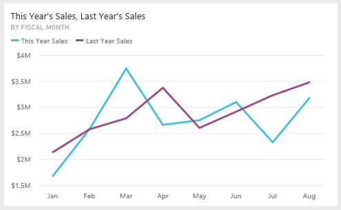

    Notice the large variability on Variance % to last year, with Jan, Apr, and Jul being particularly bad months.
    Let’s see if we can narrow down where the issues might be.

    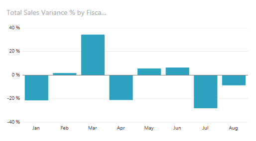

2.  Click the bubble chart, selecting '020-Mens’.

    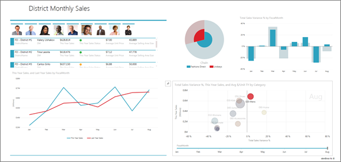
    
    Observe the men's category wasn't as severely affected in April as the business overall. Also it contributes a much bigger share of sales for Lindseys vs Fashions Direct, as indicated by the pie chart.

3.  Now, click the ‘010-Womens’ bubble.  
    Notice the women's category performed much worse than business overall across all months. Also, it contributes a much bigger share of sales for Fashions Direct vs Lindseys.

4.  Select the bubble again. Now all are selected again.

Let’s look at how our specific districts are doing.

1.  Click on the first image for the district manager in the top left.

    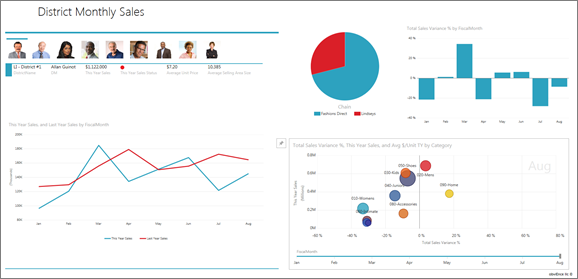

    Note that Allan’s district outperformed Last Year in March and June.

2.  Now, while Allan is still selected, click on the Women’s bubble. Note that for the Women’s category, his district (LI-District \#1 as indicated on the card above) has never met last year’s volume.

3.  Explore the other district managers and categories – what other insights can you find?

4.  When you are ready – return to the dashboard.

The last area we want to explore is our growth – new stores opened this year.

1.  Click on the 'Stores Opened This Year’ tile.

    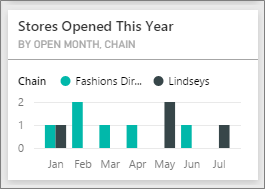

    As evident from the tile – we opened more Fashions Direct stores this year than Lindseys stores.

2.  Observe the Sales Per Sq Ft by Name chart:

    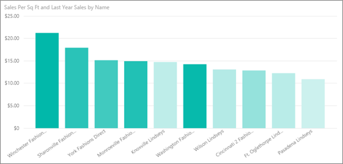

     There is quite a bit of difference in Average Sales per SQF across the new stores.

To make this easier to analyze, let’s sort it.

1.  Right click on the chart – you will see a pop-up where you can change the ‘Sort By’; and the sequence.

    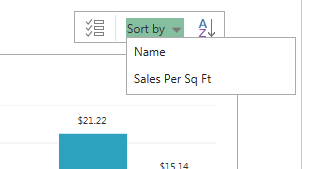

2.  Play around with these and observe the results.

3.  Click on the Fashions Direct legend item in the top right chart. Notice, even for the same chain, the best store (Winchester Fashions Direct) significantly outperforms the worst store (Cincinnati 2 Fashions Direct) $21.22 vs $12.86 respectively.

    
    
4.  In the line chart at the bottom, click Winchester Fashions Direct in the legend. The first sales numbers were reported in February and is a leading store in terms of volume for almost every month.

5.  Click on Cinncinati 2 Fashions Direct in the line chart and you will see it was opened in June and it seems to be the worst performing store.
6.  As before, explore by clicking on other bars, lines and bubbles throughout the charts and see what insights you can discover.

We hope this tour of the Retail Analysis Sample has provided you education on how to exercise the various functionality of the dashboard, Q&A and report, as well as inspiration for you to connect and explore your own data and discover the insights awaiting!

## See Also:

[Download the Retail Analysis sample content pack](https://support.powerbi.com/knowledgebase/articles/640117)  
[Download the Excel workbook for this Power BI sample](http://go.microsoft.com/fwlink/?LinkId=528592)  
[Get data (for Power BI)](http://support.powerbi.com/knowledgebase/articles/434354-get-data)  
[Power BI - Basic Concepts](http://support.powerbi.com/knowledgebase/articles/487029-power-bi-preview-basic-concepts)
