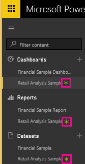

<properties
   pageTitle="Tutorial: Using the Power BI sample content packs"
   description="Tutorial: Using the Power BI sample content packs"
   services="powerbi"
   documentationCenter=""
   authors="mihart"
   manager="mblythe"
   backup=""
   editor=""
   tags=""
   qualityFocus="monitoring"
   qualityDate="03/15/2016"/>

<tags
   ms.service="powerbi"
   ms.devlang="NA"
   ms.topic="article"
   ms.tgt_pltfrm="NA"
   ms.workload="powerbi"
   ms.date="12/08/2016"
   ms.author="amac"/>

# Tutorial: Download and start using the Power BI samples  

## About the samples

Microsoft has created sample content for you to use with Power BI. Each of these samples is available as a **content pack** and as a separate Excel workbook. A *content pack* is a type of sample where the dataset is bundled with a dashboard and/or report. The sample content packs are available from within Power BI, using **Get Data**.  This tutorial teaches you how to find the sample content packs and add them to your Power BI.

The Excel workbooks that were used to create the content packs can be downloaded [as a zip file](http://go.microsoft.com/fwlink/?LinkId=535020) or [individually](powerbi-sample-downloads.md). Advanced users may want to download the Excel workbooks to explore or edit the data models.

>**NOTE**: This tutorial applies to Power BI Service and not Power BI Desktop.

The *Retail Analysis* sample content pack used in this tutorial consists of a dashboard, report, and dataset.
To familiarize yourself with this particular content pack and its scenario, you may want to
 [take a tour of the Retail Analysis sample](powerbi-sample-retail-analysis-take-a-tour.md) before beginning
 this tutorial or [download and explore the Excel workbook version of the sample](http://go.microsoft.com/fwlink/?LinkId=529778).

## Get

1.  Open and sign in to Power BI Service (powerbi.com).

2.  Select **Get Data** at the bottom of the left navigation pane. If you don't see **Get Data**, expand the nav pane by selecting .

    

2.  Select **Samples**.  

    

3.  Select the Retail Analysis sample, and choose **Connect**.   

    

4.  Power BI adds the dashboard, report, and dataset for the Retail Analysis sample. Because they're new, they're marked with a yellow asterisk.

    

5.  Now explore the dashboard and report on your own, or check out
the [Tour of the Retail Analysis sample](powerbi-sample-retail-analysis-take-a-tour.md).

## See also

[Power BI basic concepts](powerbi-service-basic-concepts.md)

[Samples for Power BI service](powerbi-sample-datasets.md)

[Data sources for Power BI](powerbi-service-get-data.md)
