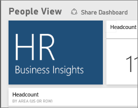

<properties 
   pageTitle="Add an image to a dashboard"
   description="Add an image to a dashboard"
   services="powerbi" 
   documentationCenter="" 
   authors="v-aljenk" 
   manager="mblythe" 
   editor=""
   tags=""/>
 
<tags
   ms.service="powerbi"
   ms.devlang="NA"
   ms.topic="article"
   ms.tgt_pltfrm="NA"
   ms.workload="powerbi"
   ms.date="10/14/2015"
   ms.author="v-aljenk"/>

# Add an image to a dashboard

Say you want your company logo on your dashboard. 

### Before you start

You need:

- Excel 2013. The Power View add-in is only available in Excel 2013.

- An Excel 2013 workbook that contains data in a table format or in the data model. If it doesn't contain any other data, add at least 2 rows and 2 columns of values -- any values will do. 

- For best results, a rectangular image with a 13:9 aspect ratio or a white background.  If the image isn't exactly 13:9, Power BI will add white padding around the edges as needed. Minimum pixels per inch are:

 - 150ppi for standard display, and

 - 350ppi for pixel-dense display (smartphones)

If you plan on adding a title and or subtitle, subtract 50 pixels from the height of your image.

Now you're ready.

1.  In the Excel workbook, add a Power View sheet: **Insert** \> **Power View**.

2.  Don't see Power View on the **Insert** tab? You may need to [turn on the Power View add-in](https://support.office.com/en-us/article/Create-a-Power-View-sheet-in-Excel-2013-b23d768d-7586-47fe-97bd-89b80967a405?ui=en-US&rs=en-US&ad=US).

3.  On the **Power View** tab \> **Insert Picture**.

4.  Browse to the picture \> **Open**.

5.  Save the workbook.

6.  In Power BI, start from the dashboard where you want the logo, or create a dashboard.

7.  Select **Get Data**, and [upload the Excel workbook](https://support.powerbi.com/knowledgebase/articles/424871-excel-data-in-power-bi) from wherever you saved it.

8.  In the navigation pane under **Reports**, select the report you just added. It has a yellow asterisk \* by its name. 

    

9.  In the report, select the image, then select the pin  icon.

    

10. Decide whether to pin the tile to an existing dashboard or to a new dashboard. 

     -   Existing dashboard: select the name of the dashboard from the dropdown.

     -   New dashboard: type the name of the new dashboard.

11. Select Pin.

    A Success message (near the top right corner) lets you know the visualization was added, as a tile, to your dashboard.

    

12. From the navigation pane, select the dashboard with the new tile. There, you can [rename, resize, link, and move](http://support.powerbi.com/knowledgebase/articles/424878-edit-a-tile-resize-move-rename-delete) the pinned visualization.

13. On the dashboard, drag the lower-right corner to make the tile smaller, and then drag it to the place you want it.

More about [creating Power BI dashboards](https://support.powerbi.com/knowledgebase/articles/475163-create-a-power-bi-dashboard).

